# VendorBridge — Frontend Architecture Bible

> **Presented by**: Principal Frontend Architect  
> **Audience**: CTO Panel, Senior Architects, Hackathon Judges  
> **Scale Target**: 10,000+ organizations · 100,000+ users · 4 distinct personas  
> **Design Philosophy**: *"Enterprise rigor, startup speed, premium aesthetics."*

---

## Table of Contents

| § | Section | Focus |
|---|---------|-------|
| 1 | [Frontend System Architecture](#1-frontend-system-architecture) | Layers, boundaries, services |
| 2 | [Information Architecture](#2-information-architecture) | Navigation, role flows |
| 3 | [Feature-Based Architecture](#3-feature-based-architecture) | Module design per feature |
| 4 | [State Management Strategy](#4-state-management-strategy) | Decision matrix, patterns |
| 5 | [Routing Architecture](#5-routing-architecture) | Route tree, guards, portals |
| 6 | [Component Architecture](#6-component-architecture) | Atomic design system |
| 7 | [Design System](#7-design-system) | Tokens, typography, motion |
| 8 | [Dashboard Architecture](#8-dashboard-architecture) | Per-role layouts, KPIs |
| 9 | [Quotation Comparison Engine UI](#9-quotation-comparison-engine-ui) | Flagship feature deep-dive |
| 10 | [Performance Architecture](#10-performance-architecture) | Lighthouse 95+, scale |
| 11 | [Security Architecture](#11-security-architecture) | JWT, RBAC, guards |
| 12 | [Real-Time Architecture](#12-real-time-architecture) | WebSockets, live updates |
| 13 | [Folder Structure](#13-folder-structure) | Production-grade tree |
| 14 | [Judge-Winning UX Features](#14-judge-winning-ux-features) | Top 10 ranked |
| 15 | [Final Architecture Review](#15-final-architecture-review) | Self-critique + V2 |

---

# 1. Frontend System Architecture

## 1.1 High-Level Layer Diagram

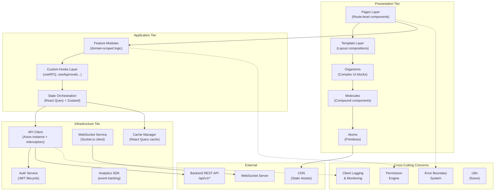

## 1.2 Architecture Decisions & Rationale

| Decision | Choice | Rejected Alternative | Rationale |
|----------|--------|---------------------|-----------|
| **Framework** | Next.js 14+ (App Router) | Vite + React SPA | SSR for dashboard SEO; file-based routing reduces boilerplate; built-in image optimization; React Server Components for data-heavy pages |
| **Rendering Strategy** | Hybrid (SSR + CSR) | Full SSR or Full CSR | Dashboards benefit from SSR (first paint speed); interactive forms need CSR; vendor portal pages can be SSG for performance |
| **Module System** | Feature-based vertical slices | Layer-based horizontal | Each feature owns its entire stack (components → hooks → API → types); enables team ownership and parallel development |
| **Portal Separation** | Route-based separation within single app | Separate applications | Shared design system, shared auth logic, shared API client; route groups `(internal)` and `(vendor)` provide clean separation without deployment complexity |
| **Monorepo** | Single app (hackathon) → Turborepo (scale) | Multi-repo | Hackathon speed demands single repo; architecture supports extraction to monorepo later |

## 1.3 Module Boundary Diagram

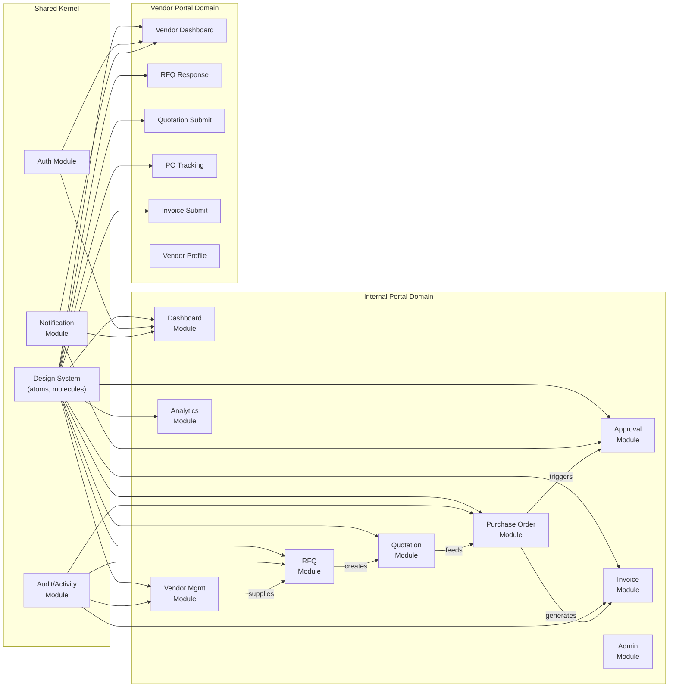

> [!IMPORTANT]
> **Module Communication Rule**: Modules communicate through well-defined interfaces (exported hooks and types), never by importing internal components directly. Cross-module data flows through React Query's shared cache keyed by entity ID.

## 1.4 API Layer Architecture

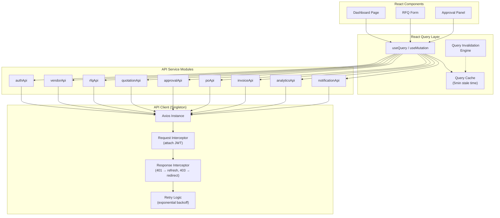

---

# 2. Information Architecture

## 2.1 Navigation Hierarchy — Internal Portal

```mermaid
graph TD
    ROOT["VendorBridge Internal"]
    
    ROOT --> DASH["🏠 Dashboard"]
    ROOT --> PROC["📋 Procurement"]
    ROOT --> VEND["🏢 Vendors"]
    ROOT --> APPROVE["✅ Approvals"]
    ROOT --> FIN["💰 Finance"]
    ROOT --> REPORT["📊 Analytics"]
    ROOT --> SETTINGS["⚙️ Settings"]

    PROC --> RFQ["RFQ Management"]
    PROC --> QOT["Quotations"]
    PROC --> POC["Purchase Orders"]

    RFQ --> RFQ_LIST["All RFQs"]
    RFQ --> RFQ_CREATE["Create RFQ"]
    RFQ --> RFQ_DETAIL["RFQ Detail"]
    RFQ --> RFQ_COMPARE["Compare Quotes ⭐"]

    VEND --> V_LIST["Vendor Directory"]
    VEND --> V_DETAIL["Vendor Profile"]
    VEND --> V_SCORE["Performance Scores"]
    VEND --> V_ONBOARD["Onboarding Queue"]

    APPROVE --> APR_PENDING["Pending Approvals"]
    APPROVE --> APR_HISTORY["Approval History"]
    APPROVE --> APR_RULES["Approval Rules"]

    FIN --> INV_LIST["Invoices"]
    FIN --> INV_MATCH["3-Way Matching"]
    FIN --> BUDGET["Budget Tracker"]

    REPORT --> RPT_SPEND["Spend Analytics"]
    REPORT --> RPT_VENDOR["Vendor Analytics"]
    REPORT --> RPT_PERF["Procurement KPIs"]
    REPORT --> RPT_RISK["Risk Radar"]

    SETTINGS --> SET_USERS["User Management"]
    SETTINGS --> SET_ROLES["Roles & Permissions"]
    SETTINGS --> SET_AUDIT["Audit Logs"]
    SETTINGS --> SET_ORG["Organization"]
```

## 2.2 Navigation Hierarchy — Vendor Portal

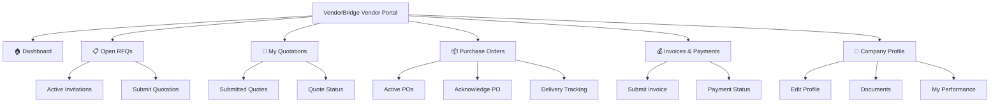

## 2.3 Role-Based Navigation Matrix

| Navigation Item | Admin | Procurement Officer | Manager | Vendor |
|----------------|-------|-------------------|---------|--------|
| **Dashboard** | ✅ System Health | ✅ Procurement Ops | ✅ Approvals Focus | ✅ Vendor Dashboard |
| **Vendors** | ✅ Full CRUD | ✅ Browse + Add | ✅ Browse Only | ❌ (own profile only) |
| **RFQ Management** | ✅ All | ✅ Own + Create | ✅ Read Only | ✅ Assigned Only |
| **Quotations** | ✅ All | ✅ Compare + Select | ✅ Read Only | ✅ Own Submissions |
| **Approvals** | ✅ All + Rules | ❌ | ✅ Pending Queue | ❌ |
| **Purchase Orders** | ✅ All | ✅ Create + Track | ✅ Approve | ✅ Own POs |
| **Invoices** | ✅ All | ✅ Match + Approve | ✅ Read | ✅ Submit + Track |
| **Analytics** | ✅ Full Reports | ✅ Basic Dashboard | ✅ Dept Analytics | ❌ |
| **Settings** | ✅ Full | ❌ | ❌ | ❌ |
| **Audit Logs** | ✅ | ❌ | ❌ | ❌ |

## 2.4 User Journey Flowchart — Core Procurement Cycle

```mermaid
graph LR
    subgraph "Procurement Officer"
        A["Identify Need"] --> B["Create RFQ"]
        B --> C["Add Line Items"]
        C --> D["Select & Invite Vendors"]
        D --> E["Send RFQ"]
        E --> H["Review Quotations"]
        H --> I["⭐ Compare Quotations"]
        I --> J["Select Best Vendor"]
        J --> K["Generate PO"]
        K --> L["Submit for Approval"]
    end

    subgraph "Vendor"
        E --> F["Receive RFQ Notification"]
        F --> G["Submit Quotation"]
        G --> H
        P --> Q["Acknowledge PO"]
        Q --> R["Deliver Goods"]
        R --> S["Submit Invoice"]
    end

    subgraph "Manager"
        L --> M["Review Approval<br/>(with context card)"]
        M -->|Approve| N["PO Approved"]
        M -->|Reject| O["Return to Officer"]
        N --> P["PO Sent to Vendor"]
    end

    subgraph "System"
        S --> T["3-Way Match<br/>(PO ↔ GRN ↔ Invoice)"]
        T -->|Match| U["Auto-Approve Payment"]
        T -->|Exception| V["Flag for Review"]
    end
```

---

# 3. Feature-Based Frontend Architecture

## 3.1 Feature Module Structure

Every feature module follows an identical internal structure — this consistency enables any developer to navigate any module instantly:

```
features/
└── {feature-name}/
    ├── index.ts                    # Public API barrel export
    ├── components/                 # UI components scoped to this feature
    │   ├── {FeatureName}List.tsx
    │   ├── {FeatureName}Detail.tsx
    │   ├── {FeatureName}Form.tsx
    │   └── {FeatureName}Card.tsx
    ├── hooks/                      # Feature-specific hooks
    │   ├── use{FeatureName}.ts     # Single entity operations
    │   ├── use{FeatureName}List.ts # List/paginated operations
    │   └── use{FeatureName}Mutations.ts
    ├── api/                        # API service functions
    │   └── {featureName}Api.ts
    ├── types/                      # TypeScript interfaces
    │   └── {featureName}.types.ts
    ├── utils/                      # Feature-specific utilities
    │   └── {featureName}.utils.ts
    ├── constants/                  # Feature constants & enums
    │   └── {featureName}.constants.ts
    └── __tests__/                  # Co-located tests
        ├── {FeatureName}List.test.tsx
        └── use{FeatureName}.test.ts
```

## 3.2 Feature Module Deep-Dive

### 📋 `features/dashboard/`

| Aspect | Detail |
|--------|--------|
| **Responsibilities** | Render role-specific dashboards; aggregate KPI data; display action items; show trend charts |
| **Boundaries** | Reads from analytics API and notification API. Never writes data — purely a consumer module. |
| **Ownership** | Core Platform Team |
| **Reusable Assets** | `<KpiCard>`, `<SparklineChart>`, `<ActionItemTable>`, `<TrendAreaChart>` |
| **API Interactions** | `GET /analytics/dashboard`, `GET /notifications`, `GET /approvals/pending` |
| **Key Components** | `ProcurementDashboard`, `ManagerDashboard`, `VendorDashboard`, `AdminDashboard`, `DashboardShell` (layout switcher by role) |

---

### 🏢 `features/vendors/`

| Aspect | Detail |
|--------|--------|
| **Responsibilities** | Vendor CRUD, directory browsing, profile management, status transitions (approve/suspend/blacklist), performance scorecard display |
| **Boundaries** | Owns vendor entity. Exposes `useVendorOptions()` hook consumed by RFQ module for vendor selection. Does NOT own RFQ or PO data — queries those as read-only for the vendor profile view. |
| **Ownership** | Vendor Management Team |
| **Reusable Assets** | `<VendorCard>`, `<VendorBadge>`, `<PerformanceRadar>`, `<VendorSelector>` (multi-select with scores) |
| **API Interactions** | `GET/POST/PUT /vendors`, `GET /vendors/:id/performance`, `PUT /vendors/:id/status`, `GET /vendor-categories` |
| **Key Components** | `VendorDirectory`, `VendorProfile`, `VendorOnboardingForm`, `VendorPerformancePanel`, `VendorStatusTimeline` |

---

### 📄 `features/rfqs/`

| Aspect | Detail |
|--------|--------|
| **Responsibilities** | RFQ lifecycle management: create (wizard), edit, send, close, cancel. Line item management. Vendor invitation. |
| **Boundaries** | Owns RFQ entity and RFQ items. Depends on `vendors` module for vendor selection. Consumed by `quotations` module. |
| **Ownership** | Procurement Workflow Team |
| **Reusable Assets** | `<RfqWizard>` (multi-step form), `<LineItemEditor>` (dynamic row add/remove), `<RfqStatusBadge>`, `<DeadlineCountdown>` |
| **API Interactions** | `GET/POST/PUT/DELETE /rfqs`, `POST /rfqs/:id/items`, `POST /rfqs/:id/send`, `PUT /rfqs/:id/close`, `POST /rfqs/:id/vendors` |
| **Key Components** | `RfqList`, `RfqDetail`, `RfqCreateWizard` (4-step), `RfqItemTable`, `RfqVendorInvite`, `RfqTimeline` |

---

### 💬 `features/quotations/`

| Aspect | Detail |
|--------|--------|
| **Responsibilities** | Vendor quotation submission (vendor portal); quotation viewing/reviewing (internal); **quotation comparison engine** (⭐ flagship) |
| **Boundaries** | Owns quotation entity. Reads from RFQ module. Feeds into PO module via "Select Vendor → Generate PO" flow. |
| **Ownership** | Procurement Workflow Team |
| **Reusable Assets** | `<QuotationComparisonMatrix>` ⭐, `<PriceCell>` (color-coded), `<RankingBar>`, `<ScoreBreakdown>`, `<QuotationForm>` |
| **API Interactions** | `GET/POST /quotations`, `GET /rfqs/:id/quotations/compare`, `PUT /quotations/:id/select`, `PUT /quotations/:id/reject` |
| **Key Components** | `QuotationList`, `QuotationSubmitForm`, `QuotationComparisonEngine` ⭐, `QuotationScorecard`, `VendorRecommendationBadge` |

---

### ✅ `features/approvals/`

| Aspect | Detail |
|--------|--------|
| **Responsibilities** | Approval queue display; approve/reject actions; contextual data cards (budget impact, vendor score, price history); approval rule management (admin); escalation tracking |
| **Boundaries** | Cross-cutting — consumes entity data from PO, vendor, and invoice modules to build context cards. Owns approval_requests entity. |
| **Ownership** | Governance Team |
| **Reusable Assets** | `<ApprovalContextCard>` ⭐ (the "smart approval"), `<ApprovalActions>`, `<EscalationTimeline>`, `<BudgetImpactGauge>` |
| **API Interactions** | `GET /approvals/pending`, `PUT /approvals/:id/approve`, `PUT /approvals/:id/reject`, `PUT /approvals/:id/escalate`, `GET/POST /approval-rules` |
| **Key Components** | `ApprovalQueue`, `ApprovalDetailPanel`, `ApprovalRuleBuilder`, `ApprovalContextCard`, `EscalationIndicator` |

---

### 📦 `features/purchase-orders/`

| Aspect | Detail |
|--------|--------|
| **Responsibilities** | PO generation from selected quotation; PO lifecycle management; goods receipt recording; PDF export |
| **Boundaries** | Depends on quotation (for generation) and approval (for status transitions). Consumed by invoice module for matching. |
| **Ownership** | Procurement Workflow Team |
| **Reusable Assets** | `<PoStatusTimeline>`, `<PoLineItemTable>`, `<PoDocumentLinks>`, `<GoodsReceiptForm>` |
| **API Interactions** | `GET/POST /purchase-orders`, `PUT /purchase-orders/:id/submit`, `PUT /purchase-orders/:id/send`, `POST /purchase-orders/:id/receive`, `GET /purchase-orders/:id/pdf` |
| **Key Components** | `PoList`, `PoDetail`, `PoCreateFromQuotation`, `PoTimeline`, `GoodsReceiptEntry` |

---

### 💰 `features/invoices/`

| Aspect | Detail |
|--------|--------|
| **Responsibilities** | Invoice submission (vendor); invoice listing; 3-way matching visualization (PO ↔ GRN ↔ Invoice); approve/dispute actions |
| **Boundaries** | Reads from PO module and goods receipts. Owns invoice entity. |
| **Ownership** | Finance Team |
| **Reusable Assets** | `<ThreeWayMatchPanel>` ⭐, `<MatchStatusIndicator>`, `<InvoiceDiscrepancyHighlight>`, `<PaymentTimeline>` |
| **API Interactions** | `GET/POST /invoices`, `GET /invoices/:id/match`, `PUT /invoices/:id/approve`, `PUT /invoices/:id/dispute` |
| **Key Components** | `InvoiceList`, `InvoiceDetail`, `InvoiceSubmitForm`, `ThreeWayMatchView`, `InvoiceAgingChart` |

---

### 📊 `features/analytics/`

| Aspect | Detail |
|--------|--------|
| **Responsibilities** | Spend analytics; vendor performance reports; procurement KPIs; approval efficiency metrics; risk radar |
| **Boundaries** | Read-only aggregation module. Never mutates data. Queries dedicated analytics endpoints. |
| **Ownership** | Data & Insights Team |
| **Reusable Assets** | `<SpendTreemap>`, `<TrendAreaChart>`, `<VendorLeaderboard>`, `<SpendHeatmap>`, `<ConversionFunnel>`, `<BudgetGauge>` |
| **API Interactions** | `GET /analytics/spend`, `GET /analytics/vendor-performance`, `GET /analytics/trends`, `GET /analytics/approval-efficiency`, `GET /analytics/budget` |
| **Key Components** | `SpendAnalyticsPage`, `VendorAnalyticsPage`, `ProcurementKpiPage`, `RiskRadarPage` |

---

### 🔔 `features/notifications/`

| Aspect | Detail |
|--------|--------|
| **Responsibilities** | Notification bell/dropdown; notification list page; mark read; real-time WebSocket integration |
| **Boundaries** | Receives events from all modules. Shared kernel — instantiated at app shell level. |
| **Ownership** | Core Platform Team |
| **Reusable Assets** | `<NotificationBell>`, `<NotificationDropdown>`, `<NotificationItem>`, `<NotificationToast>` |
| **API Interactions** | `GET /notifications`, `GET /notifications/unread-count`, `PUT /notifications/:id/read`, `PUT /notifications/read-all`, WebSocket: `notification:new` |
| **Key Components** | `NotificationCenter`, `NotificationList`, `NotificationPreferences` |

---

# 4. State Management Strategy

## 4.1 State Categories & Ownership

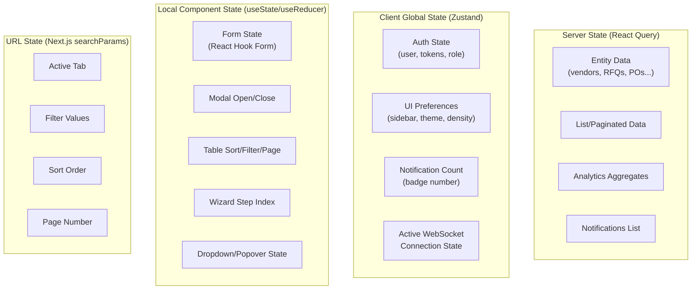

## 4.2 State Decision Matrix

| State Type | Location | Why Here | Why Not Elsewhere |
|-----------|----------|----------|-------------------|
| **Vendor list data** | React Query (`queryKey: ['vendors', filters]`) | Server-derived; needs caching, background refresh, pagination | Zustand would duplicate server truth; local state loses it on unmount |
| **Single RFQ detail** | React Query (`queryKey: ['rfq', id]`) | Cacheable; shareable across comparison + detail views | Context would re-render entire tree; local state can't be shared |
| **Auth user + JWT** | Zustand (`useAuthStore`) | Needs to persist across route changes; synchronous access for interceptors | React Query is async; Context causes re-renders on token refresh |
| **Sidebar collapsed** | Zustand (`useUIStore`) | Persists across route changes; no server involvement | Local state resets on navigate; URL state is overkill |
| **RFQ create form data** | React Hook Form (local) | Complex validation; multi-step wizard; no need to share | React Query is for server data; Zustand is overkill for ephemeral form state |
| **Table sort/filter** | URL searchParams | Shareable links; back-button friendly; bookmarkable | Local state breaks back-button; Zustand is invisible to URL |
| **Notification badge count** | Zustand (synced via WebSocket) | Needs instant update from WS event; read in header (global) | React Query polling has latency; local state is scoped |
| **Quotation comparison data** | React Query (`queryKey: ['quotation-compare', rfqId]`) | Expensive computation; cacheable; derived from server | Zustand would go stale; local state unmounts with page |
| **Approval pending count** | React Query + Zustand sync | Query fetches; Zustand holds badge count updated via WS | Pure local state can't receive WS events |
| **Modal open/close** | `useState` (component-local) | Ephemeral UI state; no persistence needed | Any global store is over-engineering for this |
| **Theme (dark/light)** | Zustand + localStorage | User preference; persists across sessions | Server state is overkill; CSS-only can't track programmatically |

## 4.3 React Query Configuration

```typescript
// lib/queryClient.ts — The nerve center of server state

const queryClient = new QueryClient({
  defaultOptions: {
    queries: {
      staleTime: 5 * 60 * 1000,       // 5 min — data considered fresh
      gcTime: 30 * 60 * 1000,          // 30 min — garbage collect unused cache
      retry: 2,                         // Retry failed requests twice
      retryDelay: (attempt) =>          // Exponential backoff
        Math.min(1000 * 2 ** attempt, 10000),
      refetchOnWindowFocus: true,       // Refresh when user returns to tab
      refetchOnReconnect: true,         // Refresh on network restore
    },
    mutations: {
      retry: 0,                         // Don't auto-retry mutations
      onError: (error) => {             // Global mutation error handler
        toast.error(getErrorMessage(error));
      },
    },
  },
});
```

### Per-Feature Cache Tuning

| Feature | `staleTime` | `gcTime` | `refetchInterval` | Rationale |
|---------|------------|----------|-------------------|-----------|
| Dashboard KPIs | 30s | 5min | 60s | Near real-time feel for executives |
| Vendor list | 5min | 30min | — | Vendors don't change often |
| RFQ list | 2min | 10min | — | Active procurement needs fresher data |
| Quotation comparison | 10min | 1hr | — | Expensive computation; rarely changes |
| Approval pending | 30s | 5min | 30s | Managers need immediate visibility |
| Notifications | 15s | 5min | — (WS pushes) | WebSocket handles real-time; query is fallback |
| Analytics/reports | 15min | 1hr | — | Pre-computed; changes slowly |
| Audit logs | 0 (always fetch) | 5min | — | Must show latest for compliance |

## 4.4 Optimistic Updates Strategy

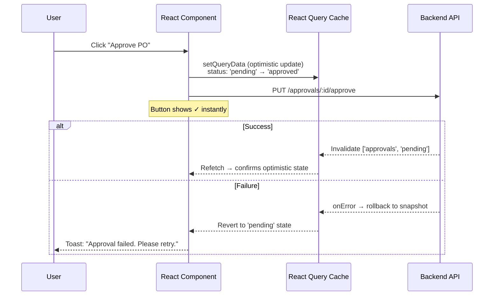

**Modules using optimistic updates:**

| Action | Optimistic Behavior | Rollback Strategy |
|--------|---------------------|-------------------|
| Approve/Reject | Instantly move card from pending → decided | Restore original status; show error toast |
| Mark notification read | Immediately grey out; decrement badge | Restore unread state; restore badge count |
| Change vendor status | Badge updates instantly | Revert badge; show error |
| Delete RFQ draft | Remove from list immediately | Re-insert at original position |

## 4.5 Zustand Store Architecture

```typescript
// Three focused stores — not one monolithic store

// 1. Auth Store — synchronous JWT access for interceptors
interface AuthStore {
  user: User | null;
  accessToken: string | null;
  role: UserRole;
  permissions: Permission[];
  login: (credentials) => Promise<void>;
  logout: () => void;
  refreshToken: () => Promise<string>;
  hasPermission: (module, action, resource) => boolean;
}

// 2. UI Store — ephemeral preferences
interface UIStore {
  sidebarCollapsed: boolean;
  theme: 'dark' | 'light' | 'system';
  tableDensity: 'compact' | 'default' | 'comfortable';
  toggleSidebar: () => void;
  setTheme: (theme) => void;
}

// 3. Real-time Store — WebSocket-driven ephemeral state
interface RealtimeStore {
  unreadNotificationCount: number;
  pendingApprovalCount: number;
  connectionStatus: 'connected' | 'disconnected' | 'reconnecting';
  incrementUnread: () => void;
  setUnread: (count: number) => void;
  setPendingApprovals: (count: number) => void;
}
```

---

# 5. Routing Architecture

## 5.1 Next.js App Router — Route Tree

```
app/
├── layout.tsx                          # Root layout (providers, fonts)
├── globals.css                         # Global styles
├── page.tsx                            # Landing/marketing page (public)
│
├── (auth)/                             # Auth route group (no sidebar)
│   ├── layout.tsx                      # Centered card layout
│   ├── login/page.tsx                  # /login
│   ├── register/page.tsx               # /register (vendor self-register)
│   ├── forgot-password/page.tsx        # /forgot-password
│   └── reset-password/page.tsx         # /reset-password?token=xxx
│
├── (internal)/                         # Internal portal route group
│   ├── layout.tsx                      # Sidebar + Header + AuthGuard
│   ├── dashboard/page.tsx              # /dashboard (role-adaptive)
│   │
│   ├── vendors/
│   │   ├── page.tsx                    # /vendors (directory)
│   │   ├── new/page.tsx                # /vendors/new
│   │   └── [vendorId]/
│   │       ├── page.tsx                # /vendors/:id (profile)
│   │       └── performance/page.tsx    # /vendors/:id/performance
│   │
│   ├── rfqs/
│   │   ├── page.tsx                    # /rfqs (list)
│   │   ├── new/page.tsx                # /rfqs/new (wizard)
│   │   └── [rfqId]/
│   │       ├── page.tsx                # /rfqs/:id (detail)
│   │       └── compare/page.tsx        # /rfqs/:id/compare ⭐
│   │
│   ├── quotations/
│   │   ├── page.tsx                    # /quotations (list)
│   │   └── [quotationId]/page.tsx      # /quotations/:id
│   │
│   ├── approvals/
│   │   ├── page.tsx                    # /approvals (pending queue)
│   │   ├── history/page.tsx            # /approvals/history
│   │   └── rules/page.tsx              # /approvals/rules (admin)
│   │
│   ├── purchase-orders/
│   │   ├── page.tsx                    # /purchase-orders (list)
│   │   └── [poId]/page.tsx             # /purchase-orders/:id
│   │
│   ├── invoices/
│   │   ├── page.tsx                    # /invoices (list)
│   │   └── [invoiceId]/
│   │       ├── page.tsx                # /invoices/:id
│   │       └── match/page.tsx          # /invoices/:id/match
│   │
│   ├── analytics/
│   │   ├── page.tsx                    # /analytics (overview)
│   │   ├── spend/page.tsx              # /analytics/spend
│   │   ├── vendors/page.tsx            # /analytics/vendors
│   │   └── risk/page.tsx               # /analytics/risk
│   │
│   └── settings/
│       ├── page.tsx                    # /settings (admin)
│       ├── users/page.tsx              # /settings/users
│       ├── roles/page.tsx              # /settings/roles
│       ├── audit-logs/page.tsx         # /settings/audit-logs
│       └── organization/page.tsx       # /settings/organization
│
├── (vendor)/                           # Vendor portal route group
│   ├── layout.tsx                      # Vendor-specific sidebar + AuthGuard(role='vendor')
│   ├── portal/
│   │   ├── page.tsx                    # /portal (vendor dashboard)
│   │   ├── rfqs/
│   │   │   ├── page.tsx                # /portal/rfqs (assigned RFQs)
│   │   │   └── [rfqId]/
│   │   │       ├── page.tsx            # /portal/rfqs/:id (view RFQ)
│   │   │       └── respond/page.tsx    # /portal/rfqs/:id/respond (submit quote)
│   │   ├── quotations/page.tsx         # /portal/quotations
│   │   ├── purchase-orders/page.tsx    # /portal/purchase-orders
│   │   ├── invoices/
│   │   │   ├── page.tsx                # /portal/invoices
│   │   │   └── new/page.tsx            # /portal/invoices/new
│   │   └── profile/page.tsx            # /portal/profile
│
└── api/                                # Next.js API routes (BFF pattern)
    └── health/route.ts                 # /api/health
```

## 5.2 Route Protection Architecture

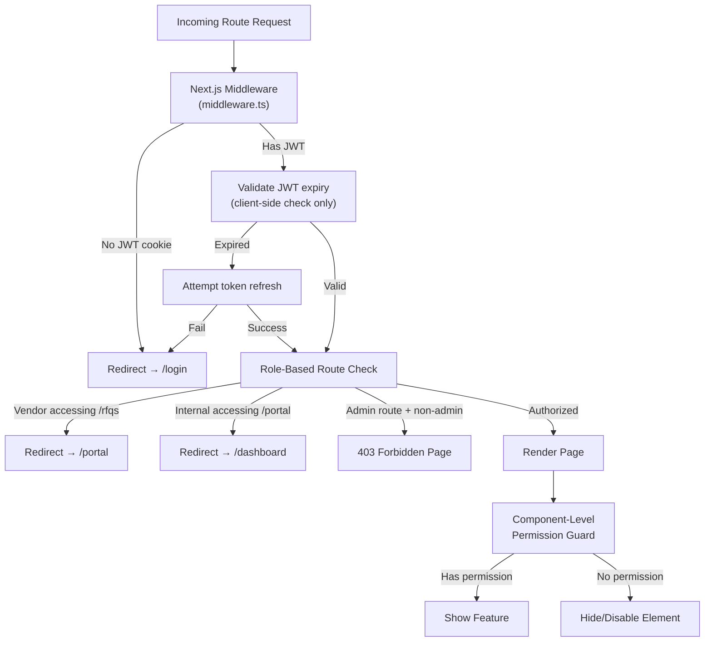

### Middleware Route Rules

```typescript
// middleware.ts — Edge Runtime route protection

const routeRules: RouteRule[] = [
  // Public routes — no auth required
  { pattern: '/login',            access: 'public' },
  { pattern: '/register',         access: 'public' },
  { pattern: '/forgot-password',  access: 'public' },

  // Internal portal — any authenticated internal role
  { pattern: '/dashboard',        access: 'auth', roles: ['admin', 'procurement_officer', 'manager'] },
  { pattern: '/vendors',          access: 'auth', roles: ['admin', 'procurement_officer', 'manager'] },
  { pattern: '/rfqs',             access: 'auth', roles: ['admin', 'procurement_officer', 'manager'] },
  { pattern: '/quotations',       access: 'auth', roles: ['admin', 'procurement_officer', 'manager'] },
  { pattern: '/purchase-orders',  access: 'auth', roles: ['admin', 'procurement_officer', 'manager'] },
  { pattern: '/invoices',         access: 'auth', roles: ['admin', 'procurement_officer'] },

  // Approval routes — only admin + manager
  { pattern: '/approvals',        access: 'auth', roles: ['admin', 'manager'] },
  { pattern: '/approvals/rules',  access: 'auth', roles: ['admin'] },

  // Admin-only routes
  { pattern: '/settings',         access: 'auth', roles: ['admin'] },
  { pattern: '/analytics',        access: 'auth', roles: ['admin', 'procurement_officer', 'manager'] },

  // Vendor portal — vendor role only
  { pattern: '/portal',           access: 'auth', roles: ['vendor'] },
];
```

### Component-Level Permission Guard

```tsx
// Usage example — granular permission control
<PermissionGate module="purchase_orders" action="approve">
  <Button onClick={handleApprove}>Approve PO</Button>
</PermissionGate>

// Renders nothing if user lacks permission
// Can also render a disabled state:
<PermissionGate module="vendors" action="delete" fallback={<Button disabled>Delete</Button>}>
  <Button onClick={handleDelete}>Delete Vendor</Button>
</PermissionGate>
```

---

# 6. Component Architecture (Atomic Design)

## 6.1 Layer Overview

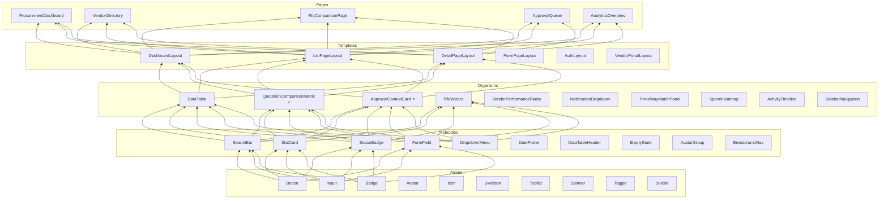

## 6.2 Atom Examples

### `<Button>`

```
Props:
  variant:  'primary' | 'secondary' | 'ghost' | 'danger' | 'success'
  size:     'xs' | 'sm' | 'md' | 'lg'
  loading:  boolean (shows spinner, disables interaction)
  icon:     ReactNode (leading icon)
  iconEnd:  ReactNode (trailing icon)
  fullWidth: boolean
  disabled: boolean

Features:
  - Keyboard accessible (focus ring on Tab)
  - Loading state replaces text with spinner
  - Ripple effect on click (micro-animation)
  - CSS custom properties for theming
```

### `<Badge>`

```
Props:
  variant:  'default' | 'success' | 'warning' | 'danger' | 'info'
  size:     'sm' | 'md'
  dot:      boolean (leading colored dot)
  pulse:    boolean (pulse animation for urgent items)
  
Procurement-specific presets:
  <Badge variant="success" dot>Approved</Badge>
  <Badge variant="warning" dot pulse>Pending Approval</Badge>
  <Badge variant="danger" dot>Rejected</Badge>
  <Badge variant="info" dot>Draft</Badge>
```

### `<Input>`

```
Props:
  label:        string (floating label animation)
  error:        string (validation message)
  helpText:     string
  prefix:       ReactNode (e.g., ₹ symbol)
  suffix:       ReactNode (e.g., unit selector)
  loading:      boolean (inline spinner)
  
Features:
  - Floating label on focus (animation)
  - Error state with red border + message
  - Character count for text areas
  - Input masking for currency, phone
```

## 6.3 Molecule Examples

### `<StatCard>` (KPI Card)

```
Props:
  title:      string ("Total Spend MTD")
  value:      string | number ("₹24,50,000")
  change:     number (+12.5)
  trend:      'up' | 'down' | 'flat'
  icon:       ReactNode
  sparkline:  number[] (last 7 data points)
  loading:    boolean (shows skeleton)

Behavior:
  - Value animates on mount (counter animation)
  - Trend arrow + percentage colored green/red
  - Sparkline renders as inline SVG mini-chart
  - Hover: subtle elevation + glow
```

### `<VendorCard>`

```
Props:
  vendor:    Vendor (company name, rating, categories, status)
  compact:   boolean (for list view vs. grid view)
  
Renders:
  - Company name + avatar/logo
  - Star rating (filled stars)
  - Category tags (max 3, "+N more")
  - Status badge (approved/pending/suspended)
  - Quick actions (view, edit) on hover
```

### `<SearchBar>`

```
Props:
  placeholder: string
  onSearch:    (query: string) => void
  filters:     FilterConfig[] (rendered as dropdown chips)
  suggestions: boolean (autocomplete)
  
Behavior:
  - Debounced input (300ms)
  - Filter chips below search input
  - Cmd+K keyboard shortcut to focus
  - Recent searches in dropdown
```

## 6.4 Organism Examples

### `<QuotationComparisonMatrix>` ⭐

```
Props:
  rfqId:       string
  quotations:  QuotationComparison[]
  rfqItems:    RfqItem[]
  
Structure:
  ┌──────────────────┬────────────┬────────────┬────────────┐
  │ Item             │ Vendor A   │ Vendor B   │ Vendor C   │
  │                  │ ★ 4.2     │ ★ 3.8     │ ★ 4.5     │
  │                  │ 15 days   │ 10 days   │ 20 days   │
  ├──────────────────┼────────────┼────────────┼────────────┤
  │ Office Chairs    │ ₹2,500 🟢 │ ₹2,800    │ ₹3,100 🔴 │
  │ Standing Desks   │ ₹8,000    │ ₹7,500 🟢 │ ₹8,200 🔴 │
  │ Monitor Arms     │ ₹1,200 🟢 │ ₹1,500    │ ₹1,350    │
  ├──────────────────┼────────────┼────────────┼────────────┤
  │ TOTAL            │ ₹11,700   │ ₹11,800   │ ₹12,650   │
  │ Weighted Score   │ 87/100    │ 82/100    │ 79/100    │
  │                  │ 🏆 RECOMMENDED          │            │
  └──────────────────┴────────────┴────────────┴────────────┘
  
Features:
  - Color gradient: green (lowest) → red (highest) per row
  - Pin a column for side-by-side scroll on many vendors
  - Hover cell → tooltip: "15% below avg" or "Historical: ₹2,200 last quarter"
  - Score breakdown popover (price 40%, delivery 30%, rating 30%)
  - "Select Vendor" CTA per column
```

### `<ApprovalContextCard>` ⭐

```
Props:
  approval:     ApprovalRequest
  entityData:   PurchaseOrder | VendorRegistration
  
Structure:
  ┌─────────────────────────────────────────────────────────┐
  │ 🟡 PENDING APPROVAL — Purchase Order PO-2026-0042      │
  ├──────────────────────────┬──────────────────────────────┤
  │ Requester: Priya Sharma  │ Amount: ₹1,85,000           │
  │ Vendor: TechSupply Co.   │ Category: IT Equipment      │
  │ Submitted: 2h ago        │ Due: 22h remaining          │
  ├──────────────────────────┴──────────────────────────────┤
  │ 📊 CONTEXT                                             │
  │ ┌────────────┐ ┌────────────┐ ┌─────────────────────┐  │
  │ │ Budget     │ │ Vendor     │ │ Price History       │  │
  │ │ ████░░ 62% │ │ ★★★★☆ 4.2 │ │ ↑ 3% vs last order │  │
  │ │ Used       │ │ On-time 94%│ │ ↓ 8% vs market avg │  │
  │ └────────────┘ └────────────┘ └─────────────────────┘  │
  │ ⚠️ This exceeds typical order size by 40%               │
  ├─────────────────────────────────────────────────────────┤
  │ [💬 Comment...]    [ ❌ Reject ]    [ ✅ Approve ]      │
  └─────────────────────────────────────────────────────────┘
  
  Key: Managers make informed decisions without leaving the page.
```

### `<ActivityTimeline>`

```
Props:
  entityType: 'rfq' | 'po' | 'vendor' | 'invoice'
  entityId:   string
  
Renders:
  ● Created by Priya Sharma ——————————— Jun 1, 9:30 AM
  │  "Created RFQ for IT Equipment Q3"
  │
  ● Sent to 3 vendors ————————————————— Jun 1, 10:15 AM  
  │  TechSupply Co., OfficeMax, FurniPro
  │
  ● Quotation received from TechSupply — Jun 3, 2:45 PM
  │  Total: ₹1,85,000 · 15 day delivery
  │
  ● All quotations received —————————— Jun 4, 11:00 AM
  │
  ● Vendor selected: TechSupply Co. —— Jun 4, 3:20 PM
  │  Score: 87/100 · Recommended by system
  │
  ● PO-2026-0042 generated ——————————— Jun 4, 3:21 PM
```

## 6.5 Template Examples

### `<DashboardLayout>`

```
Structure:
  ┌─────────────────────────────────────────────────────────┐
  │ Header: Logo · Search (Cmd+K) · Notifications · Avatar │
  ├────────┬────────────────────────────────────────────────┤
  │        │  ┌──────┐ ┌──────┐ ┌──────┐ ┌──────┐         │
  │  Side  │  │ KPI  │ │ KPI  │ │ KPI  │ │ KPI  │         │
  │  bar   │  └──────┘ └──────┘ └──────┘ └──────┘         │
  │        │  ┌──────────────────┐ ┌────────────────┐      │
  │  Nav   │  │  Primary Chart   │ │ Secondary      │      │
  │        │  │  (Area/Bar)      │ │ Chart (Donut)  │      │
  │        │  └──────────────────┘ └────────────────┘      │
  │        │  ┌──────────────────────────────────────┐      │
  │        │  │  Action Required Table / Feed         │      │
  │        │  └──────────────────────────────────────┘      │
  └────────┴────────────────────────────────────────────────┘
```

### `<ListPageLayout>`

```
Structure:
  ┌─────────────────────────────────────────────────────────┐
  │ Header: Page Title · [+ Create] button                  │
  ├─────────────────────────────────────────────────────────┤
  │ Tabs: All (120) · Draft (5) · Active (45) · Closed (70)│
  ├─────────────────────────────────────────────────────────┤
  │ SearchBar · Filters · Sort · View Toggle (Table/Card)   │
  ├─────────────────────────────────────────────────────────┤
  │ DataTable / CardGrid                                    │
  │ ┌──────────────────────────────────────────────────┐    │
  │ │ Row 1 ...                                         │    │
  │ │ Row 2 ...                                         │    │
  │ │ Row N ...                                         │    │
  │ └──────────────────────────────────────────────────┘    │
  ├─────────────────────────────────────────────────────────┤
  │ Pagination: ← 1 2 3 ... 8 → · Showing 1-20 of 150     │
  └─────────────────────────────────────────────────────────┘
```

### `<DetailPageLayout>`

```
Structure:
  ┌─────────────────────────────────────────────────────────┐
  │ Breadcrumb: Vendors > TechSupply Co.                    │
  ├─────────────────────────────────────────────────────────┤
  │ Entity Header: Name · Status Badge · Action Buttons     │
  ├──────────────────────────────┬──────────────────────────┤
  │ Main Content (2/3 width)     │ Sidebar (1/3 width)      │
  │ ┌──────────────────────────┐ │ ┌────────────────────┐   │
  │ │ Tab: Details│Items│Docs  │ │ │ Status Timeline    │   │
  │ └──────────────────────────┘ │ │                    │   │
  │ ┌──────────────────────────┐ │ │ Activity Feed      │   │
  │ │ Content Area             │ │ │                    │   │
  │ │ (varies by active tab)   │ │ │ Related Entities   │   │
  │ └──────────────────────────┘ │ └────────────────────┘   │
  └──────────────────────────────┴──────────────────────────┘
```

---

# 7. Design System

## 7.1 Design Philosophy

> Inspired by **Linear** (speed & precision), **Stripe Dashboard** (data density), **Vercel** (minimal elegance), **Ramp** (financial clarity), and **Notion** (comfortable information hierarchy). 
> **Not** Bootstrap. **Not** generic Material UI. **Not** admin templates.

## 7.2 Color System

### Dark Mode (Primary)

| Token | Value | Usage |
|-------|-------|-------|
| `--bg-base` | `#09090b` (Zinc-950) | Page background |
| `--bg-surface` | `#18181b` (Zinc-900) | Card backgrounds |
| `--bg-elevated` | `#27272a` (Zinc-800) | Elevated cards, dropdowns |
| `--bg-overlay` | `#3f3f46` (Zinc-700) | Hover states, active |
| `--border-subtle` | `#27272a` | Default borders |
| `--border-default` | `#3f3f46` | Input borders |
| `--border-strong` | `#52525b` | Focus borders |
| `--text-primary` | `#fafafa` | Headings, primary text |
| `--text-secondary` | `#a1a1aa` (Zinc-400) | Descriptions, labels |
| `--text-tertiary` | `#71717a` (Zinc-500) | Placeholders, disabled |

### Semantic Colors

| Token | Value | Usage |
|-------|-------|-------|
| `--accent-primary` | `#818cf8` (Indigo-400) | Primary buttons, links, focus |
| `--accent-primary-hover` | `#6366f1` (Indigo-500) | Button hover |
| `--accent-primary-muted` | `rgba(129,140,248,0.15)` | Selected row, active nav |
| `--success` | `#34d399` (Emerald-400) | Approved, matched, on-track |
| `--success-muted` | `rgba(52,211,153,0.15)` | Success backgrounds |
| `--warning` | `#fbbf24` (Amber-400) | Pending, attention needed |
| `--warning-muted` | `rgba(251,191,36,0.15)` | Warning backgrounds |
| `--danger` | `#f87171` (Red-400) | Rejected, errors, overdue |
| `--danger-muted` | `rgba(248,113,113,0.15)` | Danger backgrounds |
| `--info` | `#60a5fa` (Blue-400) | Draft, informational |

### Comparison Matrix Colors (Quotation Engine)

| Token | Purpose |
|-------|---------|
| `--price-lowest` → `#34d399` | Best price cell glow |
| `--price-highest` → `#f87171` | Worst price cell glow |
| `--price-mid` → `#fbbf24` | Mid-range price |
| `--gradient-rank` | `linear-gradient(135deg, #818cf8, #34d399)` — winner gradient |

### Light Mode

| Token | Value |
|-------|-------|
| `--bg-base` | `#ffffff` |
| `--bg-surface` | `#f4f4f5` (Zinc-100) |
| `--bg-elevated` | `#e4e4e7` (Zinc-200) |
| `--text-primary` | `#09090b` (Zinc-950) |
| `--text-secondary` | `#52525b` (Zinc-600) |
| `--accent-primary` | `#6366f1` (Indigo-500) |

## 7.3 Typography

| Token | Properties | Usage |
|-------|-----------|-------|
| `--font-family` | `'Inter', -apple-system, sans-serif` | All text |
| `--font-mono` | `'JetBrains Mono', monospace` | Codes, IDs, amounts |
| `--text-display` | `36px / 40px · 700 · -0.02em` | Page titles (Dashboard, Analytics) |
| `--text-h1` | `30px / 36px · 600 · -0.02em` | Section headers |
| `--text-h2` | `24px / 32px · 600 · -0.01em` | Card titles |
| `--text-h3` | `20px / 28px · 600` | Sub-section headers |
| `--text-h4` | `16px / 24px · 600` | Table headers, labels |
| `--text-body` | `14px / 20px · 400` | Default body text |
| `--text-body-sm` | `13px / 18px · 400` | Table cells, secondary info |
| `--text-caption` | `12px / 16px · 500` | Badges, timestamps, help text |
| `--text-overline` | `11px / 16px · 600 · 0.05em · UPPERCASE` | Section labels, category tags |

### Numeric/Financial Typography

```css
.currency-amount {
  font-family: var(--font-mono);
  font-variant-numeric: tabular-nums;
  letter-spacing: -0.01em;
  font-weight: 600;
}
/* ₹24,50,000 — monospaced digits align in tables */
```

## 7.4 Spacing Scale

| Token | Value | Usage |
|-------|-------|-------|
| `--space-1` | `4px` | Inline icon gaps |
| `--space-2` | `8px` | Badge padding, tight gaps |
| `--space-3` | `12px` | Input padding, card inner |
| `--space-4` | `16px` | Component gaps |
| `--space-5` | `20px` | Card padding |
| `--space-6` | `24px` | Section gaps |
| `--space-8` | `32px` | Major section spacing |
| `--space-10` | `40px` | Page-level padding |
| `--space-12` | `48px` | Dashboard grid gaps |

## 7.5 Border Radius

| Token | Value | Usage |
|-------|-------|-------|
| `--radius-sm` | `4px` | Badges, tags |
| `--radius-md` | `8px` | Buttons, inputs |
| `--radius-lg` | `12px` | Cards, modals |
| `--radius-xl` | `16px` | Feature panels, dialogs |
| `--radius-full` | `9999px` | Avatars, pills |

## 7.6 Shadows & Elevation

| Token | Value | Usage |
|-------|-------|-------|
| `--shadow-xs` | `0 1px 2px rgba(0,0,0,0.3)` | Subtle lift |
| `--shadow-sm` | `0 2px 4px rgba(0,0,0,0.3)` | Cards at rest |
| `--shadow-md` | `0 4px 12px rgba(0,0,0,0.4)` | Dropdowns, popovers |
| `--shadow-lg` | `0 8px 24px rgba(0,0,0,0.5)` | Modals |
| `--shadow-glow-primary` | `0 0 20px rgba(129,140,248,0.3)` | Focus ring glow |
| `--shadow-glow-success` | `0 0 20px rgba(52,211,153,0.3)` | Approved state glow |

### Glassmorphism (Login + Feature Cards)

```css
.glass-card {
  background: rgba(24, 24, 27, 0.6);
  backdrop-filter: blur(16px) saturate(180%);
  border: 1px solid rgba(63, 63, 70, 0.5);
  box-shadow: 0 8px 32px rgba(0, 0, 0, 0.4);
}
```

## 7.7 Animation Principles

| Principle | Token | Value | Usage |
|-----------|-------|-------|-------|
| **Duration (micro)** | `--duration-fast` | `100ms` | Button press, toggle |
| **Duration (standard)** | `--duration-normal` | `200ms` | Hover effects, focus |
| **Duration (emphasis)** | `--duration-slow` | `300ms` | Modal open, page transitions |
| **Duration (dramatic)** | `--duration-slower` | `500ms` | Dashboard card stagger, chart animate |
| **Easing (default)** | `--ease-default` | `cubic-bezier(0.4, 0, 0.2, 1)` | General transitions |
| **Easing (enter)** | `--ease-enter` | `cubic-bezier(0, 0, 0.2, 1)` | Elements appearing |
| **Easing (exit)** | `--ease-exit` | `cubic-bezier(0.4, 0, 1, 1)` | Elements leaving |
| **Easing (spring)** | `--ease-spring` | `cubic-bezier(0.34, 1.56, 0.64, 1)` | Playful bounce (notifications) |

### Animation Patterns

| Pattern | Implementation | Where Used |
|---------|---------------|------------|
| **Counter animation** | `useCountUp(targetValue, 1500ms)` | KPI card numbers on mount |
| **Stagger entrance** | Children delay by `i * 80ms` | Dashboard cards, table rows |
| **Skeleton shimmer** | Gradient keyframe animation | All loading states |
| **Chart morph** | Recharts `animationBegin` + `animationDuration` | All chart renders |
| **Page slide** | `translateY(8px)` → `0` + `opacity 0→1` | Route transitions |
| **Notification pulse** | Scale 1→1.15→1 loop | Urgent approval badge |
| **Toast slide-in** | `translateX(100%)` → `0` from right | Sonner toast notifications |

---

# 8. Dashboard Architecture

## 8.1 Procurement Officer Dashboard

```
┌───────────────────────────────────────────────────────────────────┐
│ Good morning, Priya 👋                                    Jun 6  │
├────────────┬────────────┬────────────┬────────────────────────────┤
│ 📋 Open    │ ⏳ Pending │ 📦 Active  │ 💰 Spend MTD              │
│ RFQs       │ Approvals  │ POs        │                           │
│ 12         │ 3          │ 28         │ ₹24.5L                    │
│ ↑ 2 new    │ 🔴 1 urgent│ ↑ 5 this wk│ ↑ 12% vs last month      │
│ ┈┈╱╲╱╲┈   │ ┈┈┈╱╲┈┈   │ ┈┈╱╲╱╲┈   │ ┈┈╱╲╱╲╱╲┈               │
├────────────┴────────────┴────────────┴────────────────────────────┤
│                                                                   │
│  Spend Trend (Last 6 Months)            RFQ Conversion Funnel     │
│  ┌─────────────────────────┐            ┌──────────────────┐     │
│  │  ╱╲   ╱╲               │            │ Created     45   │     │
│  │ ╱  ╲ ╱  ╲   ╱╲         │            │ Sent        38   │     │
│  │╱    ╲    ╲ ╱  ╲╱╲      │            │ Quoted      32   │     │
│  │ (gradient filled area)  │            │ Awarded     28   │     │
│  └─────────────────────────┘            │ PO Created  26   │     │
│                                          └──────────────────┘     │
├───────────────────────────────────────────────────────────────────┤
│ 🚨 Action Required                                               │
│ ┌─────────────────────────────────────────────────────────────┐   │
│ │ ● RFQ-2026-0089: 3 quotations received — Compare Now →     │   │
│ │ ● PO-2026-0042: Awaiting vendor acknowledgment — Follow Up │   │
│ │ ● INV-2026-0156: 3-way match exception — Review →          │   │
│ │ ● RFQ-2026-0092: Deadline tomorrow — 1 vendor pending      │   │
│ └─────────────────────────────────────────────────────────────┘   │
└───────────────────────────────────────────────────────────────────┘
```

| Widget | Data Source | Refresh Rate | Chart Type |
|--------|-----------|-------------|-----------|
| KPI Cards (×4) | `GET /analytics/dashboard` | 60s | Sparkline (inline SVG) |
| Spend Trend | `GET /analytics/trends?months=6` | 5min | Area chart (gradient fill) |
| RFQ Funnel | `GET /analytics/rfq-conversion` | 5min | Vertical funnel |
| Action Items | `GET /notifications?actionable=true` | 30s (+ WebSocket push) | Action table |

## 8.2 Manager Dashboard

```
┌───────────────────────────────────────────────────────────────────┐
│ Pending Approvals — 5 items need your attention                   │
├──────────────────────────┬──────────────────────────┬─────────────┤
│ 🟡 PO-2026-0042         │ 🟡 PO-2026-0044         │ 🔴 VENDOR   │
│ TechSupply Co.           │ OfficeMax Ltd.           │ Registration│
│ ₹1,85,000 · IT Equip    │ ₹42,000 · Stationery    │ FurniPro    │
│ Budget: ████░░ 62%       │ Budget: ██░░░░ 28%       │ New Vendor  │
│ Vendor: ★★★★☆ 4.2       │ Vendor: ★★★☆☆ 3.8       │ Pending 48h │
│ [Reject] [✅ Approve]   │ [Reject] [✅ Approve]   │ [Review →]  │
├──────────────────────────┴──────────────────────────┴─────────────┤
│                                                                   │
│  Budget Utilization                    Dept Spend by Category     │
│  ┌──────────────────┐                  ┌──────────────────┐      │
│  │ ████████████░░░░ │ 68%              │    IT (42%)      │      │
│  │ Committed: ₹34L  │                  │  ╭───────────╮   │      │
│  │ Available: ₹16L  │                  │  │   Office   │   │      │
│  │ Budget:    ₹50L  │                  │  │   (28%)    │   │      │
│  └──────────────────┘                  │  ╰───────────╯   │      │
│                                         │    Maint (18%)   │      │
│  Approval Efficiency                   │    Other (12%)   │      │
│  Avg Time: 3.2h ✅ (target: <8h)       └──────────────────┘      │
│  Escalation Rate: 8% ✅ (<15%)                                    │
└───────────────────────────────────────────────────────────────────┘
```

## 8.3 Vendor Dashboard

```
┌───────────────────────────────────────────────────────────────────┐
│ Welcome back, TechSupply Co.                                      │
├────────────┬────────────┬────────────┬────────────────────────────┤
│ 📋 Open    │ 📄 Active  │ 📦 Active  │ 💰 Pending               │
│ RFQs       │ Quotes     │ POs        │ Payments                  │
│ 4          │ 6          │ 12         │ ₹3.2L                     │
│ 2 new today│ 1 selected │ 3 delivery │ Due within 15 days        │
├────────────┴────────────┴────────────┴────────────────────────────┤
│                                                                   │
│  📋 RFQ Invitations Requiring Response                            │
│  ┌────────────────────────────────────────────────────────────┐   │
│  │ RFQ-2026-0089 · IT Equipment Q3 · Due: Jun 8 (2 days)    │   │
│  │ 5 items · Est. Budget: ₹2,00,000     [Respond Now →]     │   │
│  ├────────────────────────────────────────────────────────────┤   │
│  │ RFQ-2026-0091 · Office Supplies · Due: Jun 12 (6 days)   │   │
│  │ 8 items · Est. Budget: ₹50,000       [Respond Now →]     │   │
│  └────────────────────────────────────────────────────────────┘   │
│                                                                   │
│  My Performance Score          Payment Timeline                   │
│  ┌────────────────────┐        ┌──────────────────────────────┐  │
│  │ Overall: ★★★★☆ 4.2│        │ ● INV-156: ₹85K · Due Jun 15│  │
│  │ On-time:  94% ✅   │        │ ● INV-149: ₹42K · Due Jun 22│  │
│  │ Quality:  4.5/5    │        │ ● INV-142: ₹1.2L · Paid ✅  │  │
│  │ Response: 88%      │        └──────────────────────────────┘  │
│  └────────────────────┘                                           │
└───────────────────────────────────────────────────────────────────┘
```

## 8.4 Admin Dashboard

```
┌───────────────────────────────────────────────────────────────────┐
│ System Overview                                        Admin Panel│
├────────────┬────────────┬────────────┬────────────────────────────┤
│ 👥 Active  │ 🏢 Total   │ 📋 Active  │ 📊 System                │
│ Users      │ Vendors    │ RFQs       │ Health                    │
│ 84/120     │ 245        │ 38         │ ✅ All Systems Normal     │
│ Online now │ 12 pending │ 15 open    │ API: 45ms avg             │
├────────────┴────────────┴────────────┴────────────────────────────┤
│                                                                   │
│  User Activity (Last 7 Days)       Vendor Status Distribution     │
│  ┌─────────────────────────┐       ┌──────────────────────┐      │
│  │ █████ Mon: 84 actions   │       │ ✅ Active:    189    │      │
│  │ ████  Tue: 72 actions   │       │ 🟡 Pending:   12    │      │
│  │ ██████ Wed: 96 actions  │       │ ⏸️ Suspended:  8    │      │
│  │ ███   Thu: 45 actions   │       │ 🚫 Blacklisted: 3   │      │
│  └─────────────────────────┘       └──────────────────────┘      │
│                                                                   │
│  Recent Audit Log                                                 │
│  ┌────────────────────────────────────────────────────────────┐   │
│  │ 10:23 AM · Priya updated PO-2026-0042 status → sent      │   │
│  │ 10:15 AM · Anand approved PO-2026-0041                    │   │
│  │ 09:58 AM · Vendor TechSupply updated profile              │   │
│  │ 09:45 AM · System escalated approval APR-0089             │   │
│  └────────────────────────────────────────────────────────────┘   │
└───────────────────────────────────────────────────────────────────┘
```

---

# 9. Quotation Comparison Engine UI ⭐

> This is the flagship feature — the one judges remember 24 hours later.

## 9.1 Screen Layout

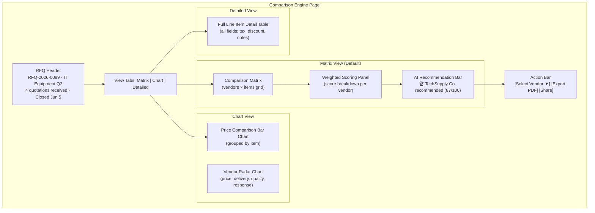

## 9.2 Matrix View — Detailed Wireframe

```
┌────────────────────────────────────────────────────────────────────────┐
│ Quotation Comparison · RFQ-2026-0089 · IT Equipment Q3                │
│ 4 quotations · Budget estimate: ₹2,00,000                             │
├────────────────────────────────────────────────────────────────────────┤
│ [Matrix ⬛] [Chart ◻] [Detailed ◻]      Weight: Price 40% · Del 30% · Rating 30%  │
├──────────────┬──────────────┬──────────────┬──────────────┬───────────┤
│              │ 🏆 TechSupply│  OfficeMax   │  FurniPro    │ QuickBuy  │
│              │   Co.        │   Ltd.       │   Inc.       │  Traders  │
│              │ ★★★★☆ 4.2   │ ★★★☆☆ 3.8   │ ★★★★★ 4.5   │ ★★★☆☆ 3.5│
│              │ 📦 15 days   │ 📦 10 days   │ 📦 20 days   │ 📦 12 days│
│              │ 💳 Net 30    │ 💳 Net 45    │ 💳 Net 30    │ 💳 Net 15 │
├──────────────┼──────────────┼──────────────┼──────────────┼───────────┤
│ Office Chairs│ ₹2,500  🟢  │ ₹2,800      │ ₹3,100  🔴  │ ₹2,650   │
│ ×20 pcs      │ ₹50,000     │ ₹56,000     │ ₹62,000     │ ₹53,000  │
│              │ -8% vs avg ↓│              │ +12% vs avg↑│           │
├──────────────┼──────────────┼──────────────┼──────────────┼───────────┤
│ Standing Desk│ ₹8,000      │ ₹7,500  🟢  │ ₹8,200      │ ₹9,000 🔴│
│ ×10 pcs      │ ₹80,000     │ ₹75,000     │ ₹82,000     │ ₹90,000  │
├──────────────┼──────────────┼──────────────┼──────────────┼───────────┤
│ Monitor Arms │ ₹1,200  🟢  │ ₹1,500      │ ₹1,350      │ ₹1,400   │
│ ×20 pcs      │ ₹24,000     │ ₹30,000     │ ₹27,000     │ ₹28,000  │
├──────────────┼──────────────┼──────────────┼──────────────┼───────────┤
│ Cable Mgmt   │ ₹400        │ ₹350   🟢   │ ₹500   🔴   │ ₹380     │
│ ×30 pcs      │ ₹12,000     │ ₹10,500     │ ₹15,000     │ ₹11,400  │
╞══════════════╪══════════════╪══════════════╪══════════════╪═══════════╡
│ SUBTOTAL     │ ₹1,66,000   │ ₹1,71,500   │ ₹1,86,000   │ ₹1,82,400│
│ TAX (18%)    │ ₹29,880     │ ₹30,870     │ ₹33,480     │ ₹32,832  │
│ GRAND TOTAL  │ ₹1,95,880   │ ₹2,02,370   │ ₹2,19,480   │ ₹2,15,232│
╞══════════════╪══════════════╪══════════════╪══════════════╪═══════════╡
│ SCORE        │              │              │              │           │
│  Price (40%) │ ██████░░ 36  │ █████░░░ 32  │ ████░░░░ 28  │ ████░░░░ 29│
│  Deliv (30%) │ █████░░░ 22  │ ███████░ 28  │ ████░░░░ 18  │ ██████░░ 25│
│  Rating(30%) │ ██████░░ 25  │ █████░░░ 23  │ ███████░ 27  │ ████░░░░ 21│
│  ────────────│──────────────│──────────────│──────────────│───────────│
│  TOTAL       │ 83/100  🥇  │ 83/100  🥈  │ 73/100       │ 75/100   │
├──────────────┴──────────────┴──────────────┴──────────────┴───────────┤
│ 🏆 RECOMMENDATION: TechSupply Co. — Best overall value               │
│ Lowest total price with strong vendor rating (4.2).                   │
│ Delivery in 15 days is acceptable for category timeline.              │
│                                                                        │
│           [ ✅ Select TechSupply Co. ] [ Compare in Detail → ]        │
└────────────────────────────────────────────────────────────────────────┘
```

## 9.3 Scoring Methodology

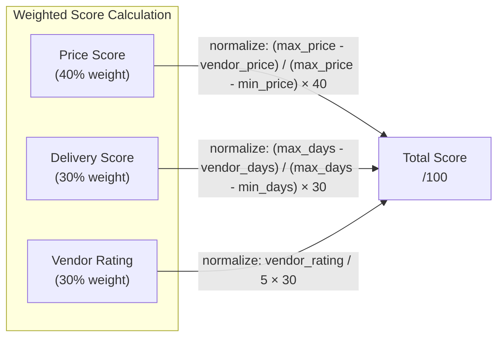

**Price Score Formula**: `((maxTotal - vendorTotal) / (maxTotal - minTotal)) × 40`
- Vendor with lowest price gets 40/40; highest gets 0/40

**Delivery Score Formula**: `((maxDays - vendorDays) / (maxDays - minDays)) × 30`
- Vendor with fastest delivery gets 30/30

**Rating Score Formula**: `(vendorRating / 5.0) × 30`
- 5-star vendor gets 30/30

## 9.4 UX Innovations in the Comparison Engine

| Feature | Implementation | Impact |
|---------|---------------|--------|
| **Color gradient cells** | CSS `background: hsl(${120 * (1 - normalizedPrice)}, 70%, 15%)` | Instant visual pattern recognition |
| **Historical price tooltip** | Hover → "Last order: ₹2,200 (Jun 2025) · +13.6% increase" | Detects price creep |
| **Score breakdown popover** | Click score → animated bar chart breakdown | Transparent methodology |
| **Column pinning** | First column (items) stays fixed on horizontal scroll | Usable with 5+ vendors |
| **Keyboard navigation** | Arrow keys traverse cells; Enter selects vendor | Power user efficiency |
| **Recommendation reasoning** | AI-style natural language explanation below matrix | Builds trust in scoring |
| **Weight adjustment sliders** | Adjustable weights (price/delivery/rating) — scores recalculate live | Customizable decision-making |

---

# 10. Performance Architecture

## 10.1 Code Splitting Strategy

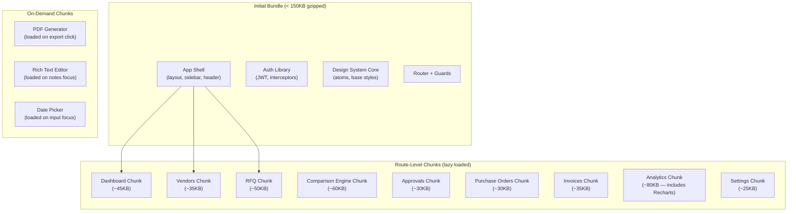

## 10.2 Performance Budget

| Metric | Target | Strategy |
|--------|--------|----------|
| **First Contentful Paint** | < 1.2s | SSR shell; inline critical CSS; preload Inter font |
| **Largest Contentful Paint** | < 2.0s | SSR dashboard KPIs; skeleton loading for charts |
| **Time to Interactive** | < 3.0s | Code-split non-critical routes; defer analytics scripts |
| **Cumulative Layout Shift** | < 0.05 | Fixed skeleton dimensions; font `size-adjust`; image aspect ratios |
| **Total Blocking Time** | < 150ms | Avoid large synchronous computations; use `requestIdleCallback` for non-critical work |
| **Bundle Size (initial)** | < 150KB gz | Tree-shake aggressively; no full lodash; tiny icon imports |
| **Lighthouse Score** | 95+ | All of the above combined |

## 10.3 Rendering Strategies by Page Type

| Page Type | Rendering | Rationale |
|-----------|-----------|-----------|
| Dashboard | **SSR + Client hydration** | Fast first paint with KPIs; charts hydrate on client |
| List pages (vendors, RFQs) | **CSR with skeleton** | Data changes frequently; server rendering wastes compute |
| Detail pages | **SSR for above-fold** + **CSR for tabs** | Header/status renders fast; tab content lazy loads |
| Comparison engine | **CSR** | Highly interactive; data fetched on navigation |
| Analytics | **SSR for KPI summary** + **CSR for charts** | KPI numbers render server-side; chart libs are CSR-only |
| Login page | **SSG** | Static page; cached at CDN edge |
| Settings | **CSR** | Low traffic; no SEO value |

## 10.4 Table Optimization (TanStack Table)

| Technique | Implementation | Impact |
|-----------|---------------|--------|
| **Virtualization** | `@tanstack/react-virtual` for 1000+ row tables | Renders only ~20 visible rows; DOM stays small |
| **Column virtualization** | Horizontal virtualization for comparison matrix | Handles 10+ vendor columns |
| **Pagination** | Server-side pagination (`?page=1&limit=20`) | Never loads full dataset |
| **Debounced filters** | 300ms debounce on filter inputs | Reduces API calls |
| **Memoized rows** | `React.memo` on row components | Prevents re-render on sibling updates |
| **Sticky headers** | `position: sticky` on `<thead>` | Header visible during scroll |

## 10.5 Dashboard Rendering Strategy

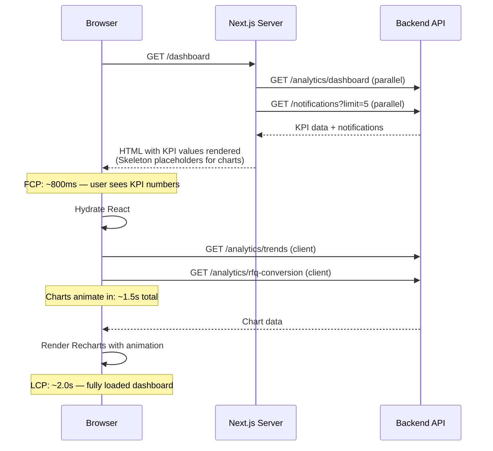

## 10.6 Caching Architecture

| Layer | Implementation | TTL | Invalidation |
|-------|---------------|-----|-------------|
| **Browser Cache** | Service Worker for static assets | Immutable (hashed filenames) | Deploy invalidates |
| **CDN** | Next.js static export for marketing pages | 1 hour | Manual purge |
| **React Query** | In-memory query cache | 5 min default (tuned per feature) | Mutation → `invalidateQueries` |
| **localStorage** | UI preferences (theme, sidebar, density) | Permanent | User action only |
| **sessionStorage** | Wizard draft state (RFQ create) | Session | Form submit clears |

---

# 11. Security Architecture

## 11.1 Authentication Flow

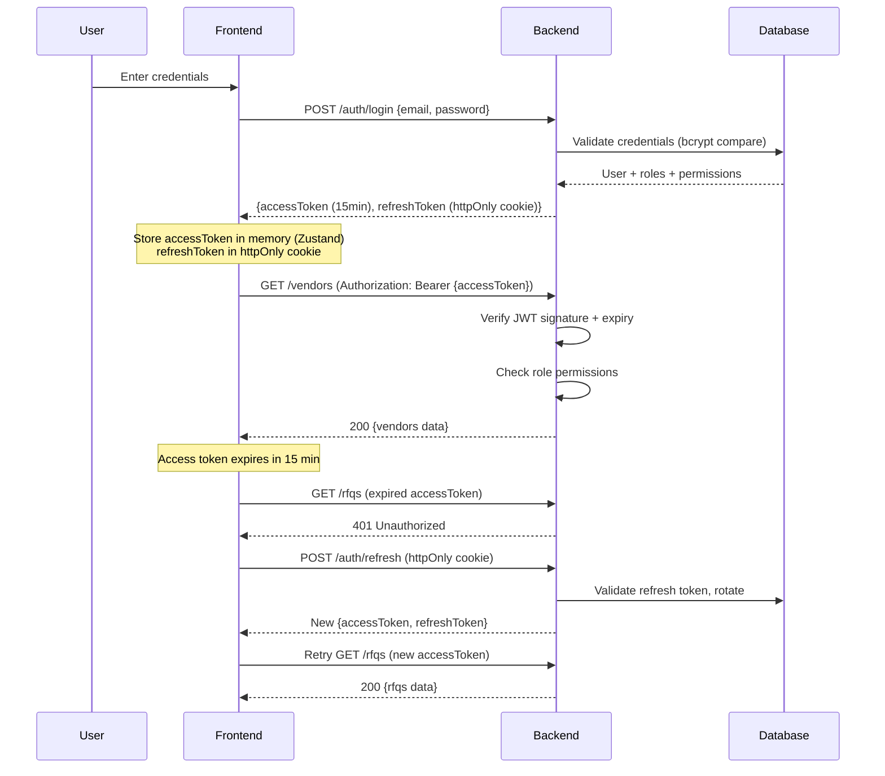

## 11.2 Token Storage Strategy

| Token | Storage | Rationale |
|-------|---------|-----------|
| **Access Token** | Zustand in-memory (JavaScript variable) | Not accessible via XSS (not in localStorage); short-lived (15min) |
| **Refresh Token** | httpOnly, Secure, SameSite=Strict cookie | Not accessible via JavaScript; browser sends automatically; CSRF-safe with SameSite |
| **User Profile** | Zustand (hydrated from `/auth/me` on mount) | Avoids localStorage tampering; re-verified from server on refresh |
| **Role/Permissions** | Zustand (from JWT claims + server verification) | Client uses for UI gating; server re-verifies on every API call |

> [!WARNING]
> **Never store JWT in localStorage or sessionStorage.** These are accessible to XSS attacks. Access tokens live only in JavaScript memory; refresh tokens live only in httpOnly cookies.

## 11.3 RBAC Permission Guard Architecture

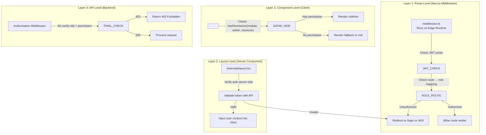

## 11.4 Frontend Security Checklist

| Control | Implementation |
|---------|---------------|
| **XSS Prevention** | React auto-escapes by default; CSP header disallows inline scripts; sanitize user-generated HTML (DOMPurify) for any `dangerouslySetInnerHTML` |
| **CSRF Prevention** | SameSite=Strict cookies; no CORS to unknown origins |
| **Clickjacking** | `X-Frame-Options: DENY` header; `frame-ancestors 'none'` in CSP |
| **Sensitive Data** | Never log tokens or passwords to console; clear auth state on logout |
| **Audit Visibility** | Every page with entity detail shows "Last modified by X at Y" from audit API |
| **Session Management** | Auto-logout after 30min inactivity; single-session enforcement (optional) |
| **Input Validation** | Zod schemas validate all form inputs before API submission |
| **Error Messages** | Generic errors to users ("Invalid credentials"), detailed errors only in server logs |

---

# 12. Real-Time Architecture

## 12.1 WebSocket Event Flow

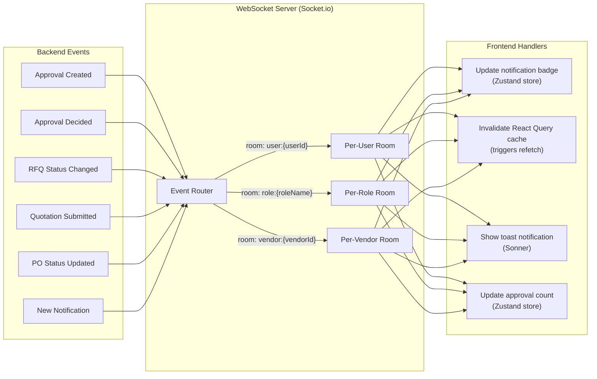

## 12.2 WebSocket Client Architecture

```typescript
// lib/websocket.ts — Singleton connection manager

interface WebSocketEvents {
  'notification:new':       (notification: Notification) => void;
  'approval:created':       (approval: ApprovalRequest) => void;
  'approval:decided':       (data: { id: string; status: string }) => void;
  'rfq:status_changed':     (data: { id: string; status: string }) => void;
  'quotation:submitted':    (data: { rfqId: string; vendorName: string }) => void;
  'po:status_changed':      (data: { id: string; status: string }) => void;
}

// Connection lifecycle:
// 1. Connect on successful login (after JWT obtained)
// 2. Authenticate via handshake (send accessToken)
// 3. Server adds user to rooms: user:{id}, role:{role}
// 4. On token refresh, re-authenticate connection
// 5. Disconnect on logout
// 6. Auto-reconnect with exponential backoff
```

## 12.3 Event → UI Update Mapping

| WebSocket Event | UI Update | Store Update | Query Invalidation |
|----------------|-----------|-------------|-------------------|
| `notification:new` | Toast notification slide-in | `realtimeStore.incrementUnread()` | `['notifications']` |
| `approval:created` | Badge pulse on sidebar "Approvals" | `realtimeStore.setPendingApprovals(+1)` | `['approvals', 'pending']` |
| `approval:decided` | Remove card from approval queue | `realtimeStore.setPendingApprovals(-1)` | `['approvals', 'pending']`, `['purchase-orders', poId]` |
| `rfq:status_changed` | Status badge updates in list | — | `['rfqs']`, `['rfq', rfqId]` |
| `quotation:submitted` | Toast: "New quotation from {vendor}" | — | `['rfq', rfqId, 'quotations']` |
| `po:status_changed` | Timeline step activates | — | `['purchase-orders', poId]` |

## 12.4 Graceful Degradation

| Scenario | Behavior |
|----------|----------|
| WebSocket disconnected | Fall back to React Query polling (30s intervals); show "Reconnecting..." indicator in header |
| WebSocket reconnected | Re-sync unread count via API; invalidate all active queries |
| Slow network | React Query shows stale cached data immediately; fetches updated data in background |
| API down | Error boundary shows friendly message; cached data remains visible; retry button |

---

# 13. Folder Structure

```
vendorbridge/
├── public/
│   ├── favicon.ico
│   ├── logo.svg
│   ├── og-image.png
│   └── fonts/
│       └── inter-var.woff2
│
├── src/
│   ├── app/                                    # Next.js App Router
│   │   ├── layout.tsx                          # Root layout (providers)
│   │   ├── globals.css                         # CSS custom properties
│   │   ├── page.tsx                            # Landing page
│   │   │
│   │   ├── (auth)/                             # Auth route group
│   │   │   ├── layout.tsx
│   │   │   ├── login/page.tsx
│   │   │   ├── register/page.tsx
│   │   │   └── forgot-password/page.tsx
│   │   │
│   │   ├── (internal)/                         # Internal portal
│   │   │   ├── layout.tsx                      # Sidebar + header + AuthGuard
│   │   │   ├── dashboard/page.tsx
│   │   │   ├── vendors/
│   │   │   │   ├── page.tsx
│   │   │   │   ├── new/page.tsx
│   │   │   │   └── [vendorId]/page.tsx
│   │   │   ├── rfqs/
│   │   │   │   ├── page.tsx
│   │   │   │   ├── new/page.tsx
│   │   │   │   └── [rfqId]/
│   │   │   │       ├── page.tsx
│   │   │   │       └── compare/page.tsx        # ⭐ Flagship
│   │   │   ├── quotations/
│   │   │   │   ├── page.tsx
│   │   │   │   └── [quotationId]/page.tsx
│   │   │   ├── approvals/
│   │   │   │   ├── page.tsx
│   │   │   │   ├── history/page.tsx
│   │   │   │   └── rules/page.tsx
│   │   │   ├── purchase-orders/
│   │   │   │   ├── page.tsx
│   │   │   │   └── [poId]/page.tsx
│   │   │   ├── invoices/
│   │   │   │   ├── page.tsx
│   │   │   │   └── [invoiceId]/
│   │   │   │       ├── page.tsx
│   │   │   │       └── match/page.tsx
│   │   │   ├── analytics/
│   │   │   │   ├── page.tsx
│   │   │   │   ├── spend/page.tsx
│   │   │   │   ├── vendors/page.tsx
│   │   │   │   └── risk/page.tsx
│   │   │   └── settings/
│   │   │       ├── page.tsx
│   │   │       ├── users/page.tsx
│   │   │       ├── roles/page.tsx
│   │   │       ├── audit-logs/page.tsx
│   │   │       └── organization/page.tsx
│   │   │
│   │   └── (vendor)/                           # Vendor portal
│   │       ├── layout.tsx
│   │       └── portal/
│   │           ├── page.tsx
│   │           ├── rfqs/
│   │           │   ├── page.tsx
│   │           │   └── [rfqId]/
│   │           │       ├── page.tsx
│   │           │       └── respond/page.tsx
│   │           ├── quotations/page.tsx
│   │           ├── purchase-orders/page.tsx
│   │           ├── invoices/
│   │           │   ├── page.tsx
│   │           │   └── new/page.tsx
│   │           └── profile/page.tsx
│   │
│   ├── features/                               # Feature modules (vertical slices)
│   │   ├── auth/
│   │   │   ├── index.ts
│   │   │   ├── components/
│   │   │   │   ├── LoginForm.tsx
│   │   │   │   ├── RegisterForm.tsx
│   │   │   │   └── PortalSelector.tsx
│   │   │   ├── hooks/
│   │   │   │   ├── useAuth.ts
│   │   │   │   └── usePermissions.ts
│   │   │   ├── api/authApi.ts
│   │   │   ├── stores/authStore.ts             # Zustand auth store
│   │   │   └── types/auth.types.ts
│   │   │
│   │   ├── dashboard/
│   │   │   ├── index.ts
│   │   │   ├── components/
│   │   │   │   ├── DashboardShell.tsx          # Role-based switcher
│   │   │   │   ├── ProcurementDashboard.tsx
│   │   │   │   ├── ManagerDashboard.tsx
│   │   │   │   ├── VendorDashboard.tsx
│   │   │   │   ├── AdminDashboard.tsx
│   │   │   │   └── widgets/
│   │   │   │       ├── KpiCardRow.tsx
│   │   │   │       ├── SpendTrendChart.tsx
│   │   │   │       ├── RfqConversionFunnel.tsx
│   │   │   │       ├── ActionItemsTable.tsx
│   │   │   │       ├── ApprovalQueueWidget.tsx
│   │   │   │       └── BudgetGauge.tsx
│   │   │   ├── hooks/useDashboard.ts
│   │   │   └── api/dashboardApi.ts
│   │   │
│   │   ├── vendors/
│   │   │   ├── index.ts
│   │   │   ├── components/
│   │   │   │   ├── VendorDirectory.tsx
│   │   │   │   ├── VendorProfile.tsx
│   │   │   │   ├── VendorForm.tsx
│   │   │   │   ├── VendorCard.tsx
│   │   │   │   ├── VendorSelector.tsx
│   │   │   │   ├── VendorPerformancePanel.tsx
│   │   │   │   └── VendorStatusTimeline.tsx
│   │   │   ├── hooks/
│   │   │   │   ├── useVendors.ts
│   │   │   │   ├── useVendor.ts
│   │   │   │   └── useVendorMutations.ts
│   │   │   ├── api/vendorApi.ts
│   │   │   ├── types/vendor.types.ts
│   │   │   └── constants/vendorStatus.ts
│   │   │
│   │   ├── rfqs/
│   │   │   ├── index.ts
│   │   │   ├── components/
│   │   │   │   ├── RfqList.tsx
│   │   │   │   ├── RfqDetail.tsx
│   │   │   │   ├── RfqCreateWizard.tsx
│   │   │   │   ├── RfqItemEditor.tsx
│   │   │   │   ├── RfqVendorInvite.tsx
│   │   │   │   └── RfqStatusBadge.tsx
│   │   │   ├── hooks/
│   │   │   │   ├── useRfqs.ts
│   │   │   │   ├── useRfq.ts
│   │   │   │   └── useRfqMutations.ts
│   │   │   ├── api/rfqApi.ts
│   │   │   ├── types/rfq.types.ts
│   │   │   └── utils/rfqValidation.ts
│   │   │
│   │   ├── quotations/
│   │   │   ├── index.ts
│   │   │   ├── components/
│   │   │   │   ├── QuotationList.tsx
│   │   │   │   ├── QuotationSubmitForm.tsx
│   │   │   │   ├── QuotationComparisonEngine.tsx    # ⭐
│   │   │   │   ├── ComparisonMatrix.tsx
│   │   │   │   ├── PriceCell.tsx
│   │   │   │   ├── ScoreBreakdownPopover.tsx
│   │   │   │   ├── VendorColumnHeader.tsx
│   │   │   │   ├── RecommendationBar.tsx
│   │   │   │   └── WeightAdjuster.tsx
│   │   │   ├── hooks/
│   │   │   │   ├── useQuotations.ts
│   │   │   │   ├── useQuotationComparison.ts
│   │   │   │   └── useQuotationMutations.ts
│   │   │   ├── api/quotationApi.ts
│   │   │   ├── types/quotation.types.ts
│   │   │   └── utils/scoringEngine.ts              # Score calculation logic
│   │   │
│   │   ├── approvals/
│   │   │   ├── index.ts
│   │   │   ├── components/
│   │   │   │   ├── ApprovalQueue.tsx
│   │   │   │   ├── ApprovalContextCard.tsx          # ⭐
│   │   │   │   ├── ApprovalActions.tsx
│   │   │   │   ├── ApprovalRuleBuilder.tsx
│   │   │   │   ├── EscalationIndicator.tsx
│   │   │   │   └── BudgetImpactGauge.tsx
│   │   │   ├── hooks/
│   │   │   │   ├── useApprovals.ts
│   │   │   │   └── useApprovalMutations.ts
│   │   │   ├── api/approvalApi.ts
│   │   │   └── types/approval.types.ts
│   │   │
│   │   ├── purchase-orders/
│   │   │   ├── index.ts
│   │   │   ├── components/
│   │   │   │   ├── PoList.tsx
│   │   │   │   ├── PoDetail.tsx
│   │   │   │   ├── PoCreateFromQuotation.tsx
│   │   │   │   ├── PoTimeline.tsx
│   │   │   │   ├── PoLineItemTable.tsx
│   │   │   │   └── GoodsReceiptForm.tsx
│   │   │   ├── hooks/
│   │   │   │   ├── usePurchaseOrders.ts
│   │   │   │   └── usePoMutations.ts
│   │   │   ├── api/poApi.ts
│   │   │   └── types/po.types.ts
│   │   │
│   │   ├── invoices/
│   │   │   ├── index.ts
│   │   │   ├── components/
│   │   │   │   ├── InvoiceList.tsx
│   │   │   │   ├── InvoiceDetail.tsx
│   │   │   │   ├── InvoiceSubmitForm.tsx
│   │   │   │   ├── ThreeWayMatchPanel.tsx           # ⭐
│   │   │   │   └── InvoiceAgingChart.tsx
│   │   │   ├── hooks/
│   │   │   │   ├── useInvoices.ts
│   │   │   │   └── useInvoiceMutations.ts
│   │   │   ├── api/invoiceApi.ts
│   │   │   └── types/invoice.types.ts
│   │   │
│   │   ├── analytics/
│   │   │   ├── index.ts
│   │   │   ├── components/
│   │   │   │   ├── SpendAnalytics.tsx
│   │   │   │   ├── VendorAnalytics.tsx
│   │   │   │   ├── ProcurementKpis.tsx
│   │   │   │   ├── RiskRadar.tsx
│   │   │   │   └── charts/
│   │   │   │       ├── SpendTrendArea.tsx
│   │   │   │       ├── SpendByCategoryTreemap.tsx
│   │   │   │       ├── VendorLeaderboardBar.tsx
│   │   │   │       ├── SpendHeatmap.tsx
│   │   │   │       ├── ApprovalEfficiencyGauge.tsx
│   │   │   │       └── RfqConversionFunnel.tsx
│   │   │   ├── hooks/useAnalytics.ts
│   │   │   └── api/analyticsApi.ts
│   │   │
│   │   └── notifications/
│   │       ├── index.ts
│   │       ├── components/
│   │       │   ├── NotificationBell.tsx
│   │       │   ├── NotificationDropdown.tsx
│   │       │   ├── NotificationItem.tsx
│   │       │   └── NotificationList.tsx
│   │       ├── hooks/useNotifications.ts
│   │       ├── api/notificationApi.ts
│   │       └── types/notification.types.ts
│   │
│   ├── components/                              # Shared design system
│   │   ├── atoms/
│   │   │   ├── Button.tsx
│   │   │   ├── Input.tsx
│   │   │   ├── Badge.tsx
│   │   │   ├── Avatar.tsx
│   │   │   ├── Skeleton.tsx
│   │   │   ├── Spinner.tsx
│   │   │   ├── Toggle.tsx
│   │   │   ├── Tooltip.tsx
│   │   │   ├── Divider.tsx
│   │   │   └── Icon.tsx
│   │   ├── molecules/
│   │   │   ├── SearchBar.tsx
│   │   │   ├── StatCard.tsx
│   │   │   ├── StatusBadge.tsx
│   │   │   ├── FormField.tsx
│   │   │   ├── DropdownMenu.tsx
│   │   │   ├── DatePicker.tsx
│   │   │   ├── Breadcrumb.tsx
│   │   │   ├── EmptyState.tsx
│   │   │   ├── AvatarGroup.tsx
│   │   │   ├── ConfirmDialog.tsx
│   │   │   └── TabNav.tsx
│   │   ├── organisms/
│   │   │   ├── DataTable.tsx
│   │   │   ├── Sidebar.tsx
│   │   │   ├── Header.tsx
│   │   │   ├── ActivityTimeline.tsx
│   │   │   ├── EntityHeader.tsx
│   │   │   ├── FilterPanel.tsx
│   │   │   └── CommandPalette.tsx               # Cmd+K search
│   │   └── templates/
│   │       ├── DashboardLayout.tsx
│   │       ├── ListPageLayout.tsx
│   │       ├── DetailPageLayout.tsx
│   │       ├── FormPageLayout.tsx
│   │       ├── AuthLayout.tsx
│   │       └── VendorPortalLayout.tsx
│   │
│   ├── lib/                                     # Infrastructure
│   │   ├── api/
│   │   │   ├── client.ts                        # Axios instance + interceptors
│   │   │   └── types.ts                         # ApiResponse<T>, PaginatedResponse<T>
│   │   ├── auth/
│   │   │   ├── middleware.ts                    # Route protection logic
│   │   │   └── guards.tsx                       # PermissionGate component
│   │   ├── websocket/
│   │   │   ├── client.ts                        # Socket.io client singleton
│   │   │   ├── events.ts                        # Event type definitions
│   │   │   └── useWebSocket.ts                  # React hook for WS events
│   │   ├── queryClient.ts                       # React Query client config
│   │   └── utils/
│   │       ├── formatters.ts                    # Currency, date, number formatters
│   │       ├── validators.ts                    # Zod schemas
│   │       ├── cn.ts                            # Class name merge utility
│   │       └── constants.ts                     # App-wide constants
│   │
│   ├── stores/                                  # Zustand stores
│   │   ├── authStore.ts
│   │   ├── uiStore.ts
│   │   └── realtimeStore.ts
│   │
│   ├── types/                                   # Global type definitions
│   │   ├── api.types.ts                         # Shared API types
│   │   ├── common.types.ts                      # UUID, Timestamp, etc.
│   │   └── navigation.types.ts                  # Route, NavItem types
│   │
│   └── styles/                                  # Design tokens & global CSS
│       ├── tokens.css                           # CSS custom properties
│       ├── reset.css                            # CSS reset
│       ├── typography.css                       # Font face, type scale
│       └── animations.css                       # Keyframe animations
│
├── middleware.ts                                # Next.js Edge middleware
├── next.config.js
├── tsconfig.json
├── package.json
├── .env.local
├── .env.example
└── README.md
```

> [!TIP]
> **Scalability metrics**: This structure supports 50+ developers by feature-team ownership, 100+ screens via route-per-page convention, and multiple teams via the vertical slice architecture where each team owns `features/{their-domain}/` end-to-end.

---

# 14. Judge-Winning UX Features

## Top 10 Ranked by Effort × Impact × Wow Factor

| Rank | Feature | Effort | Impact | Wow | Why It Wins |
|------|---------|--------|--------|-----|-------------|
| **1** | **Quotation Comparison Matrix with live scoring** | Medium | ⭐⭐⭐⭐⭐ | ⭐⭐⭐⭐⭐ | The centerpiece. Visual, analytical, immediately understood. Color-coded price cells with adjustable weight sliders — judges will interact with this. |
| **2** | **Animated Dashboard with counter KPIs** | Low | ⭐⭐⭐⭐⭐ | ⭐⭐⭐⭐⭐ | First thing anyone sees. Numbers counting up, sparkline charts, gradient area charts animating in with staggered entrance. Sets the premium tone. |
| **3** | **Smart Approval Context Cards** | Medium | ⭐⭐⭐⭐⭐ | ⭐⭐⭐⭐⭐ | Judges who've worked in enterprise will immediately appreciate. Budget gauge, vendor score, price history — all inline. "Finally, approvals with context." |
| **4** | **Command Palette (Cmd+K)** | Low | ⭐⭐⭐ | ⭐⭐⭐⭐⭐ | Screams "we know what power users want." Search vendors, jump to PO, find RFQ — all from keyboard. Linear/Vercel-level UX. |
| **5** | **Glassmorphic Login with Portal Split** | Low | ⭐⭐⭐ | ⭐⭐⭐⭐ | First impression before login. Animated brand side, glass card, Internal/Vendor portal tabs. Sets the bar before dashboard even loads. |
| **6** | **Activity Timeline on Every Entity** | Low | ⭐⭐⭐⭐ | ⭐⭐⭐⭐ | GitHub-style timeline on RFQs, POs, vendors. Shows enterprise-grade provenance thinking. Low effort, high architectural signal. |
| **7** | **Real-time Toast Notifications** | Low | ⭐⭐⭐ | ⭐⭐⭐⭐ | During demo: approve a PO as manager → procurement officer's tab shows toast + badge increment live. Real-time proof in real-time. |
| **8** | **3-Way Match Visualization** | Medium | ⭐⭐⭐⭐ | ⭐⭐⭐⭐ | Side-by-side PO vs GRN vs Invoice with discrepancy highlighting in red. Deep domain knowledge visible instantly. |
| **9** | **Spend Heatmap (Category × Month)** | Low | ⭐⭐⭐⭐ | ⭐⭐⭐⭐ | Visually striking. Green-to-red gradient cells showing spend intensity. Judges love data visualization. |
| **10** | **Skeleton Loading States** | Low | ⭐⭐ | ⭐⭐⭐⭐ | Subtle but judges notice. Instead of spinners, content-shaped skeletons shimmer. Signals production quality. Every page has it. |

## Effort-to-Impact Optimization Matrix

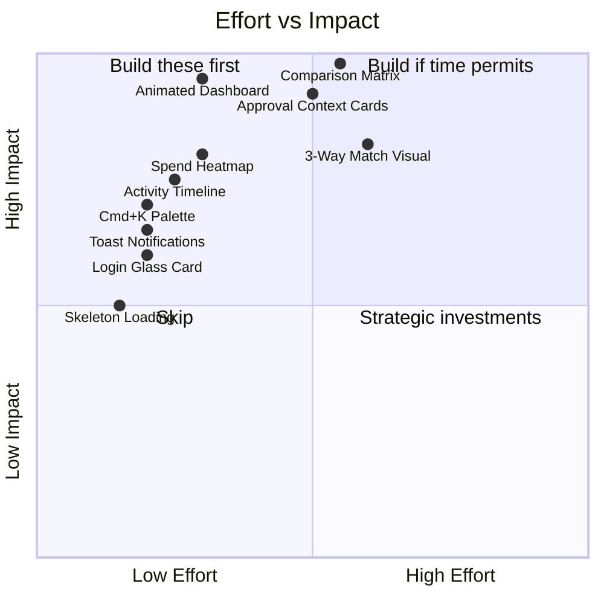

---

# 15. Final Architecture Review

## 15.1 Self-Critique: Identified Risks & Bottlenecks

| Risk | Severity | Area | Mitigation |
|------|---------|------|------------|
| **Comparison engine with 10+ vendors** | Medium | Performance | Column virtualization; horizontal scroll with pinned first column; cap at 8 visible columns |
| **Dashboard with 6+ concurrent API calls** | Medium | Performance | `Promise.all` on SSR; React Query parallel queries; waterfall prevention |
| **WebSocket connection management in SSR** | Low | Architecture | WebSocket is client-only (CSR); SSR renders without real-time, hydrates on client |
| **Feature module coupling** | Medium | Maintainability | Quotations imports from vendors and RFQs. Mitigate with barrel exports and interface-based imports, never deep imports |
| **State synchronization** (React Query cache vs Zustand vs WebSocket) | Medium | Complexity | Clear ownership: Zustand owns auth + UI; React Query owns server data; WebSocket pushes invalidations, never directly mutates |
| **Bundle size growth** | Medium | Performance | Recharts is heavy (~35KB gz). Mitigate: dynamic import only on analytics pages; consider lighter alternatives (visx) for embedded sparklines |
| **Next.js App Router maturity** | Low | Framework | App Router is stable in Next.js 14+; server components reduce client bundle; fallback to CSR for complex interactive pages |
| **Design system drift** | Medium | Maintainability | Without Storybook or strict review, atoms diverge. Mitigate: mandatory Storybook stories for each atom/molecule before PR merge |

## 15.2 Technical Debt Acknowledgments

| Debt | Current State | Future Remediation |
|------|--------------|-------------------|
| **No i18n** | English-only | Extract all strings to locale files; add next-intl |
| **No Storybook** | Components tested only in-context | Add Storybook with visual regression testing |
| **No E2E tests** | Manual testing only | Add Playwright tests for critical flows (RFQ → PO cycle) |
| **Hardcoded scoring weights** | 40/30/30 in frontend | Make weights configurable per organization (admin settings) |
| **No offline support** | Requires network | Service Worker cache for read operations; queue mutations for sync |
| **Single timezone** | No timezone handling | Add timezone-aware date formatting; store all dates UTC |
| **No accessibility audit** | Basic keyboard support | Full WCAG 2.1 AA audit; ARIA labels; screen reader testing |

## 15.3 Version 2 Architecture Improvements

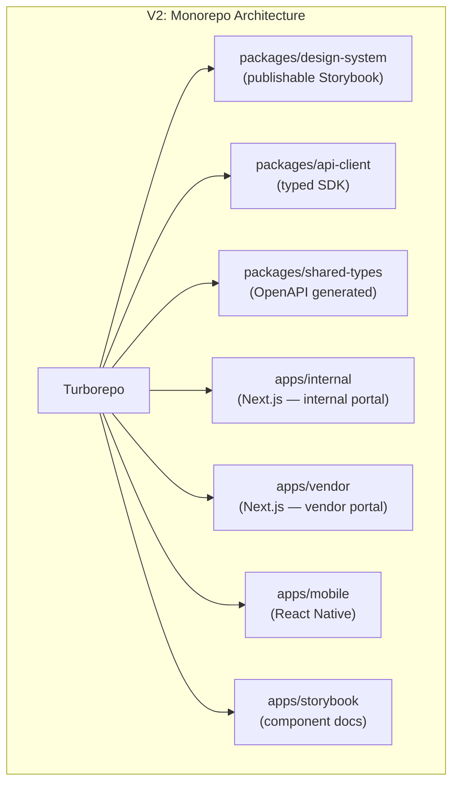

### V2 Improvements Detail

| Area | V1 (Current) | V2 (Future) | Benefit |
|------|-------------|-------------|---------|
| **Project structure** | Single Next.js app | Turborepo monorepo | Independent deployment; separate vendor/internal build; shared packages |
| **API types** | Manually defined TypeScript interfaces | OpenAPI spec → auto-generated types + SDK | Zero type drift; API changes auto-propagate |
| **Design system** | Co-located components | Standalone package with Storybook | Reusable across apps; visual regression testing; design documentation |
| **Testing** | Unit tests (Vitest) | + Playwright E2E + Visual regression (Chromatic) | End-to-end confidence; catch visual regressions |
| **State management** | React Query + Zustand | + Module federation for micro-frontends | Feature teams deploy independently |
| **Real-time** | Socket.io | Server-Sent Events for notifications + WebSocket for collaboration | Simpler for one-way push; WebSocket for bidirectional needs |
| **Analytics** | Recharts | Move to deck.gl for large-scale geo/spend visualization | Enterprise-grade data visualization |
| **Search** | API-driven search | Algolia/Meilisearch for instant search | Sub-50ms search with typo tolerance |
| **i18n** | None | next-intl with ICU message format | Multi-language support; RTL layout |
| **Accessibility** | Basic | WCAG 2.1 AA certified; automated Axe-core in CI | Legal compliance; broader user base |
| **Mobile** | Responsive web | React Native app (shared types package) | Native approval workflows; push notifications |
| **Observability** | Console logs | Sentry (errors) + Datadog RUM (performance) + PostHog (product analytics) | Full-stack observability |

---

## Architecture Summary

```
┌─────────────────────────────────────────────────────────────────────┐
│                     VendorBridge Architecture                       │
│                                                                     │
│  Framework:    Next.js 14+ (App Router, hybrid SSR/CSR)             │
│  State:        React Query (server) + Zustand (client) + URL        │
│  Components:   Atomic Design (atoms → pages)                        │
│  Styling:      CSS Custom Properties + Vanilla CSS (dark-first)     │
│  Forms:        React Hook Form + Zod                                │
│  Tables:       TanStack Table + TanStack Virtual                    │
│  Charts:       Recharts (lazy loaded)                               │
│  Real-time:    Socket.io client                                     │
│  Auth:         JWT (memory) + Refresh Token (httpOnly cookie)       │
│  Routing:      File-based + middleware guards + PermissionGate      │
│                                                                     │
│  ⭐ Star Features:                                                  │
│    1. Quotation Comparison Matrix with live scoring                  │
│    2. Smart Approval Context Cards                                   │
│    3. Animated KPI Dashboard                                         │
│    4. 3-Way Invoice Matching Visualization                           │
│    5. Command Palette (Cmd+K)                                        │
│                                                                     │
│  Target: Lighthouse 95+ · 10K+ orgs · 100K+ users                  │
└─────────────────────────────────────────────────────────────────────┘
```

---

*Architecture designed for VendorBridge — engineered to win hackathons and scale to enterprise.*
