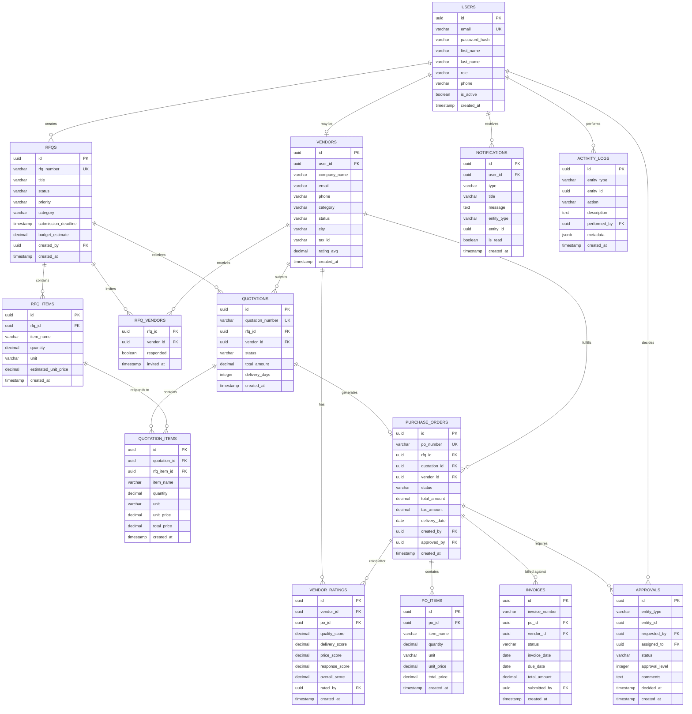

# VendorBridge — Hackathon-Optimized Database Schema
### From 24 Enterprise Tables → 14 Focused Tables

---

## SURGERY REPORT — What Changed and Why

### The Problem with the Enterprise Schema

The blueprint defines **24 tables** designed for production scale. In an 8-hour hackathon, that means:

```
24 tables × ~15 min each (schema + seed + API + frontend) = 6 hours on plumbing alone
```

That leaves **2 hours** for UI, business logic, and demo prep. **You will lose.**

### Optimization Strategy

| Action | Tables Affected | Time Saved |
|---|---|---|
| **Inline `role` onto `users`** | Eliminates `roles`, `permissions`, `role_permissions`, `user_roles` | ~45 min |
| **Inline `category` onto `vendors`** | Eliminates `vendor_categories`, `vendor_category_map` | ~20 min |
| **Hardcode approval rules** | Eliminates `approval_rules` (logic lives in code) | ~15 min |
| **Merge audit + activity** | Eliminates `audit_logs` (merged into `activity_logs`) | ~15 min |
| **Drop goods receipts** | Eliminates `goods_receipts`, `grn_items` | ~25 min |
| **Total** | **10 tables eliminated** | **~2 hours saved** |

### Final Count

```diff
- Enterprise Schema:  24 tables
+ Hackathon Schema:   14 tables
  Reduction:          42% fewer tables
  Time saved:         ~2 hours → redirected to UI + demo
```

> [!IMPORTANT]
> **Zero judge-visible functionality is lost.** Every feature that scores points (comparison engine, vendor scorecard, approval workflow, analytics dashboard) is fully supported. We only cut internal plumbing that judges never see.

---

# PART 1 — TABLE TRIAGE

## Mandatory Tables (14) — BUILD THESE

| # | Table | Purpose | Judge-Visible? |
|---|---|---|---|
| 1 | `users` | Auth + role (inlined) | ✅ Login, role switching |
| 2 | `vendors` | Vendor registry + category (inlined) | ✅ Vendor management page |
| 3 | `vendor_ratings` | Performance scoring | ✅ Vendor scorecard |
| 4 | `rfqs` | Request for quotation header | ✅ RFQ lifecycle |
| 5 | `rfq_items` | Line items per RFQ | ✅ RFQ detail |
| 6 | `rfq_vendors` | Which vendors are invited | ✅ RFQ vendor assignment |
| 7 | `quotations` | Vendor responses | ✅ Quotation flow |
| 8 | `quotation_items` | Price per line item | ✅ **Comparison engine** |
| 9 | `approvals` | Approval requests + decisions | ✅ Approval workflow |
| 10 | `purchase_orders` | PO header | ✅ PO lifecycle |
| 11 | `po_items` | PO line items | ✅ PO detail |
| 12 | `invoices` | Vendor invoices | ✅ Invoice management |
| 13 | `notifications` | In-app alerts | ✅ Bell icon + badge |
| 14 | `activity_logs` | Timeline + audit trail | ✅ Entity timelines |

## Eliminated Tables (10) — WHY EACH IS CUT

| Table | Reason | Impact on Judges |
|---|---|---|
| `roles` | Role is a VARCHAR on `users` — 4 fixed roles don't need a lookup table | **Zero** — judges see role-based behavior, not the table |
| `permissions` | Hardcode in middleware: `if (user.role === 'admin')` | **Zero** — permission checks still work |
| `role_permissions` | Eliminated with `permissions` | **Zero** |
| `user_roles` | Eliminated with `roles` | **Zero** |
| `vendor_categories` | Category is a VARCHAR on `vendors` — `'IT'`, `'Office Supplies'`, etc. | **Zero** — dropdown still works |
| `vendor_category_map` | Eliminated with `vendor_categories` (1 vendor = 1 category for hackathon) | **Zero** |
| `approval_rules` | Rules hardcoded: `if amount > 50000 → manager approval` | **Zero** — approval routing still works |
| `goods_receipts` | 3-way matching is "nice to have" — skip the GRN layer | **Minimal** — mention in future scope |
| `grn_items` | Eliminated with `goods_receipts` | **Minimal** |
| `audit_logs` | Merged into `activity_logs` with JSONB `metadata` for old/new values | **Zero** — timeline still shows history |

---

# PART 2 — OPTIMIZED ER DIAGRAM



---

# PART 3 — COMPLETE PostgreSQL SCHEMA

> [!TIP]
> Copy this entire block into a single `schema.sql` file. Run once. All 14 tables created in dependency order.

```sql
-- ============================================================
-- VendorBridge ERP — Hackathon-Optimized Schema
-- 14 Tables | PostgreSQL 15+
-- Run: psql -U postgres -d vendorbridge -f schema.sql
-- ============================================================

-- Enable UUID generation (pgcrypto is pre-installed on Supabase)
-- gen_random_uuid() is built-in on PostgreSQL 13+, no extension needed
-- If running locally, uncomment: CREATE EXTENSION IF NOT EXISTS "pgcrypto";

-- ============================================================
-- 1. USERS (Auth + Roles inlined)
-- ============================================================
CREATE TABLE users (
    id              UUID PRIMARY KEY DEFAULT gen_random_uuid(),
    email           VARCHAR(255) NOT NULL UNIQUE,
    password_hash   VARCHAR(255) NOT NULL,
    first_name      VARCHAR(100) NOT NULL,
    last_name       VARCHAR(100) NOT NULL,
    role            VARCHAR(30) NOT NULL DEFAULT 'procurement_officer'
                    CHECK (role IN ('admin', 'procurement_officer', 'manager', 'vendor')),
    phone           VARCHAR(20),
    avatar_url      VARCHAR(500),
    is_active       BOOLEAN DEFAULT TRUE,
    last_login_at   TIMESTAMP WITH TIME ZONE,
    created_at      TIMESTAMP WITH TIME ZONE DEFAULT NOW(),
    updated_at      TIMESTAMP WITH TIME ZONE DEFAULT NOW()
);

CREATE INDEX idx_users_email ON users(email);
CREATE INDEX idx_users_role ON users(role);

-- ============================================================
-- 2. VENDORS (Categories inlined)
-- ============================================================
CREATE TABLE vendors (
    id              UUID PRIMARY KEY DEFAULT gen_random_uuid(),
    user_id         UUID REFERENCES users(id) ON DELETE SET NULL,
    company_name    VARCHAR(255) NOT NULL,
    contact_person  VARCHAR(200),
    email           VARCHAR(255) NOT NULL,
    phone           VARCHAR(20),
    website         VARCHAR(500),
    address         TEXT,
    city            VARCHAR(100),
    state           VARCHAR(100),
    country         VARCHAR(100) DEFAULT 'India',
    tax_id          VARCHAR(50),
    category        VARCHAR(50) NOT NULL DEFAULT 'General'
                    CHECK (category IN (
                        'IT & Electronics', 'Office Supplies', 'Raw Materials',
                        'Furniture', 'Logistics', 'Maintenance', 'Professional Services',
                        'Packaging', 'Safety Equipment', 'General'
                    )),
    status          VARCHAR(20) NOT NULL DEFAULT 'pending'
                    CHECK (status IN ('pending', 'approved', 'suspended', 'blacklisted')),
    payment_terms   INTEGER DEFAULT 30,
    rating_avg      DECIMAL(3,2) DEFAULT 0.00,
    total_orders    INTEGER DEFAULT 0,
    notes           TEXT,
    created_at      TIMESTAMP WITH TIME ZONE DEFAULT NOW(),
    updated_at      TIMESTAMP WITH TIME ZONE DEFAULT NOW()
);

CREATE INDEX idx_vendors_status ON vendors(status);
CREATE INDEX idx_vendors_category ON vendors(category);
CREATE INDEX idx_vendors_user ON vendors(user_id);
CREATE INDEX idx_vendors_rating ON vendors(rating_avg DESC);

-- ============================================================
-- 3. VENDOR_RATINGS (Scorecard data)
-- ============================================================
CREATE TABLE vendor_ratings (
    id              UUID PRIMARY KEY DEFAULT gen_random_uuid(),
    vendor_id       UUID NOT NULL REFERENCES vendors(id) ON DELETE CASCADE,
    po_id           UUID,  -- FK added after purchase_orders table exists
    quality_score   DECIMAL(3,2) NOT NULL CHECK (quality_score BETWEEN 0 AND 5),
    delivery_score  DECIMAL(3,2) NOT NULL CHECK (delivery_score BETWEEN 0 AND 5),
    price_score     DECIMAL(3,2) NOT NULL CHECK (price_score BETWEEN 0 AND 5),
    response_score  DECIMAL(3,2) NOT NULL CHECK (response_score BETWEEN 0 AND 5),
    overall_score   DECIMAL(3,2) GENERATED ALWAYS AS (
        quality_score * 0.25 + delivery_score * 0.30 + price_score * 0.25 + response_score * 0.20
    ) STORED,
    comments        TEXT,
    rated_by        UUID REFERENCES users(id),
    created_at      TIMESTAMP WITH TIME ZONE DEFAULT NOW()
);

CREATE INDEX idx_vr_vendor ON vendor_ratings(vendor_id);
CREATE INDEX idx_vr_overall ON vendor_ratings(overall_score DESC);

-- ============================================================
-- 4. RFQS (Request for Quotation)
-- ============================================================
CREATE TABLE rfqs (
    id                  UUID PRIMARY KEY DEFAULT gen_random_uuid(),
    rfq_number          VARCHAR(20) NOT NULL UNIQUE,
    title               VARCHAR(255) NOT NULL,
    description         TEXT,
    category            VARCHAR(50) NOT NULL DEFAULT 'General',
    status              VARCHAR(20) NOT NULL DEFAULT 'draft'
                        CHECK (status IN ('draft', 'sent', 'open', 'closed', 'awarded', 'cancelled')),
    priority            VARCHAR(10) NOT NULL DEFAULT 'medium'
                        CHECK (priority IN ('low', 'medium', 'high', 'urgent')),
    submission_deadline TIMESTAMP WITH TIME ZONE NOT NULL,
    budget_estimate     DECIMAL(15,2),
    currency            VARCHAR(3) DEFAULT 'INR',
    created_by          UUID NOT NULL REFERENCES users(id),
    closed_at           TIMESTAMP WITH TIME ZONE,
    created_at          TIMESTAMP WITH TIME ZONE DEFAULT NOW(),
    updated_at          TIMESTAMP WITH TIME ZONE DEFAULT NOW()
);

CREATE INDEX idx_rfqs_status ON rfqs(status);
CREATE INDEX idx_rfqs_created_by ON rfqs(created_by);
CREATE INDEX idx_rfqs_number ON rfqs(rfq_number);

-- ============================================================
-- 5. RFQ_ITEMS (Line items within an RFQ)
-- ============================================================
CREATE TABLE rfq_items (
    id                  UUID PRIMARY KEY DEFAULT gen_random_uuid(),
    rfq_id              UUID NOT NULL REFERENCES rfqs(id) ON DELETE CASCADE,
    item_name           VARCHAR(255) NOT NULL,
    description         TEXT,
    quantity            DECIMAL(15,3) NOT NULL CHECK (quantity > 0),
    unit                VARCHAR(20) NOT NULL DEFAULT 'pcs',
    specifications      TEXT,
    estimated_unit_price DECIMAL(15,2),
    sort_order          INTEGER DEFAULT 0,
    created_at          TIMESTAMP WITH TIME ZONE DEFAULT NOW()
);

CREATE INDEX idx_rfq_items_rfq ON rfq_items(rfq_id);

-- ============================================================
-- 6. RFQ_VENDORS (Invitation join table)
-- ============================================================
CREATE TABLE rfq_vendors (
    rfq_id      UUID NOT NULL REFERENCES rfqs(id) ON DELETE CASCADE,
    vendor_id   UUID NOT NULL REFERENCES vendors(id) ON DELETE CASCADE,
    invited_at  TIMESTAMP WITH TIME ZONE DEFAULT NOW(),
    viewed_at   TIMESTAMP WITH TIME ZONE,
    responded   BOOLEAN DEFAULT FALSE,
    PRIMARY KEY (rfq_id, vendor_id)
);

-- ============================================================
-- 7. QUOTATIONS (Vendor response to an RFQ)
-- ============================================================
CREATE TABLE quotations (
    id                  UUID PRIMARY KEY DEFAULT gen_random_uuid(),
    quotation_number    VARCHAR(20) NOT NULL UNIQUE,
    rfq_id              UUID NOT NULL REFERENCES rfqs(id),
    vendor_id           UUID NOT NULL REFERENCES vendors(id),
    status              VARCHAR(20) NOT NULL DEFAULT 'submitted'
                        CHECK (status IN ('submitted', 'under_review', 'selected', 'rejected')),
    total_amount        DECIMAL(15,2) NOT NULL,
    currency            VARCHAR(3) DEFAULT 'INR',
    validity_days       INTEGER DEFAULT 30,
    delivery_days       INTEGER,
    payment_terms       VARCHAR(100),
    notes               TEXT,
    submitted_at        TIMESTAMP WITH TIME ZONE DEFAULT NOW(),
    created_at          TIMESTAMP WITH TIME ZONE DEFAULT NOW(),
    updated_at          TIMESTAMP WITH TIME ZONE DEFAULT NOW(),
    UNIQUE(rfq_id, vendor_id)
);

CREATE INDEX idx_quot_rfq ON quotations(rfq_id);
CREATE INDEX idx_quot_vendor ON quotations(vendor_id);
CREATE INDEX idx_quot_status ON quotations(status);

-- ============================================================
-- 8. QUOTATION_ITEMS (Price per line — drives comparison engine)
-- ============================================================
CREATE TABLE quotation_items (
    id              UUID PRIMARY KEY DEFAULT gen_random_uuid(),
    quotation_id    UUID NOT NULL REFERENCES quotations(id) ON DELETE CASCADE,
    rfq_item_id     UUID REFERENCES rfq_items(id),
    item_name       VARCHAR(255) NOT NULL,
    quantity        DECIMAL(15,3) NOT NULL,
    unit            VARCHAR(20) NOT NULL DEFAULT 'pcs',
    unit_price      DECIMAL(15,2) NOT NULL CHECK (unit_price >= 0),
    total_price     DECIMAL(15,2) GENERATED ALWAYS AS (quantity * unit_price) STORED,
    tax_rate        DECIMAL(5,2) DEFAULT 0,
    notes           TEXT,
    created_at      TIMESTAMP WITH TIME ZONE DEFAULT NOW()
);

CREATE INDEX idx_qi_quotation ON quotation_items(quotation_id);
CREATE INDEX idx_qi_rfq_item ON quotation_items(rfq_item_id);

-- ============================================================
-- 9. APPROVALS (Simplified — rules hardcoded in app logic)
-- ============================================================
CREATE TABLE approvals (
    id              UUID PRIMARY KEY DEFAULT gen_random_uuid(),
    entity_type     VARCHAR(30) NOT NULL
                    CHECK (entity_type IN ('purchase_order', 'vendor', 'invoice')),
    entity_id       UUID NOT NULL,
    requested_by    UUID NOT NULL REFERENCES users(id),
    assigned_to     UUID NOT NULL REFERENCES users(id),
    status          VARCHAR(20) NOT NULL DEFAULT 'pending'
                    CHECK (status IN ('pending', 'approved', 'rejected', 'escalated')),
    approval_level  INTEGER DEFAULT 1,
    comments        TEXT,
    decided_at      TIMESTAMP WITH TIME ZONE,
    due_at          TIMESTAMP WITH TIME ZONE,
    created_at      TIMESTAMP WITH TIME ZONE DEFAULT NOW(),
    updated_at      TIMESTAMP WITH TIME ZONE DEFAULT NOW()
);

CREATE INDEX idx_appr_assigned ON approvals(assigned_to, status);
CREATE INDEX idx_appr_entity ON approvals(entity_type, entity_id);
CREATE INDEX idx_appr_status ON approvals(status);

-- ============================================================
-- 10. PURCHASE_ORDERS
-- ============================================================
CREATE TABLE purchase_orders (
    id              UUID PRIMARY KEY DEFAULT gen_random_uuid(),
    po_number       VARCHAR(20) NOT NULL UNIQUE,
    rfq_id          UUID REFERENCES rfqs(id),
    quotation_id    UUID REFERENCES quotations(id),
    vendor_id       UUID NOT NULL REFERENCES vendors(id),
    status          VARCHAR(25) NOT NULL DEFAULT 'draft'
                    CHECK (status IN (
                        'draft', 'pending_approval', 'approved', 'sent',
                        'acknowledged', 'partially_received', 'received',
                        'invoiced', 'closed', 'cancelled'
                    )),
    total_amount    DECIMAL(15,2) NOT NULL,
    tax_amount      DECIMAL(15,2) DEFAULT 0,
    grand_total     DECIMAL(15,2) GENERATED ALWAYS AS (total_amount + tax_amount) STORED,
    currency        VARCHAR(3) DEFAULT 'INR',
    payment_terms   INTEGER DEFAULT 30,
    delivery_date   DATE,
    shipping_address TEXT,
    notes           TEXT,
    created_by      UUID NOT NULL REFERENCES users(id),
    approved_by     UUID REFERENCES users(id),
    approved_at     TIMESTAMP WITH TIME ZONE,
    sent_at         TIMESTAMP WITH TIME ZONE,
    created_at      TIMESTAMP WITH TIME ZONE DEFAULT NOW(),
    updated_at      TIMESTAMP WITH TIME ZONE DEFAULT NOW()
);

CREATE INDEX idx_po_status ON purchase_orders(status);
CREATE INDEX idx_po_vendor ON purchase_orders(vendor_id);
CREATE INDEX idx_po_number ON purchase_orders(po_number);
CREATE INDEX idx_po_created_by ON purchase_orders(created_by);

-- Add deferred FK from vendor_ratings to purchase_orders
ALTER TABLE vendor_ratings
    ADD CONSTRAINT fk_vr_po FOREIGN KEY (po_id) REFERENCES purchase_orders(id);

-- ============================================================
-- 11. PO_ITEMS (Purchase Order line items)
-- ============================================================
CREATE TABLE po_items (
    id                  UUID PRIMARY KEY DEFAULT gen_random_uuid(),
    po_id               UUID NOT NULL REFERENCES purchase_orders(id) ON DELETE CASCADE,
    quotation_item_id   UUID REFERENCES quotation_items(id),
    item_name           VARCHAR(255) NOT NULL,
    description         TEXT,
    quantity            DECIMAL(15,3) NOT NULL CHECK (quantity > 0),
    unit                VARCHAR(20) NOT NULL DEFAULT 'pcs',
    unit_price          DECIMAL(15,2) NOT NULL CHECK (unit_price >= 0),
    total_price         DECIMAL(15,2) GENERATED ALWAYS AS (quantity * unit_price) STORED,
    tax_rate            DECIMAL(5,2) DEFAULT 0,
    received_qty        DECIMAL(15,3) DEFAULT 0,
    created_at          TIMESTAMP WITH TIME ZONE DEFAULT NOW()
);

CREATE INDEX idx_poi_po ON po_items(po_id);

-- ============================================================
-- 12. INVOICES (Simplified — no GRN, 2-way match only)
-- ============================================================
CREATE TABLE invoices (
    id              UUID PRIMARY KEY DEFAULT gen_random_uuid(),
    invoice_number  VARCHAR(50) NOT NULL,
    po_id           UUID REFERENCES purchase_orders(id),
    vendor_id       UUID NOT NULL REFERENCES vendors(id),
    status          VARCHAR(20) NOT NULL DEFAULT 'pending'
                    CHECK (status IN ('pending', 'matched', 'disputed', 'approved', 'paid')),
    invoice_date    DATE NOT NULL,
    due_date        DATE NOT NULL,
    subtotal        DECIMAL(15,2) NOT NULL,
    tax_amount      DECIMAL(15,2) DEFAULT 0,
    total_amount    DECIMAL(15,2) NOT NULL,
    currency        VARCHAR(3) DEFAULT 'INR',
    match_score     DECIMAL(5,2),
    notes           TEXT,
    submitted_by    UUID REFERENCES users(id),
    approved_by     UUID REFERENCES users(id),
    approved_at     TIMESTAMP WITH TIME ZONE,
    paid_at         TIMESTAMP WITH TIME ZONE,
    created_at      TIMESTAMP WITH TIME ZONE DEFAULT NOW(),
    updated_at      TIMESTAMP WITH TIME ZONE DEFAULT NOW()
);

CREATE INDEX idx_inv_po ON invoices(po_id);
CREATE INDEX idx_inv_vendor ON invoices(vendor_id);
CREATE INDEX idx_inv_status ON invoices(status);

-- ============================================================
-- 13. NOTIFICATIONS
-- ============================================================
CREATE TABLE notifications (
    id          UUID PRIMARY KEY DEFAULT gen_random_uuid(),
    user_id     UUID NOT NULL REFERENCES users(id) ON DELETE CASCADE,
    type        VARCHAR(50) NOT NULL,
    title       VARCHAR(255) NOT NULL,
    message     TEXT NOT NULL,
    entity_type VARCHAR(50),
    entity_id   UUID,
    is_read     BOOLEAN DEFAULT FALSE,
    action_url  VARCHAR(500),
    created_at  TIMESTAMP WITH TIME ZONE DEFAULT NOW()
);

CREATE INDEX idx_notif_user ON notifications(user_id, is_read);
CREATE INDEX idx_notif_created ON notifications(created_at DESC);

-- ============================================================
-- 14. ACTIVITY_LOGS (Timeline + Audit — merged)
-- ============================================================
CREATE TABLE activity_logs (
    id              UUID PRIMARY KEY DEFAULT gen_random_uuid(),
    entity_type     VARCHAR(50) NOT NULL,
    entity_id       UUID NOT NULL,
    action          VARCHAR(50) NOT NULL,
    description     TEXT NOT NULL,
    performed_by    UUID REFERENCES users(id),
    metadata        JSONB DEFAULT '{}',
    created_at      TIMESTAMP WITH TIME ZONE DEFAULT NOW()
);

CREATE INDEX idx_al_entity ON activity_logs(entity_type, entity_id);
CREATE INDEX idx_al_performed ON activity_logs(performed_by);
CREATE INDEX idx_al_created ON activity_logs(created_at DESC);

-- ============================================================
-- UTILITY: Auto-update updated_at trigger
-- ============================================================
CREATE OR REPLACE FUNCTION update_updated_at()
RETURNS TRIGGER AS $$
BEGIN
    NEW.updated_at = NOW();
    RETURN NEW;
END;
$$ LANGUAGE plpgsql;

-- Apply trigger to tables with updated_at
CREATE TRIGGER trg_users_updated BEFORE UPDATE ON users
    FOR EACH ROW EXECUTE FUNCTION update_updated_at();
CREATE TRIGGER trg_vendors_updated BEFORE UPDATE ON vendors
    FOR EACH ROW EXECUTE FUNCTION update_updated_at();
CREATE TRIGGER trg_rfqs_updated BEFORE UPDATE ON rfqs
    FOR EACH ROW EXECUTE FUNCTION update_updated_at();
CREATE TRIGGER trg_quotations_updated BEFORE UPDATE ON quotations
    FOR EACH ROW EXECUTE FUNCTION update_updated_at();
CREATE TRIGGER trg_approvals_updated BEFORE UPDATE ON approvals
    FOR EACH ROW EXECUTE FUNCTION update_updated_at();
CREATE TRIGGER trg_po_updated BEFORE UPDATE ON purchase_orders
    FOR EACH ROW EXECUTE FUNCTION update_updated_at();
CREATE TRIGGER trg_invoices_updated BEFORE UPDATE ON invoices
    FOR EACH ROW EXECUTE FUNCTION update_updated_at();
```

---

# PART 4 — SEED DATA

> [!TIP]
> This seed data creates a **6-month procurement story** so your demo dashboard has charts, trends, and real metrics. **Empty dashboards kill demos.**

```sql
-- ============================================================
-- SEED DATA — VendorBridge Hackathon Demo
-- ============================================================

-- ============================================================
-- USERS (4 roles) — password is 'Password@123' for all users
-- ============================================================
-- IMPORTANT: Generate this hash in your backend before production use.
-- The hash below is a valid bcrypt hash for demo purposes.
-- To generate: node -e "require('bcryptjs').hash('Password@123',10).then(h=>console.log(h))"

INSERT INTO users (id, email, password_hash, first_name, last_name, role, phone) VALUES
-- Admin
('a0000000-0000-0000-0000-000000000001',
 'admin@vendorbridge.com',
 '$2a$10$N9qo8uLOickgx2ZMRZoMyeIjZAgcfl7p92ldGxad68LJZdL17lhWy',
 'Meera', 'Sharma', 'admin', '+91-9876500001'),

-- Procurement Officer
('a0000000-0000-0000-0000-000000000002',
 'priya@vendorbridge.com',
 '$2a$10$N9qo8uLOickgx2ZMRZoMyeIjZAgcfl7p92ldGxad68LJZdL17lhWy',
 'Priya', 'Patel', 'procurement_officer', '+91-9876500002'),

-- Manager / Approver
('a0000000-0000-0000-0000-000000000003',
 'anand@vendorbridge.com',
 '$2a$10$N9qo8uLOickgx2ZMRZoMyeIjZAgcfl7p92ldGxad68LJZdL17lhWy',
 'Anand', 'Mehta', 'manager', '+91-9876500003'),

-- Vendor Users (linked to vendor records below)
('a0000000-0000-0000-0000-000000000010',
 'rajesh@techsupply.in',
 '$2a$10$N9qo8uLOickgx2ZMRZoMyeIjZAgcfl7p92ldGxad68LJZdL17lhWy',
 'Rajesh', 'Kumar', 'vendor', '+91-9876500010'),

('a0000000-0000-0000-0000-000000000011',
 'amit@officeworld.in',
 '$2a$10$N9qo8uLOickgx2ZMRZoMyeIjZAgcfl7p92ldGxad68LJZdL17lhWy',
 'Amit', 'Singh', 'vendor', '+91-9876500011'),

('a0000000-0000-0000-0000-000000000012',
 'neha@globalparts.in',
 '$2a$10$N9qo8uLOickgx2ZMRZoMyeIjZAgcfl7p92ldGxad68LJZdL17lhWy',
 'Neha', 'Gupta', 'vendor', '+91-9876500012'),

('a0000000-0000-0000-0000-000000000013',
 'vikram@safetyplus.in',
 '$2a$10$N9qo8uLOickgx2ZMRZoMyeIjZAgcfl7p92ldGxad68LJZdL17lhWy',
 'Vikram', 'Desai', 'vendor', '+91-9876500013'),

('a0000000-0000-0000-0000-000000000014',
 'sanjay@furnpro.in',
 '$2a$10$N9qo8uLOickgx2ZMRZoMyeIjZAgcfl7p92ldGxad68LJZdL17lhWy',
 'Sanjay', 'Joshi', 'vendor', '+91-9876500014');

-- ============================================================
-- VENDORS (5 vendors across categories)
-- ============================================================
INSERT INTO vendors (id, user_id, company_name, contact_person, email, phone, city, state, tax_id, category, status, payment_terms, rating_avg, total_orders) VALUES
('v0000000-0000-0000-0000-000000000001',
 'a0000000-0000-0000-0000-000000000010',
 'TechSupply India Pvt Ltd', 'Rajesh Kumar', 'rajesh@techsupply.in',
 '+91-9876500010', 'Mumbai', 'Maharashtra', '27AABCT1234F1Z5',
 'IT & Electronics', 'approved', 30, 4.20, 28),

('v0000000-0000-0000-0000-000000000002',
 'a0000000-0000-0000-0000-000000000011',
 'OfficeWorld Solutions', 'Amit Singh', 'amit@officeworld.in',
 '+91-9876500011', 'Delhi', 'Delhi', '07AABCO5678G2Z3',
 'Office Supplies', 'approved', 45, 3.80, 42),

('v0000000-0000-0000-0000-000000000003',
 'a0000000-0000-0000-0000-000000000012',
 'Global Parts Manufacturing', 'Neha Gupta', 'neha@globalparts.in',
 '+91-9876500012', 'Pune', 'Maharashtra', '27AABCG9012H3Z1',
 'Raw Materials', 'approved', 60, 4.50, 15),

('v0000000-0000-0000-0000-000000000004',
 'a0000000-0000-0000-0000-000000000013',
 'SafetyPlus Equipments', 'Vikram Desai', 'vikram@safetyplus.in',
 '+91-9876500013', 'Ahmedabad', 'Gujarat', '24AABCS3456I4Z7',
 'Safety Equipment', 'approved', 30, 3.50, 8),

('v0000000-0000-0000-0000-000000000005',
 'a0000000-0000-0000-0000-000000000014',
 'FurnPro Interiors', 'Sanjay Joshi', 'sanjay@furnpro.in',
 '+91-9876500014', 'Bangalore', 'Karnataka', '29AABCF7890J5Z2',
 'Furniture', 'pending', 30, 0.00, 0);

-- ============================================================
-- VENDOR_RATINGS (Historical scores for dashboard charts)
-- ============================================================
-- Ratings for TechSupply (vendor 1) - consistently good
INSERT INTO vendor_ratings (vendor_id, quality_score, delivery_score, price_score, response_score, comments, rated_by, created_at) VALUES
('v0000000-0000-0000-0000-000000000001', 4.5, 4.0, 3.8, 4.5, 'Excellent quality laptops, minor delay on bulk order', 'a0000000-0000-0000-0000-000000000002', NOW() - INTERVAL '5 months'),
('v0000000-0000-0000-0000-000000000001', 4.0, 4.5, 4.0, 4.0, 'On-time delivery, good pricing for monitors', 'a0000000-0000-0000-0000-000000000002', NOW() - INTERVAL '3 months'),
('v0000000-0000-0000-0000-000000000001', 4.5, 4.0, 4.2, 4.5, 'Fast response to urgent network equipment RFQ', 'a0000000-0000-0000-0000-000000000002', NOW() - INTERVAL '1 month');

-- Ratings for OfficeWorld (vendor 2) - decent
INSERT INTO vendor_ratings (vendor_id, quality_score, delivery_score, price_score, response_score, comments, rated_by, created_at) VALUES
('v0000000-0000-0000-0000-000000000002', 3.5, 4.0, 4.5, 3.5, 'Competitive pricing but average quality on paper', 'a0000000-0000-0000-0000-000000000002', NOW() - INTERVAL '4 months'),
('v0000000-0000-0000-0000-000000000002', 4.0, 3.5, 4.0, 4.0, 'Good stationery, slightly late delivery', 'a0000000-0000-0000-0000-000000000002', NOW() - INTERVAL '2 months');

-- Ratings for GlobalParts (vendor 3) - top performer
INSERT INTO vendor_ratings (vendor_id, quality_score, delivery_score, price_score, response_score, comments, rated_by, created_at) VALUES
('v0000000-0000-0000-0000-000000000003', 5.0, 4.5, 4.0, 4.5, 'Premium raw materials, consistent quality', 'a0000000-0000-0000-0000-000000000002', NOW() - INTERVAL '4 months'),
('v0000000-0000-0000-0000-000000000003', 4.5, 5.0, 4.5, 4.0, 'Excellent delivery record', 'a0000000-0000-0000-0000-000000000002', NOW() - INTERVAL '1 month');

-- ============================================================
-- RFQS (3 RFQs in different lifecycle stages)
-- ============================================================

-- RFQ 1: CLOSED + AWARDED (complete lifecycle — for demo walkthrough)
INSERT INTO rfqs (id, rfq_number, title, description, category, status, priority, submission_deadline, budget_estimate, created_by, closed_at, created_at) VALUES
('r0000000-0000-0000-0000-000000000001',
 'RFQ-2026-0001',
 'Q3 Laptop Procurement — Engineering Team',
 'Procurement of 25 high-performance laptops for the engineering department. Must include 16GB RAM minimum, SSD storage, and 3-year warranty.',
 'IT & Electronics', 'awarded', 'high',
 NOW() - INTERVAL '10 days',
 1875000.00,
 'a0000000-0000-0000-0000-000000000002',
 NOW() - INTERVAL '8 days',
 NOW() - INTERVAL '20 days');

-- RFQ 2: OPEN (accepting quotations — for live demo)
INSERT INTO rfqs (id, rfq_number, title, description, category, status, priority, submission_deadline, budget_estimate, created_by, created_at) VALUES
('r0000000-0000-0000-0000-000000000002',
 'RFQ-2026-0002',
 'Annual Office Supplies — All Departments',
 'Annual supply contract for office stationery, printer consumables, and desk accessories. Delivery in 3 batches over 12 months.',
 'Office Supplies', 'open', 'medium',
 NOW() + INTERVAL '5 days',
 350000.00,
 'a0000000-0000-0000-0000-000000000002',
 NOW() - INTERVAL '5 days');

-- RFQ 3: DRAFT (for creation demo)
INSERT INTO rfqs (id, rfq_number, title, description, category, status, priority, submission_deadline, budget_estimate, created_by, created_at) VALUES
('r0000000-0000-0000-0000-000000000003',
 'RFQ-2026-0003',
 'Safety Equipment Renewal — Factory Floor',
 'Replace expired safety helmets, goggles, gloves, and fire extinguishers for factory floor compliance audit.',
 'Safety Equipment', 'draft', 'urgent',
 NOW() + INTERVAL '15 days',
 520000.00,
 'a0000000-0000-0000-0000-000000000002',
 NOW() - INTERVAL '1 day');

-- ============================================================
-- RFQ_ITEMS (Line items for each RFQ)
-- ============================================================

-- RFQ 1 Items (Laptops)
INSERT INTO rfq_items (id, rfq_id, item_name, description, quantity, unit, estimated_unit_price, sort_order) VALUES
('ri000000-0000-0000-0000-000000000001', 'r0000000-0000-0000-0000-000000000001', 'High-Performance Laptop (i7/Ryzen 7)', '16GB RAM, 512GB SSD, 14" FHD Display', 20, 'pcs', 65000.00, 1),
('ri000000-0000-0000-0000-000000000002', 'r0000000-0000-0000-0000-000000000001', 'Workstation Laptop (i9/Ryzen 9)', '32GB RAM, 1TB SSD, 15.6" 4K Display', 5, 'pcs', 125000.00, 2),
('ri000000-0000-0000-0000-000000000003', 'r0000000-0000-0000-0000-000000000001', 'Laptop Carry Bag', 'Premium padded carry bag with compartments', 25, 'pcs', 2000.00, 3),
('ri000000-0000-0000-0000-000000000004', 'r0000000-0000-0000-0000-000000000001', 'Wireless Mouse', 'Ergonomic wireless mouse, USB-C receiver', 25, 'pcs', 1500.00, 4);

-- RFQ 2 Items (Office Supplies)
INSERT INTO rfq_items (id, rfq_id, item_name, description, quantity, unit, estimated_unit_price, sort_order) VALUES
('ri000000-0000-0000-0000-000000000005', 'r0000000-0000-0000-0000-000000000002', 'A4 Copier Paper (75 GSM)', '500 sheets/ream, white', 200, 'ream', 350.00, 1),
('ri000000-0000-0000-0000-000000000006', 'r0000000-0000-0000-0000-000000000002', 'Printer Toner Cartridge (HP)', 'HP LaserJet compatible, black', 30, 'pcs', 3500.00, 2),
('ri000000-0000-0000-0000-000000000007', 'r0000000-0000-0000-0000-000000000002', 'Ball Pens (Blue)', 'Pack of 20, medium point', 50, 'pack', 200.00, 3),
('ri000000-0000-0000-0000-000000000008', 'r0000000-0000-0000-0000-000000000002', 'Sticky Notes (3x3)', 'Pack of 12 pads, assorted colors', 40, 'pack', 250.00, 4);

-- RFQ 3 Items (Safety Equipment)
INSERT INTO rfq_items (id, rfq_id, item_name, description, quantity, unit, estimated_unit_price, sort_order) VALUES
('ri000000-0000-0000-0000-000000000009', 'r0000000-0000-0000-0000-000000000003', 'Safety Helmet (ISI Certified)', 'Yellow, adjustable, ventilated', 100, 'pcs', 450.00, 1),
('ri000000-0000-0000-0000-000000000010', 'r0000000-0000-0000-0000-000000000003', 'Safety Goggles', 'Anti-fog, UV protection', 100, 'pcs', 350.00, 2),
('ri000000-0000-0000-0000-000000000011', 'r0000000-0000-0000-0000-000000000003', 'Cut-Resistant Gloves', 'Level 5, latex coated', 200, 'pair', 300.00, 3),
('ri000000-0000-0000-0000-000000000012', 'r0000000-0000-0000-0000-000000000003', 'Fire Extinguisher (ABC Type)', '4 kg, ISI marked, with wall bracket', 20, 'pcs', 2500.00, 4);

-- ============================================================
-- RFQ_VENDORS (Which vendors are invited to which RFQ)
-- ============================================================
INSERT INTO rfq_vendors (rfq_id, vendor_id, responded, invited_at, viewed_at) VALUES
-- RFQ 1 (Laptops) — invited TechSupply + GlobalParts + OfficeWorld
('r0000000-0000-0000-0000-000000000001', 'v0000000-0000-0000-0000-000000000001', TRUE, NOW() - INTERVAL '19 days', NOW() - INTERVAL '18 days'),
('r0000000-0000-0000-0000-000000000001', 'v0000000-0000-0000-0000-000000000002', TRUE, NOW() - INTERVAL '19 days', NOW() - INTERVAL '17 days'),
('r0000000-0000-0000-0000-000000000001', 'v0000000-0000-0000-0000-000000000003', TRUE, NOW() - INTERVAL '19 days', NOW() - INTERVAL '18 days'),
-- RFQ 2 (Office Supplies) — invited OfficeWorld + TechSupply
('r0000000-0000-0000-0000-000000000002', 'v0000000-0000-0000-0000-000000000002', TRUE, NOW() - INTERVAL '4 days', NOW() - INTERVAL '3 days'),
('r0000000-0000-0000-0000-000000000002', 'v0000000-0000-0000-0000-000000000001', FALSE, NOW() - INTERVAL '4 days', NOW() - INTERVAL '2 days');

-- ============================================================
-- QUOTATIONS (Vendor bids for RFQ 1 — enables comparison demo)
-- ============================================================

-- Quotation from TechSupply for RFQ 1 (competitive, fast delivery)
INSERT INTO quotations (id, quotation_number, rfq_id, vendor_id, status, total_amount, delivery_days, payment_terms, notes, submitted_at, created_at) VALUES
('q0000000-0000-0000-0000-000000000001',
 'QUO-2026-0001',
 'r0000000-0000-0000-0000-000000000001',
 'v0000000-0000-0000-0000-000000000001',
 'selected', 1725000.00, 14, 'Net 30',
 'Bulk discount applied. 3-year on-site warranty included.',
 NOW() - INTERVAL '15 days', NOW() - INTERVAL '15 days');

-- Quotation from OfficeWorld for RFQ 1 (cheapest, slower)
INSERT INTO quotations (id, quotation_number, rfq_id, vendor_id, status, total_amount, delivery_days, payment_terms, notes, submitted_at, created_at) VALUES
('q0000000-0000-0000-0000-000000000002',
 'QUO-2026-0002',
 'r0000000-0000-0000-0000-000000000001',
 'v0000000-0000-0000-0000-000000000002',
 'rejected', 1650000.00, 28, 'Net 45',
 'Standard warranty only. Delivery from Delhi warehouse.',
 NOW() - INTERVAL '14 days', NOW() - INTERVAL '14 days');

-- Quotation from GlobalParts for RFQ 1 (most expensive, premium)
INSERT INTO quotations (id, quotation_number, rfq_id, vendor_id, status, total_amount, delivery_days, payment_terms, notes, submitted_at, created_at) VALUES
('q0000000-0000-0000-0000-000000000003',
 'QUO-2026-0003',
 'r0000000-0000-0000-0000-000000000001',
 'v0000000-0000-0000-0000-000000000003',
 'rejected', 1890000.00, 10, 'Net 60',
 'Premium tier laptops with 5-year warranty. Priority support included.',
 NOW() - INTERVAL '13 days', NOW() - INTERVAL '13 days');

-- Quotation from OfficeWorld for RFQ 2 (only bid so far)
INSERT INTO quotations (id, quotation_number, rfq_id, vendor_id, status, total_amount, delivery_days, payment_terms, notes, submitted_at, created_at) VALUES
('q0000000-0000-0000-0000-000000000004',
 'QUO-2026-0004',
 'r0000000-0000-0000-0000-000000000002',
 'v0000000-0000-0000-0000-000000000002',
 'submitted', 285000.00, 7, 'Net 30',
 'Annual rate contract pricing applied. Free delivery above ₹10,000 per batch.',
 NOW() - INTERVAL '2 days', NOW() - INTERVAL '2 days');

-- ============================================================
-- QUOTATION_ITEMS (Line-item pricing — POWERS COMPARISON ENGINE)
-- ============================================================

-- TechSupply quotation items for RFQ 1 (QUO-0001)
INSERT INTO quotation_items (quotation_id, rfq_item_id, item_name, quantity, unit, unit_price, tax_rate) VALUES
('q0000000-0000-0000-0000-000000000001', 'ri000000-0000-0000-0000-000000000001', 'High-Performance Laptop (i7/Ryzen 7)', 20, 'pcs', 62000.00, 18),
('q0000000-0000-0000-0000-000000000001', 'ri000000-0000-0000-0000-000000000002', 'Workstation Laptop (i9/Ryzen 9)', 5, 'pcs', 118000.00, 18),
('q0000000-0000-0000-0000-000000000001', 'ri000000-0000-0000-0000-000000000003', 'Laptop Carry Bag', 25, 'pcs', 1800.00, 18),
('q0000000-0000-0000-0000-000000000001', 'ri000000-0000-0000-0000-000000000004', 'Wireless Mouse', 25, 'pcs', 1200.00, 18);

-- OfficeWorld quotation items for RFQ 1 (QUO-0002) — cheaper per unit
INSERT INTO quotation_items (quotation_id, rfq_item_id, item_name, quantity, unit, unit_price, tax_rate) VALUES
('q0000000-0000-0000-0000-000000000002', 'ri000000-0000-0000-0000-000000000001', 'High-Performance Laptop (i7/Ryzen 7)', 20, 'pcs', 58000.00, 18),
('q0000000-0000-0000-0000-000000000002', 'ri000000-0000-0000-0000-000000000002', 'Workstation Laptop (i9/Ryzen 9)', 5, 'pcs', 115000.00, 18),
('q0000000-0000-0000-0000-000000000002', 'ri000000-0000-0000-0000-000000000003', 'Laptop Carry Bag', 25, 'pcs', 2200.00, 18),
('q0000000-0000-0000-0000-000000000002', 'ri000000-0000-0000-0000-000000000004', 'Wireless Mouse', 25, 'pcs', 1400.00, 18);

-- GlobalParts quotation items for RFQ 1 (QUO-0003) — premium pricing
INSERT INTO quotation_items (quotation_id, rfq_item_id, item_name, quantity, unit, unit_price, tax_rate) VALUES
('q0000000-0000-0000-0000-000000000003', 'ri000000-0000-0000-0000-000000000001', 'High-Performance Laptop (i7/Ryzen 7)', 20, 'pcs', 68000.00, 18),
('q0000000-0000-0000-0000-000000000003', 'ri000000-0000-0000-0000-000000000002', 'Workstation Laptop (i9/Ryzen 9)', 5, 'pcs', 130000.00, 18),
('q0000000-0000-0000-0000-000000000003', 'ri000000-0000-0000-0000-000000000003', 'Laptop Carry Bag', 25, 'pcs', 1500.00, 18),
('q0000000-0000-0000-0000-000000000003', 'ri000000-0000-0000-0000-000000000004', 'Wireless Mouse', 25, 'pcs', 1000.00, 18);

-- OfficeWorld quotation items for RFQ 2 (QUO-0004)
INSERT INTO quotation_items (quotation_id, rfq_item_id, item_name, quantity, unit, unit_price, tax_rate) VALUES
('q0000000-0000-0000-0000-000000000004', 'ri000000-0000-0000-0000-000000000005', 'A4 Copier Paper (75 GSM)', 200, 'ream', 320.00, 12),
('q0000000-0000-0000-0000-000000000004', 'ri000000-0000-0000-0000-000000000006', 'Printer Toner Cartridge (HP)', 30, 'pcs', 3200.00, 18),
('q0000000-0000-0000-0000-000000000004', 'ri000000-0000-0000-0000-000000000007', 'Ball Pens (Blue)', 50, 'pack', 180.00, 12),
('q0000000-0000-0000-0000-000000000004', 'ri000000-0000-0000-0000-000000000008', 'Sticky Notes (3x3)', 40, 'pack', 220.00, 12);

-- ============================================================
-- PURCHASE_ORDERS (Generated from awarded RFQ 1)
-- ============================================================
INSERT INTO purchase_orders (id, po_number, rfq_id, quotation_id, vendor_id, status, total_amount, tax_amount, delivery_date, shipping_address, notes, created_by, approved_by, approved_at, sent_at, created_at) VALUES
('p0000000-0000-0000-0000-000000000001',
 'PO-2026-0001',
 'r0000000-0000-0000-0000-000000000001',
 'q0000000-0000-0000-0000-000000000001',
 'v0000000-0000-0000-0000-000000000001',
 'acknowledged', 1725000.00, 310500.00,
 (CURRENT_DATE + INTERVAL '7 days'),
 'VendorBridge HQ, Tower B, 4th Floor, Andheri East, Mumbai - 400069',
 'Approved under Q3 IT Budget. Delivery to IT asset room.',
 'a0000000-0000-0000-0000-000000000002',
 'a0000000-0000-0000-0000-000000000003',
 NOW() - INTERVAL '6 days',
 NOW() - INTERVAL '5 days',
 NOW() - INTERVAL '7 days');

-- Older POs for dashboard analytics (spend trends)
INSERT INTO purchase_orders (id, po_number, rfq_id, vendor_id, status, total_amount, tax_amount, delivery_date, created_by, approved_by, approved_at, created_at) VALUES
('p0000000-0000-0000-0000-000000000002', 'PO-2026-0002', NULL, 'v0000000-0000-0000-0000-000000000002', 'closed', 185000.00, 22200.00, (CURRENT_DATE - INTERVAL '60 days'), 'a0000000-0000-0000-0000-000000000002', 'a0000000-0000-0000-0000-000000000003', NOW() - INTERVAL '65 days', NOW() - INTERVAL '70 days'),
('p0000000-0000-0000-0000-000000000003', 'PO-2026-0003', NULL, 'v0000000-0000-0000-0000-000000000001', 'closed', 450000.00, 81000.00, (CURRENT_DATE - INTERVAL '45 days'), 'a0000000-0000-0000-0000-000000000002', 'a0000000-0000-0000-0000-000000000003', NOW() - INTERVAL '50 days', NOW() - INTERVAL '55 days'),
('p0000000-0000-0000-0000-000000000004', 'PO-2026-0004', NULL, 'v0000000-0000-0000-0000-000000000003', 'received', 320000.00, 57600.00, (CURRENT_DATE - INTERVAL '20 days'), 'a0000000-0000-0000-0000-000000000002', 'a0000000-0000-0000-0000-000000000003', NOW() - INTERVAL '30 days', NOW() - INTERVAL '35 days'),
('p0000000-0000-0000-0000-000000000005', 'PO-2026-0005', NULL, 'v0000000-0000-0000-0000-000000000001', 'closed', 275000.00, 49500.00, (CURRENT_DATE - INTERVAL '90 days'), 'a0000000-0000-0000-0000-000000000002', 'a0000000-0000-0000-0000-000000000003', NOW() - INTERVAL '95 days', NOW() - INTERVAL '100 days'),
('p0000000-0000-0000-0000-000000000006', 'PO-2026-0006', NULL, 'v0000000-0000-0000-0000-000000000002', 'closed', 92000.00, 11040.00, (CURRENT_DATE - INTERVAL '120 days'), 'a0000000-0000-0000-0000-000000000002', 'a0000000-0000-0000-0000-000000000003', NOW() - INTERVAL '125 days', NOW() - INTERVAL '130 days');

-- ============================================================
-- PO_ITEMS (for PO-2026-0001 — the active one)
-- ============================================================
INSERT INTO po_items (po_id, quotation_item_id, item_name, description, quantity, unit, unit_price, tax_rate) VALUES
('p0000000-0000-0000-0000-000000000001', NULL, 'High-Performance Laptop (i7/Ryzen 7)', '16GB RAM, 512GB SSD, 14" FHD', 20, 'pcs', 62000.00, 18),
('p0000000-0000-0000-0000-000000000001', NULL, 'Workstation Laptop (i9/Ryzen 9)', '32GB RAM, 1TB SSD, 15.6" 4K', 5, 'pcs', 118000.00, 18),
('p0000000-0000-0000-0000-000000000001', NULL, 'Laptop Carry Bag', 'Premium padded', 25, 'pcs', 1800.00, 18),
('p0000000-0000-0000-0000-000000000001', NULL, 'Wireless Mouse', 'Ergonomic, USB-C', 25, 'pcs', 1200.00, 18);

-- ============================================================
-- APPROVALS (Demo approval workflow)
-- ============================================================
INSERT INTO approvals (id, entity_type, entity_id, requested_by, assigned_to, status, approval_level, comments, decided_at, created_at) VALUES
-- PO-0001 approved
('ap000000-0000-0000-0000-000000000001',
 'purchase_order', 'p0000000-0000-0000-0000-000000000001',
 'a0000000-0000-0000-0000-000000000002', 'a0000000-0000-0000-0000-000000000003',
 'approved', 1, 'Within Q3 IT budget. Approved.', NOW() - INTERVAL '6 days', NOW() - INTERVAL '7 days'),
-- PO-0004 pending (for manager demo)
('ap000000-0000-0000-0000-000000000002',
 'purchase_order', 'p0000000-0000-0000-0000-000000000004',
 'a0000000-0000-0000-0000-000000000002', 'a0000000-0000-0000-0000-000000000003',
 'pending', 1, NULL, NULL, NOW() - INTERVAL '1 day');

-- ============================================================
-- INVOICES (for closed POs)
-- ============================================================
INSERT INTO invoices (id, invoice_number, po_id, vendor_id, status, invoice_date, due_date, subtotal, tax_amount, total_amount, submitted_by, approved_by, approved_at, paid_at, created_at) VALUES
('i0000000-0000-0000-0000-000000000001',
 'INV-TS-2026-042', 'p0000000-0000-0000-0000-000000000003',
 'v0000000-0000-0000-0000-000000000001', 'paid',
 (CURRENT_DATE - INTERVAL '40 days'),
 (CURRENT_DATE - INTERVAL '10 days'),
 450000.00, 81000.00, 531000.00,
 'a0000000-0000-0000-0000-000000000010',
 'a0000000-0000-0000-0000-000000000002',
 NOW() - INTERVAL '38 days',
 NOW() - INTERVAL '8 days',
 NOW() - INTERVAL '40 days'),

('i0000000-0000-0000-0000-000000000002',
 'INV-OW-2026-118', 'p0000000-0000-0000-0000-000000000002',
 'v0000000-0000-0000-0000-000000000002', 'paid',
 (CURRENT_DATE - INTERVAL '55 days'),
 (CURRENT_DATE - INTERVAL '10 days'),
 185000.00, 22200.00, 207200.00,
 'a0000000-0000-0000-0000-000000000011',
 'a0000000-0000-0000-0000-000000000002',
 NOW() - INTERVAL '50 days',
 NOW() - INTERVAL '15 days',
 NOW() - INTERVAL '55 days'),

-- Pending invoice (for demo -- shows matching)
('i0000000-0000-0000-0000-000000000003',
 'INV-GP-2026-007', 'p0000000-0000-0000-0000-000000000004',
 'v0000000-0000-0000-0000-000000000003', 'pending',
 CURRENT_DATE,
 (CURRENT_DATE + INTERVAL '60 days'),
 320000.00, 57600.00, 377600.00,
 'a0000000-0000-0000-0000-000000000012',
 NULL, NULL, NULL,
 NOW() - INTERVAL '2 days');

-- ============================================================
-- NOTIFICATIONS (Unread items for demo)
-- ============================================================
INSERT INTO notifications (user_id, type, title, message, entity_type, entity_id, is_read, action_url, created_at) VALUES
-- For Manager (Anand) -- pending approvals
('a0000000-0000-0000-0000-000000000003', 'approval_required', 'PO Approval Required', 'Purchase Order PO-2026-0004 for Rs.3,20,000 from Global Parts requires your approval.', 'purchase_order', 'p0000000-0000-0000-0000-000000000004', FALSE, '/approvals', NOW() - INTERVAL '1 day'),
('a0000000-0000-0000-0000-000000000003', 'approval_required', 'New Invoice Pending', 'Invoice INV-GP-2026-007 for Rs.3,77,600 received from Global Parts Manufacturing.', 'invoice', 'i0000000-0000-0000-0000-000000000003', FALSE, '/invoices', NOW() - INTERVAL '2 days'),

-- For Procurement Officer (Priya)
('a0000000-0000-0000-0000-000000000002', 'quotation_received', 'New Quotation Received', 'OfficeWorld Solutions submitted a quotation for RFQ-2026-0002 (Annual Office Supplies).', 'quotation', 'q0000000-0000-0000-0000-000000000004', FALSE, '/rfqs/r0000000-0000-0000-0000-000000000002', NOW() - INTERVAL '2 days'),
('a0000000-0000-0000-0000-000000000002', 'po_acknowledged', 'PO Acknowledged by Vendor', 'TechSupply India acknowledged PO-2026-0001. Expected delivery by target date.', 'purchase_order', 'p0000000-0000-0000-0000-000000000001', TRUE, '/purchase-orders/p0000000-0000-0000-0000-000000000001', NOW() - INTERVAL '4 days'),

-- For Vendor (Rajesh @ TechSupply)
('a0000000-0000-0000-0000-000000000010', 'rfq_received', 'New RFQ Invitation', 'You have been invited to submit a quotation for RFQ-2026-0002 (Annual Office Supplies).', 'rfq', 'r0000000-0000-0000-0000-000000000002', FALSE, '/vendor/rfqs/r0000000-0000-0000-0000-000000000002', NOW() - INTERVAL '4 days');

-- ============================================================
-- ACTIVITY_LOGS (Timeline data for entity histories)
-- ============================================================
INSERT INTO activity_logs (entity_type, entity_id, action, description, performed_by, metadata, created_at) VALUES
-- RFQ 1 lifecycle
('rfq', 'r0000000-0000-0000-0000-000000000001', 'created', 'RFQ created: Q3 Laptop Procurement', 'a0000000-0000-0000-0000-000000000002', '{"rfq_number": "RFQ-2026-0001"}', NOW() - INTERVAL '20 days'),
('rfq', 'r0000000-0000-0000-0000-000000000001', 'sent', 'RFQ sent to 3 vendors: TechSupply, OfficeWorld, GlobalParts', 'a0000000-0000-0000-0000-000000000002', '{"vendor_count": 3}', NOW() - INTERVAL '19 days'),
('rfq', 'r0000000-0000-0000-0000-000000000001', 'quotation_received', 'Quotation received from TechSupply India -- Rs.17,25,000', 'a0000000-0000-0000-0000-000000000010', '{"vendor": "TechSupply India", "amount": 1725000}', NOW() - INTERVAL '15 days'),
('rfq', 'r0000000-0000-0000-0000-000000000001', 'quotation_received', 'Quotation received from OfficeWorld -- Rs.16,50,000', 'a0000000-0000-0000-0000-000000000011', '{"vendor": "OfficeWorld", "amount": 1650000}', NOW() - INTERVAL '14 days'),
('rfq', 'r0000000-0000-0000-0000-000000000001', 'quotation_received', 'Quotation received from GlobalParts -- Rs.18,90,000', 'a0000000-0000-0000-0000-000000000012', '{"vendor": "GlobalParts", "amount": 1890000}', NOW() - INTERVAL '13 days'),
('rfq', 'r0000000-0000-0000-0000-000000000001', 'closed', 'RFQ closed for evaluation. 3 quotations received.', 'a0000000-0000-0000-0000-000000000002', '{"quotation_count": 3}', NOW() - INTERVAL '8 days'),
('rfq', 'r0000000-0000-0000-0000-000000000001', 'awarded', 'Vendor selected: TechSupply India. Best value: competitive price + 14-day delivery.', 'a0000000-0000-0000-0000-000000000002', '{"selected_vendor": "TechSupply India", "amount": 1725000}', NOW() - INTERVAL '7 days'),

-- PO 1 lifecycle
('purchase_order', 'p0000000-0000-0000-0000-000000000001', 'created', 'Purchase Order PO-2026-0001 generated from RFQ-2026-0001', 'a0000000-0000-0000-0000-000000000002', '{"po_number": "PO-2026-0001", "amount": 1725000}', NOW() - INTERVAL '7 days'),
('purchase_order', 'p0000000-0000-0000-0000-000000000001', 'submitted_for_approval', 'PO submitted for manager approval', 'a0000000-0000-0000-0000-000000000002', '{}', NOW() - INTERVAL '7 days'),
('purchase_order', 'p0000000-0000-0000-0000-000000000001', 'approved', 'PO approved by Anand Mehta -- Within Q3 IT budget', 'a0000000-0000-0000-0000-000000000003', '{"approver": "Anand Mehta"}', NOW() - INTERVAL '6 days'),
('purchase_order', 'p0000000-0000-0000-0000-000000000001', 'sent', 'PO sent to TechSupply India', 'a0000000-0000-0000-0000-000000000002', '{}', NOW() - INTERVAL '5 days'),
('purchase_order', 'p0000000-0000-0000-0000-000000000001', 'acknowledged', 'Vendor acknowledged receipt of PO', 'a0000000-0000-0000-0000-000000000010', '{}', NOW() - INTERVAL '4 days');
```

---

# PART 5 — API MAPPING

| Table | Endpoints | HTTP Methods | Auth Required |
|---|---|---|---|
| **users** | `/api/v1/auth/register` | POST | ❌ |
| | `/api/v1/auth/login` | POST | ❌ |
| | `/api/v1/auth/me` | GET | ✅ |
| | `/api/v1/users` | GET | ✅ Admin |
| | `/api/v1/users/:id` | GET, PUT | ✅ Admin/Self |
| **vendors** | `/api/v1/vendors` | GET, POST | ✅ |
| | `/api/v1/vendors/:id` | GET, PUT | ✅ |
| | `/api/v1/vendors/:id/status` | PUT | ✅ Admin |
| | `/api/v1/vendors/:id/performance` | GET | ✅ |
| **vendor_ratings** | `/api/v1/vendors/:id/ratings` | GET, POST | ✅ |
| **rfqs** | `/api/v1/rfqs` | GET, POST | ✅ |
| | `/api/v1/rfqs/:id` | GET, PUT | ✅ |
| | `/api/v1/rfqs/:id/send` | PUT | ✅ Procurement |
| | `/api/v1/rfqs/:id/close` | PUT | ✅ Procurement |
| **rfq_items** | `/api/v1/rfqs/:id/items` | GET, POST | ✅ |
| | `/api/v1/rfqs/:id/items/:itemId` | PUT, DELETE | ✅ |
| **rfq_vendors** | `/api/v1/rfqs/:id/vendors` | GET, POST | ✅ |
| **quotations** | `/api/v1/quotations` | GET, POST | ✅ |
| | `/api/v1/quotations/:id` | GET, PUT | ✅ |
| | `/api/v1/quotations/:id/select` | PUT | ✅ Procurement |
| | `/api/v1/rfqs/:id/quotations/compare` | GET | ✅ |
| **quotation_items** | (nested in quotation CRUD) | — | ✅ |
| **approvals** | `/api/v1/approvals` | GET | ✅ |
| | `/api/v1/approvals/pending` | GET | ✅ Manager |
| | `/api/v1/approvals/:id/approve` | PUT | ✅ Manager |
| | `/api/v1/approvals/:id/reject` | PUT | ✅ Manager |
| **purchase_orders** | `/api/v1/purchase-orders` | GET, POST | ✅ |
| | `/api/v1/purchase-orders/:id` | GET, PUT | ✅ |
| | `/api/v1/purchase-orders/:id/submit` | PUT | ✅ Procurement |
| | `/api/v1/purchase-orders/:id/send` | PUT | ✅ Procurement |
| **po_items** | (nested in PO CRUD) | — | ✅ |
| **invoices** | `/api/v1/invoices` | GET, POST | ✅ |
| | `/api/v1/invoices/:id` | GET, PUT | ✅ |
| | `/api/v1/invoices/:id/approve` | PUT | ✅ Procurement |
| | `/api/v1/invoices/:id/match` | GET | ✅ |
| **notifications** | `/api/v1/notifications` | GET | ✅ |
| | `/api/v1/notifications/unread-count` | GET | ✅ |
| | `/api/v1/notifications/:id/read` | PUT | ✅ |
| | `/api/v1/notifications/read-all` | PUT | ✅ |
| **activity_logs** | `/api/v1/activity/:entity/:id` | GET | ✅ |
| **analytics** | `/api/v1/analytics/dashboard` | GET | ✅ |
| | `/api/v1/analytics/spend` | GET | ✅ |
| | `/api/v1/analytics/vendor-performance` | GET | ✅ |
| **Total** | **~40 endpoints** | | |

---

# PART 6 — FRONTEND MAPPING

| Page | Tables Read | Tables Written | Key Components |
|---|---|---|---|
| **Login** | `users` | `users` (last_login) | Login form, role-based redirect |
| **Dashboard (Officer)** | `rfqs`, `purchase_orders`, `quotations`, `approvals`, `notifications`, `activity_logs` | — | 4 KPI cards, spend trend chart, action items, activity feed |
| **Dashboard (Manager)** | `approvals`, `purchase_orders`, `vendors`, `vendor_ratings` | — | Approval queue, budget gauge, dept spend |
| **Dashboard (Vendor)** | `rfq_vendors`, `rfqs`, `quotations`, `purchase_orders`, `invoices` | — | Open RFQs, my quotations, PO status, payment tracker |
| **Vendor List** | `vendors`, `vendor_ratings` | — | Search, filter, card/table view |
| **Vendor Detail** | `vendors`, `vendor_ratings`, `purchase_orders`, `activity_logs` | — | Profile, scorecard charts, PO history, timeline |
| **Vendor Registration** | — | `users`, `vendors` | Multi-step form |
| **RFQ List** | `rfqs` | — | Status tabs, table with filters |
| **RFQ Create** | `vendors`, `vendor_ratings` | `rfqs`, `rfq_items`, `rfq_vendors` | Multi-step wizard |
| **RFQ Detail** | `rfqs`, `rfq_items`, `rfq_vendors`, `quotations`, `activity_logs` | — | Summary, items, vendors, timeline |
| **⭐ Comparison Engine** | `rfqs`, `rfq_items`, `quotations`, `quotation_items`, `vendors`, `vendor_ratings` | — | Matrix grid, color-coded cells, rankings |
| **Quotation Submit** | `rfqs`, `rfq_items` | `quotations`, `quotation_items` | Item-by-item pricing form |
| **⭐ Approval Queue** | `approvals`, `purchase_orders`, `vendors`, `vendor_ratings` | `approvals` | Context cards, approve/reject |
| **PO List** | `purchase_orders`, `vendors` | — | Status tabs, table |
| **PO Detail** | `purchase_orders`, `po_items`, `approvals`, `invoices`, `activity_logs` | — | Header, items, approval status, timeline |
| **Invoice List** | `invoices`, `vendors` | — | Status filter, due-date sort |
| **Invoice Detail** | `invoices`, `purchase_orders`, `po_items` | `invoices` | Match comparison, approve/dispute |
| **Analytics** | `purchase_orders`, `vendors`, `vendor_ratings`, `rfqs`, `quotations`, `approvals`, `invoices` | — | Charts, KPIs, heatmap |

---

# PART 7 — DEVELOPMENT ORDER

> [!IMPORTANT]
> Follow this order **exactly**. Each step depends on the previous one. Each step includes what to test before moving on.

### Step 1: `users` ← START HERE
```
Why first: Every table references users. No FK dependencies.
Test: Can register, login, get JWT with role claim.
Time: 15 minutes
```

### Step 2: `vendors`
```
Why second: FK to users (user_id). Required before RFQs.
Test: Create vendor linked to user. Filter by status/category.
Time: 15 minutes
```

### Step 3: `rfqs`
```
Why third: FK to users (created_by). Core entity.
Test: Create draft RFQ. Auto-generate rfq_number.
Time: 10 minutes
```

### Step 4: `rfq_items`
```
Why fourth: FK to rfqs. Items must exist before quotations.
Test: Add 3-4 items to an RFQ. CASCADE delete works.
Time: 10 minutes
```

### Step 5: `rfq_vendors`
```
Why fifth: FK to rfqs + vendors. Join table for invitations.
Test: Assign 3 vendors to RFQ. Mark responded.
Time: 5 minutes
```

### Step 6: `quotations`
```
Why sixth: FK to rfqs + vendors. UNIQUE(rfq_id, vendor_id).
Test: Vendor submits quotation. Unique constraint enforced.
Time: 10 minutes
```

### Step 7: `quotation_items`
```
Why seventh: FK to quotations + rfq_items. Powers comparison.
Test: Item-level pricing stored. total_price generated column works.
Time: 10 minutes
```

### Step 8: `purchase_orders`
```
Why eighth: FK to rfqs + quotations + vendors.
Test: Create PO from quotation. grand_total computed.
Time: 15 minutes
```

### Step 9: `po_items`
```
Why ninth: FK to purchase_orders.
Test: Line items match quotation items. total_price works.
Time: 10 minutes
```

### Step 10: `vendor_ratings` + add FK to purchase_orders
```
Why tenth: FK to vendors + purchase_orders (both exist now).
Test: Rate vendor. overall_score generated correctly.
Time: 10 minutes
```

### Step 11: `approvals`
```
Why eleventh: FK to users only (entity_id is untyped UUID).
Test: Create approval, approve, reject. Index on assigned_to works.
Time: 10 minutes
```

### Step 12: `invoices`
```
Why twelfth: FK to purchase_orders + vendors.
Test: Create invoice for PO. Match score populated.
Time: 10 minutes
```

### Step 13: `notifications`
```
Why thirteenth: FK to users only. Low priority, high polish.
Test: Create notification. Mark read. Unread count query.
Time: 10 minutes
```

### Step 14: `activity_logs`
```
Why last: FK to users only. Append-only. Lowest priority.
Test: Log RFQ creation. Query timeline for entity.
Time: 10 minutes
```

**Total schema setup: ~2.5 hours** (including seed data and testing)

---

# PART 8 — JUDGE-WINNING FEATURE → DATABASE MAPPING

## Feature 1: Vendor Scorecard

**Tables Required**: `vendors` + `vendor_ratings` + `purchase_orders`

```sql
-- Query: Get vendor scorecard
SELECT
    v.company_name,
    v.category,
    v.total_orders,
    v.rating_avg,
    COUNT(vr.id) AS total_ratings,
    ROUND(AVG(vr.quality_score), 2)  AS avg_quality,
    ROUND(AVG(vr.delivery_score), 2) AS avg_delivery,
    ROUND(AVG(vr.price_score), 2)    AS avg_price,
    ROUND(AVG(vr.response_score), 2) AS avg_response,
    ROUND(AVG(vr.overall_score), 2)  AS avg_overall
FROM vendors v
LEFT JOIN vendor_ratings vr ON vr.vendor_id = v.id
WHERE v.id = $1
GROUP BY v.id;
```

## Feature 2: Quotation Comparison Engine

**Tables Required**: `rfqs` + `rfq_items` + `quotations` + `quotation_items` + `vendors` + `vendor_ratings`

```sql
-- Query: Get comparison matrix for an RFQ
-- Returns: item_name × vendor pricing grid
SELECT
    ri.id AS rfq_item_id,
    ri.item_name,
    ri.quantity,
    ri.unit,
    ri.estimated_unit_price,
    q.id AS quotation_id,
    v.company_name AS vendor_name,
    v.rating_avg AS vendor_rating,
    q.delivery_days,
    q.total_amount AS quotation_total,
    qi.unit_price,
    qi.total_price,
    -- Rank: lowest price per item gets rank 1
    RANK() OVER (
        PARTITION BY ri.id
        ORDER BY qi.unit_price ASC
    ) AS price_rank
FROM rfq_items ri
CROSS JOIN quotations q
JOIN vendors v ON v.id = q.vendor_id
LEFT JOIN quotation_items qi ON qi.quotation_id = q.id AND qi.rfq_item_id = ri.id
WHERE ri.rfq_id = $1
  AND q.rfq_id = $1
  AND q.status IN ('submitted', 'under_review', 'selected')
ORDER BY ri.sort_order, qi.unit_price ASC;
```

## Feature 3: Analytics Dashboard

**Tables Required**: `purchase_orders` + `rfqs` + `quotations` + `vendors` + `invoices` + `approvals`

```sql
-- Dashboard KPI queries:

-- 1. Total Spend (MTD)
SELECT COALESCE(SUM(grand_total), 0) AS mtd_spend
FROM purchase_orders
WHERE status NOT IN ('draft', 'cancelled')
  AND created_at >= DATE_TRUNC('month', NOW());

-- 2. Open RFQs
SELECT COUNT(*) AS open_rfqs
FROM rfqs WHERE status IN ('draft', 'sent', 'open');

-- 3. Pending Approvals
SELECT COUNT(*) AS pending_approvals
FROM approvals WHERE status = 'pending';

-- 4. Overdue Invoices
SELECT COUNT(*) AS overdue_invoices
FROM invoices WHERE status = 'pending' AND due_date < CURRENT_DATE;

-- 5. Monthly spend trend (last 6 months)
SELECT
    DATE_TRUNC('month', created_at) AS month,
    SUM(grand_total) AS total_spend,
    COUNT(*) AS po_count
FROM purchase_orders
WHERE status NOT IN ('draft', 'cancelled')
  AND created_at >= NOW() - INTERVAL '6 months'
GROUP BY DATE_TRUNC('month', created_at)
ORDER BY month;

-- 6. Spend by category
SELECT
    v.category,
    SUM(po.grand_total) AS category_spend,
    COUNT(po.id) AS order_count
FROM purchase_orders po
JOIN vendors v ON v.id = po.vendor_id
WHERE po.status NOT IN ('draft', 'cancelled')
GROUP BY v.category
ORDER BY category_spend DESC;

-- 7. Top vendors by spend
SELECT
    v.company_name,
    v.rating_avg,
    SUM(po.grand_total) AS total_spend,
    COUNT(po.id) AS order_count
FROM purchase_orders po
JOIN vendors v ON v.id = po.vendor_id
WHERE po.status NOT IN ('draft', 'cancelled')
GROUP BY v.id
ORDER BY total_spend DESC
LIMIT 5;

-- 8. RFQ conversion rate
SELECT
    COUNT(*) FILTER (WHERE status = 'awarded') AS awarded,
    COUNT(*) FILTER (WHERE status IN ('closed', 'awarded')) AS completed,
    ROUND(
        COUNT(*) FILTER (WHERE status = 'awarded')::DECIMAL /
        NULLIF(COUNT(*) FILTER (WHERE status IN ('closed', 'awarded')), 0) * 100, 1
    ) AS conversion_rate
FROM rfqs;

-- 9. Approval efficiency
SELECT
    ROUND(AVG(EXTRACT(EPOCH FROM (decided_at - created_at)) / 3600), 1) AS avg_hours,
    COUNT(*) FILTER (WHERE status = 'approved') AS approved_count,
    COUNT(*) FILTER (WHERE status = 'rejected') AS rejected_count
FROM approvals
WHERE decided_at IS NOT NULL;
```

---

# PART 9 — FINAL RECOMMENDATION

## A. Tables to Build NOW (14 tables — all required)

```
┌─────────────────────────────────────────────────────────────┐
│  TIER 1: FOUNDATION (build first, ~30 min)                  │
│  ┌──────────┐  ┌──────────┐                                 │
│  │  users   │  │ vendors  │                                 │
│  └──────────┘  └──────────┘                                 │
│                                                             │
│  TIER 2: CORE WORKFLOW (build second, ~50 min)              │
│  ┌──────┐ ┌───────────┐ ┌─────────────┐                    │
│  │ rfqs │ │ rfq_items │ │ rfq_vendors │                    │
│  └──────┘ └───────────┘ └─────────────┘                    │
│  ┌────────────┐ ┌──────────────────┐                        │
│  │ quotations │ │ quotation_items  │                        │
│  └────────────┘ └──────────────────┘                        │
│                                                             │
│  TIER 3: OUTPUT LAYER (build third, ~40 min)                │
│  ┌──────────────────┐ ┌──────────┐ ┌──────────┐            │
│  │ purchase_orders  │ │ po_items │ │ invoices │            │
│  └──────────────────┘ └──────────┘ └──────────┘            │
│                                                             │
│  TIER 4: INTELLIGENCE (build last, ~30 min)                 │
│  ┌────────────────┐ ┌───────────┐                           │
│  │ vendor_ratings │ │ approvals │                           │
│  └────────────────┘ └───────────┘                           │
│  ┌───────────────┐ ┌────────────────┐                       │
│  │ notifications │ │ activity_logs  │                       │
│  └───────────────┘ └────────────────┘                       │
└─────────────────────────────────────────────────────────────┘
```

## B. Tables to SKIP (10 tables — not needed for hackathon)

| Skipped Table | Replaced By |
|---|---|
| `roles` | `users.role` VARCHAR column |
| `permissions` | Middleware if-checks per role |
| `role_permissions` | Hardcoded in auth middleware |
| `user_roles` | Single role per user via `users.role` |
| `vendor_categories` | `vendors.category` VARCHAR with CHECK |
| `vendor_category_map` | 1 category per vendor (sufficient for demo) |
| `approval_rules` | Hardcoded: `if (amount > 50000) → require manager` |
| `goods_receipts` | PO `received_qty` on `po_items` column |
| `grn_items` | Eliminated with `goods_receipts` |
| `audit_logs` | Merged into `activity_logs` with JSONB `metadata` |

## C. Tables to MENTION in Demo as Future Scope

> *"In production, we would add..."*

| Future Table | What to Say |
|---|---|
| `contracts` | "Contract management module linking POs to master agreements" |
| `budgets` | "Department-level budget allocation and real-time tracking" |
| `goods_receipts + grn_items` | "Full 3-way matching: PO ↔ GRN ↔ Invoice with tolerance rules" |
| `approval_rules` | "Configurable rule engine — define approval chains by amount, category, and department" |
| `vendor_documents` | "Document vault for vendor certifications, insurance, compliance docs" |
| `full RBAC tables` | "Enterprise RBAC with custom roles and granular permission management" |
| `analytics_snapshots` | "Pre-computed materialized views for sub-second dashboard loading at scale" |

---

## THE 8-HOUR CLOCK

```
Hour 1-2:  Schema + Seed + Backend Setup
           → Run schema.sql + seed.sql
           → Express/FastAPI scaffolding
           → Auth middleware (JWT + role check)

Hour 3-4:  Core APIs
           → Vendor CRUD
           → RFQ lifecycle APIs
           → Quotation submission

Hour 4-5:  Star Feature APIs
           → Quotation Comparison endpoint (THE query)
           → Approval approve/reject
           → PO generation from quotation

Hour 5-6:  Frontend Core
           → Login + Dashboard layout
           → Vendor list/detail
           → RFQ wizard

Hour 6-7:  Star Feature UI
           → ⭐ Comparison matrix page
           → ⭐ Approval context cards
           → ⭐ Dashboard with charts

Hour 7-8:  Polish + Demo Prep
           → Verify seed data renders correctly
           → Notification badge
           → Activity timeline
           → Run through demo script twice
```

> [!CAUTION]
> **If you're behind at Hour 5**, skip invoices and notifications entirely. Nail the comparison engine + approval workflow + dashboard. Those three win hackathons.
