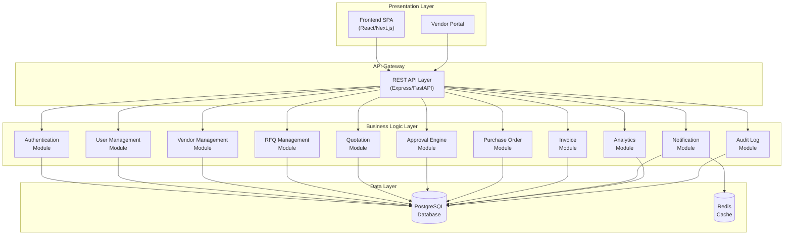
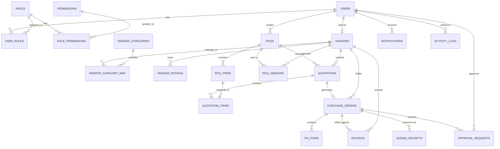
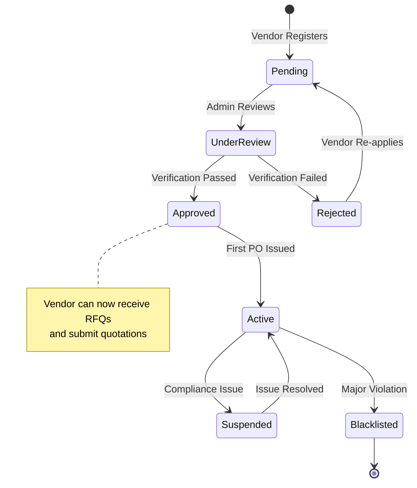
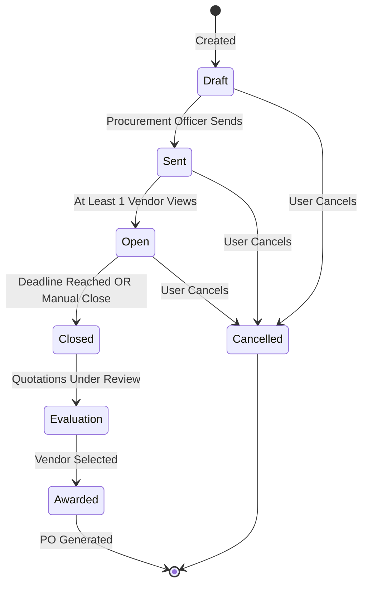
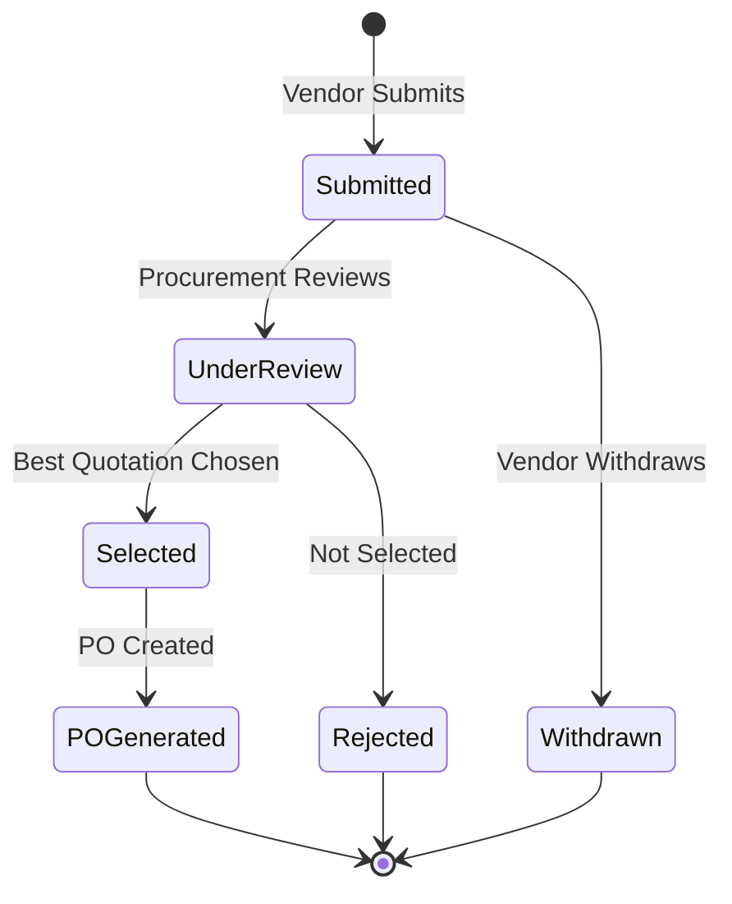
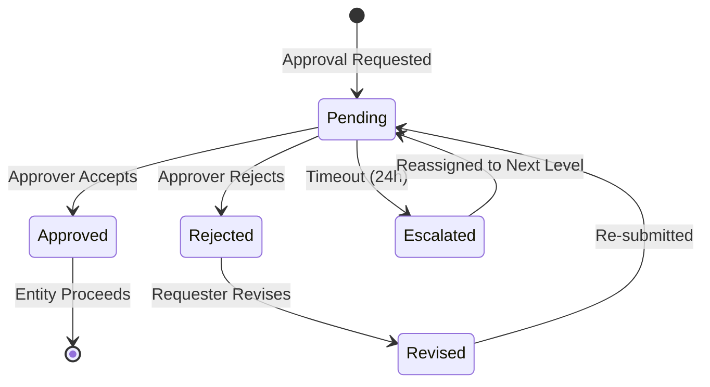
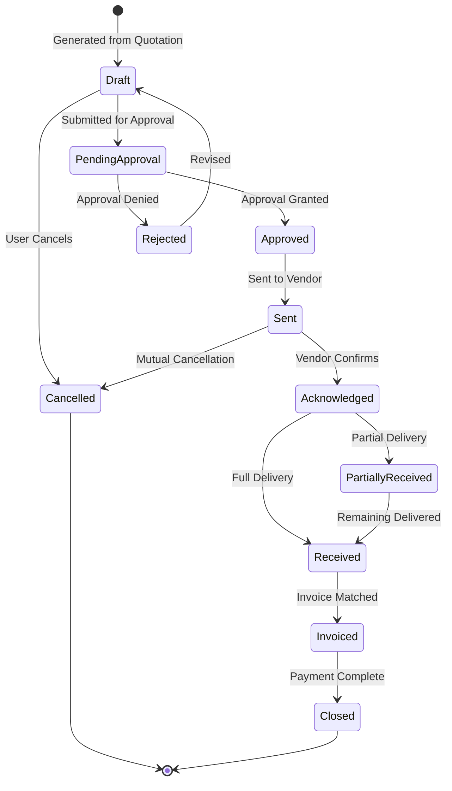
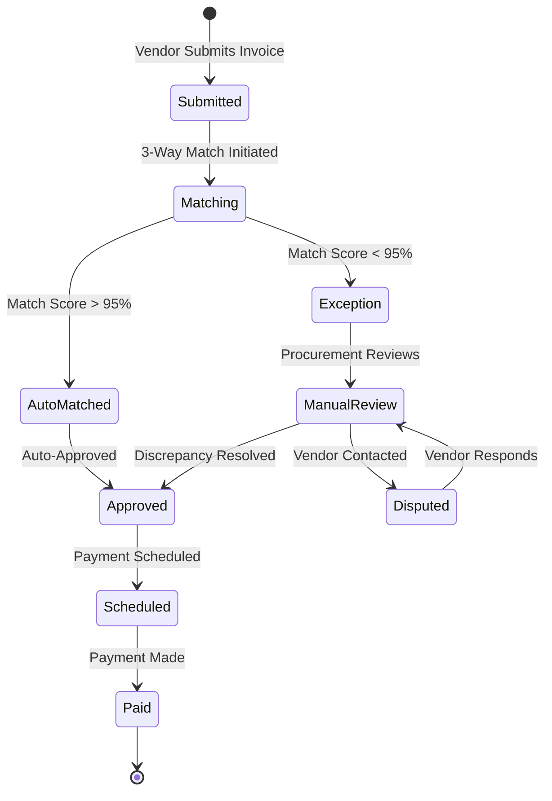

# VendorBridge — Hackathon-Winning Blueprint
### Procurement & Vendor Management ERP

> **Codename**: VendorBridge  
> **Tagline**: *"From Requisition to Receipt — Intelligent Procurement, Zero Friction."*

---

## TABLE OF CONTENTS

| Part | Title |
|------|-------|
| 1 | [Deep Problem Analysis](#part-1--deep-problem-analysis) |
| 2 | [Judge Mindset Analysis](#part-2--judge-mindset-analysis) |
| 3 | [Product Vision](#part-3--product-vision) |
| 4 | [Complete Feature Breakdown](#part-4--complete-feature-breakdown) |
| 5 | [Hackathon Winning Features](#part-5--hackathon-winning-features) |
| 6 | [ERP Module Architecture](#part-6--erp-module-architecture) |
| 7 | [Database Design](#part-7--database-design) |
| 8 | [System Workflow](#part-8--system-workflow) |
| 9 | [Role Based Access Control](#part-9--role-based-access-control) |
| 10 | [API Architecture](#part-10--api-architecture) |
| 11 | [Frontend Architecture](#part-11--frontend-architecture) |
| 12 | [Analytics Strategy](#part-12--analytics-strategy) |
| 13 | [Security Strategy](#part-13--security-strategy) |
| 14 | [Scalability Strategy](#part-14--scalability-strategy) |
| 15 | [Testing Strategy](#part-15--testing-strategy) |
| 16 | [Implementation Roadmap](#part-16--implementation-roadmap) |
| 17 | [Winning Strategy](#part-17--winning-strategy) |

---

# PART 1 — DEEP PROBLEM ANALYSIS

## 1.1 Core Business Problem

Procurement is the **single largest controllable cost center** in most organizations — typically 50–70% of total revenue is spent through procurement. Yet most mid-market companies still run procurement through a patchwork of spreadsheets, email threads, WhatsApp messages, and disconnected legacy tools. The result: **uncontrolled spend, maverick purchasing, vendor lock-in, approval paralysis, and zero spend visibility.**

VendorBridge solves this by providing a **unified, intelligent, end-to-end procurement platform** that digitizes the entire procure-to-pay cycle while embedding intelligence at every decision point.

## 1.2 Procurement Industry Pain Points

| Pain Point | Impact | Severity |
|---|---|---|
| **Fragmented vendor communication** | RFQs sent via email, responses lost, no single source of truth | 🔴 Critical |
| **No spend visibility** | Finance discovers cost overruns only at month-end close | 🔴 Critical |
| **Manual quotation comparison** | Procurement officers manually tabulate vendor responses in Excel — error-prone, slow | 🟠 High |
| **Approval bottlenecks** | POs stuck for days because the approver is on leave; no escalation path | 🟠 High |
| **Invoice-PO mismatch** | 30–40% of invoices require manual intervention due to price/quantity discrepancies | 🟠 High |
| **Vendor quality blindness** | No historical performance data; same underperforming vendors keep winning bids | 🟡 Medium |
| **Compliance gaps** | No audit trail for why a specific vendor was selected | 🔴 Critical |
| **Duplicate purchases** | Different departments unknowingly purchase the same items from different vendors at different prices | 🟠 High |
| **Late deliveries** | No systematic tracking of vendor delivery timelines | 🟡 Medium |
| **Contract leakage** | Negotiated contract terms not enforced at PO level | 🟡 Medium |

## 1.3 Current Manual Workflow Issues

```mermaid
graph LR
    A["Need Identified<br/>(Verbal/Email)"] --> B["Vendor Search<br/>(Google/Rolodex)"]
    B --> C["RFQ via Email<br/>(Copy-paste)"]
    C --> D["Quotations Received<br/>(Email attachments)"]
    D --> E["Manual Comparison<br/>(Excel)"]
    E --> F["Approval via Email<br/>(Chain of forwards)"]
    F --> G["PO via Word/PDF<br/>(Manual typing)"]
    G --> H["Invoice Matching<br/>(Eyeball check)"]
    H --> I["Payment<br/>(Separate system)"]
    
    style A fill:#ff6b6b,color:#fff
    style E fill:#ff6b6b,color:#fff
    style F fill:#ff6b6b,color:#fff
    style H fill:#ff6b6b,color:#fff
```



**Red nodes** = highest friction points where VendorBridge creates maximum value.

## 1.4 Cost of Inefficient Procurement

| Metric | Manual Process | With VendorBridge | Savings |
|---|---|---|---|
| Average PO cycle time | 5–7 days | < 24 hours | 80% faster |
| Invoice processing cost | $15–$40 per invoice | $2–$5 per invoice | 85% reduction |
| Maverick spending | 25–40% of total spend | < 5% | $$$$ |
| Procurement staff time on admin | 60–70% | 20% | 3x more strategic work |
| Vendor onboarding time | 2–4 weeks | 2–3 days | 85% faster |

## 1.5 Hidden Problems (What judges will look for)

> [!IMPORTANT]
> These are the problems that **separate winning teams from average teams**. Judges who are ERP architects will specifically look for awareness of these.

1. **Tail Spend Blindness** — Organizations focus on top vendors but 80% of vendor relationships (tail spend) are unmanaged, creating risk and cost leakage.
2. **Approval Theater** — Approvals exist for compliance, but approvers rubber-stamp because they lack contextual data (budget consumed, historical pricing, vendor score).
3. **Vendor Concentration Risk** — Over-reliance on a single vendor for critical categories creates supply chain fragility.
4. **Price Erosion Over Time** — Without historical price tracking, vendors gradually increase prices by 2–5% per cycle undetected.
5. **Shadow Procurement** — Employees bypass the system entirely because it's too slow/cumbersome.
6. **Data Silos Between Finance and Procurement** — Procurement commits spend; Finance sees it only at invoice/payment stage.

## 1.6 Opportunities for Innovation

| Opportunity | Description | Competitive Edge |
|---|---|---|
| **Intelligent Vendor Scoring** | Multi-dimensional vendor rating (price, quality, delivery, responsiveness) | No spreadsheet system can do this |
| **Predictive Spend Analytics** | Forecast procurement spend by category/vendor | Strategic procurement enablement |
| **Automated 3-Way Matching** | PO ↔ GRN ↔ Invoice auto-reconciliation | Eliminates #1 AP bottleneck |
| **Smart Approval Context** | Show approvers budget utilization, historical comparisons, risk flags inline | Transforms rubber-stamping into informed decisions |
| **Vendor Self-Service Portal** | Vendors submit quotations, update profiles, track PO status themselves | Reduces procurement team workload by 40% |

---

# PART 2 — JUDGE MINDSET ANALYSIS

## 2.1 What Average Teams Will Build

- Basic CRUD for vendors, RFQs, POs
- Simple forms with minimal validation
- No real workflow engine — just status fields updated manually
- Generic Bootstrap/Material UI with no design system
- No analytics dashboard or static placeholder charts
- Authentication with basic login, no RBAC
- Monolithic architecture with no separation of concerns
- Demo: "Here's the form, you fill it in, it saves to database"

**Judge reaction**: *"Functional but uninspired. Looks like a college assignment."*

## 2.2 What Good Teams Will Build

- Full lifecycle management (Vendor → RFQ → Quotation → PO → Invoice)
- Role-based access with at least 3 roles
- Approval workflow with basic routing
- Quotation comparison table
- Dashboard with 3–5 charts
- Notifications (in-app at minimum)
- Clean UI with consistent design
- Some business logic (budget checks, duplicate detection)
- Demo: Walk through a complete procurement cycle

**Judge reaction**: *"Solid execution. Covers the requirements. But doesn't surprise me."*

## 2.3 What WINNING Teams Will Build

- **Everything above PLUS:**
- Vendor Performance Index with weighted multi-criteria scoring
- Smart Approval Engine with escalation, delegation, and contextual data cards
- Quotation Comparison Engine with visual side-by-side, auto-ranking, recommendation
- Procurement Analytics Dashboard with real-time KPIs, trend analysis, spend heatmaps
- 3-Way Matching Engine (PO ↔ Receipt ↔ Invoice)
- Audit Trail with complete provenance chain
- Real-time notifications with actionable inline approvals
- Professional-grade UI that looks like a real SaaS product
- Vendor self-service portal (separate login experience)
- Activity timeline on every entity
- **Architecture that demonstrates ERP thinking** — modules, not pages

**Judge reaction**: *"This team understands enterprise procurement. The architecture is production-quality. The UX is premium. This could be a real product."*

## 2.4 Maximum Demo Impact Features

| Rank | Feature | Why It Impresses |
|---|---|---|
| 1 | **Quotation Comparison Engine** | Visual, interactive, shows analytical thinking |
| 2 | **Procurement Dashboard** | Immediate visual impact, shows data mastery |
| 3 | **Smart Approval Workflow** | Shows understanding of enterprise business processes |
| 4 | **Vendor Performance Scorecard** | Shows domain expertise beyond CRUD |
| 5 | **Activity Timeline / Audit Log** | Shows enterprise-grade thinking |
| 6 | **3-Way Matching** | Shows deep procurement domain knowledge |
| 7 | **Role-Based Dashboards** | Different views for different personas — sophisticated |
| 8 | **Real-time Notifications** | Shows technical polish |

## 2.5 Architecture Decisions That Maximize Score

| Decision | Why |
|---|---|
| **Modular ERP architecture** (not page-based) | Shows enterprise architecture thinking |
| **State machine for workflows** | Shows formal CS knowledge applied to business |
| **Event-driven audit logging** | Shows security awareness |
| **Separation of vendor portal from internal portal** | Shows multi-tenant / multi-persona thinking |
| **RESTful API design with versioning** | Shows API maturity |
| **Database design with proper normalization + strategic denormalization** | Shows DB architecture skill |

## 2.6 Common Mistakes That Reduce Score

| Mistake | Impact |
|---|---|
| No clear module boundaries | Looks like spaghetti code |
| Hard-coded approval logic | Shows lack of flexibility thinking |
| No audit trail | Major ERP red flag for judges |
| UI that looks like a Bootstrap template | Screams "tutorial project" |
| No error handling or validation | Shows immaturity |
| Ignoring vendor perspective | Shows incomplete domain understanding |
| No data seeding / empty demo | Kills demo impact completely |
| Over-engineering with microservices | Unnecessary complexity for hackathon |

---

# PART 3 — PRODUCT VISION

## 3.1 Mission & Vision

**Mission**: Empower procurement teams to make faster, smarter, and more transparent purchasing decisions through an intelligent, unified platform.

**Vision**: Become the procurement intelligence layer that transforms organizations from reactive purchasing to strategic sourcing.

## 3.2 Target Users & Personas

### Persona 1: Procurement Officer — "Priya"

| Attribute | Detail |
|---|---|
| **Role** | Procurement Officer |
| **Age** | 28–35 |
| **Tech Comfort** | Moderate — uses Excel daily, comfortable with web apps |
| **Daily Activities** | Creates RFQs, collects quotations, compares vendors, generates POs |
| **Goals** | Process purchases quickly, find best vendor-price combination, avoid rework |
| **Frustrations** | "I spend 3 hours comparing quotations in Excel every week." "Approvals take forever — I have to chase managers on WhatsApp." "I can never find last year's pricing for the same item." |
| **Success Metric** | RFQ-to-PO cycle time < 2 days |

### Persona 2: Vendor — "Rajesh"

| Attribute | Detail |
|---|---|
| **Role** | Sales Manager at a vendor company |
| **Age** | 35–45 |
| **Tech Comfort** | Low-Moderate — primarily uses email and WhatsApp |
| **Daily Activities** | Responds to RFQs, tracks PO status, submits invoices |
| **Goals** | Win more business, get paid on time, build relationship with buyers |
| **Frustrations** | "I never know if my quotation was received." "I submit invoices and wait weeks for payment with no visibility." "Every buyer has a different format for RFQs." |
| **Success Metric** | Quotation submission < 10 minutes; invoice payment within terms |

### Persona 3: Manager — "Anand"

| Attribute | Detail |
|---|---|
| **Role** | Department Manager / Approver |
| **Age** | 40–50 |
| **Tech Comfort** | Low — checks email, uses approval systems reluctantly |
| **Daily Activities** | Reviews and approves purchase requests, monitors department budget |
| **Goals** | Approve legitimate purchases quickly, control department spend |
| **Frustrations** | "I approve POs with no context — I don't know if this price is fair." "I'm the bottleneck because everything needs my signature." "I can't see how much budget is already committed." |
| **Success Metric** | Average approval time < 4 hours; zero unauthorized purchases |

### Persona 4: Admin — "Meera"

| Attribute | Detail |
|---|---|
| **Role** | System Administrator / ERP Admin |
| **Age** | 30–40 |
| **Tech Comfort** | High — configures systems, manages users |
| **Daily Activities** | User management, role configuration, system monitoring, report generation |
| **Goals** | Ensure system availability, enforce access controls, generate compliance reports |
| **Frustrations** | "I can't see who did what in the system." "Adding a new approval rule requires a code change." "There's no way to audit vendor data changes." |
| **Success Metric** | 100% audit coverage; zero unauthorized access incidents |

## 3.3 Success Metrics

| KPI | Target | Measurement |
|---|---|---|
| RFQ-to-PO Cycle Time | < 48 hours | System timestamps |
| Quotation Comparison Time | < 5 minutes | From RFQ close to comparison view |
| Approval Turnaround | < 4 hours | Submission to decision |
| Invoice Match Rate | > 95% auto-matched | 3-way matching engine |
| Vendor Onboarding Time | < 48 hours | Registration to approved status |
| Procurement Spend Visibility | 100% | All spend captured in system |
| User Adoption Rate | > 80% | Active users / total users |

---

# PART 4 — COMPLETE FEATURE BREAKDOWN

## 4.1 MVP Features (Must Build for Hackathon)

| # | Feature | Purpose | Business Value | Complexity | Demo Value | Judge Score |
|---|---|---|---|---|---|---|
| M1 | **User Authentication & RBAC** | Secure multi-role access | Foundation for all features | Medium | Medium | 7/10 |
| M2 | **Vendor Registration & Management** | Centralized vendor database | Single source of truth | Low | Medium | 6/10 |
| M3 | **RFQ Creation & Distribution** | Digitize request process | Eliminates email-based RFQs | Medium | High | 8/10 |
| M4 | **Vendor Quotation Submission** | Vendor self-service response | Reduces manual data entry | Medium | High | 8/10 |
| M5 | **Quotation Comparison Engine** | Side-by-side visual comparison | Saves hours of Excel work | High | **Very High** | **10/10** |
| M6 | **Approval Workflow Engine** | Configurable multi-level approvals | Enforces governance | High | **Very High** | **9/10** |
| M7 | **Purchase Order Generation** | Auto-generate PO from approved quotation | Eliminates manual PO creation | Medium | High | 8/10 |
| M8 | **Procurement Dashboard** | KPIs, charts, at-a-glance insights | Executive visibility | Medium | **Very High** | **10/10** |
| M9 | **Invoice Management** | Record and track invoices | Financial control | Medium | Medium | 7/10 |
| M10 | **Notification System** | In-app alerts for actions needed | Reduces delays | Low | Medium | 6/10 |

## 4.2 Advanced Features (Build if Time Permits)

| # | Feature | Purpose | Business Value | Complexity | Demo Value | Judge Score |
|---|---|---|---|---|---|---|
| A1 | **Vendor Performance Scoring** | Rate vendors on delivery, quality, price | Strategic sourcing enablement | Medium | High | 9/10 |
| A2 | **3-Way Matching (PO-GRN-Invoice)** | Auto-reconciliation | Eliminates AP bottleneck | High | High | 9/10 |
| A3 | **Approval Escalation Engine** | Auto-escalate stale approvals | Eliminates bottlenecks | Medium | High | 8/10 |
| A4 | **Activity Timeline** | Chronological audit trail per entity | Compliance & transparency | Low | High | 8/10 |
| A5 | **Budget Tracking** | Track committed vs. actual spend per dept | Financial governance | Medium | High | 8/10 |
| A6 | **Email Notifications** | Notify stakeholders via email | Broader reach | Low | Medium | 5/10 |

## 4.3 Premium Features (Differentiation)

| # | Feature | Purpose | Business Value | Complexity | Demo Value | Judge Score |
|---|---|---|---|---|---|---|
| P1 | **AI Vendor Recommendation** | Suggest best vendor based on history | Procurement intelligence | High | **Very High** | **10/10** |
| P2 | **Spend Intelligence Dashboard** | Category-wise, trend-based spend analysis | CFO-level visibility | Medium | High | 9/10 |
| P3 | **Procurement Risk Radar** | Flag vendor concentration, single-source risk | Risk management | Medium | High | 9/10 |
| P4 | **Smart RFQ Templates** | Pre-configured templates by category | Accelerates RFQ creation | Low | Medium | 6/10 |
| P5 | **Vendor Portal** | Dedicated vendor-facing experience | Self-service for vendors | High | High | 8/10 |

## 4.4 Future Features (Mention in Demo, Don't Build)

| # | Feature | Purpose |
|---|---|---|
| F1 | **OCR Invoice Processing** | Auto-extract data from scanned invoices |
| F2 | **Contract Management** | Link POs to master contracts |
| F3 | **Multi-Currency Support** | International procurement |
| F4 | **Punch-out Catalogs** | Direct ordering from vendor catalogs |
| F5 | **Mobile App** | On-the-go approvals |
| F6 | **EDI Integration** | Electronic Data Interchange with vendors |
| F7 | **Blockchain Audit Trail** | Immutable procurement records |

---

# PART 5 — HACKATHON WINNING FEATURES

## 20+ Innovative Features Ranked

| # | Feature | Description | Dev Effort | Demo Impact | Judge Impact |
|---|---|---|---|---|---|
| 1 | **🏆 Quotation Comparison Matrix** | Visual side-by-side with auto-ranking, color-coded pricing, weighted scoring | Medium | ⭐⭐⭐⭐⭐ | ⭐⭐⭐⭐⭐ |
| 2 | **🏆 Procurement Health Dashboard** | Organization-wide procurement KPIs with real-time updates | Medium | ⭐⭐⭐⭐⭐ | ⭐⭐⭐⭐⭐ |
| 3 | **🏆 Smart Approval Context Cards** | Show approvers: budget status, price history, vendor score, risk flags inline | Medium | ⭐⭐⭐⭐⭐ | ⭐⭐⭐⭐⭐ |
| 4 | **Vendor Performance Index (VPI)** | Composite score: On-Time Delivery (30%) + Quality (25%) + Price Competitiveness (25%) + Responsiveness (20%) | Medium | ⭐⭐⭐⭐ | ⭐⭐⭐⭐⭐ |
| 5 | **Approval Escalation Engine** | Auto-escalate to next approver after configurable timeout (e.g., 24h) | Low | ⭐⭐⭐⭐ | ⭐⭐⭐⭐ |
| 6 | **Procurement Risk Radar** | Visual risk indicators: vendor concentration, single-source categories, price anomalies | Medium | ⭐⭐⭐⭐ | ⭐⭐⭐⭐⭐ |
| 7 | **3-Way Matching Engine** | PO ↔ Goods Receipt ↔ Invoice auto-reconciliation with exception handling | High | ⭐⭐⭐⭐ | ⭐⭐⭐⭐⭐ |
| 8 | **Spend Heatmap** | Visual heatmap of spending by category × month | Low | ⭐⭐⭐⭐⭐ | ⭐⭐⭐⭐ |
| 9 | **Activity Timeline** | GitHub-style activity feed on every entity (RFQ, PO, Vendor) | Low | ⭐⭐⭐⭐ | ⭐⭐⭐⭐ |
| 10 | **AI Cost Optimization Suggestions** | "You paid 15% more than market average for this category" | High | ⭐⭐⭐⭐⭐ | ⭐⭐⭐⭐⭐ |
| 11 | **Smart RFQ Matching** | Auto-suggest vendors based on category, past performance, and capacity | Medium | ⭐⭐⭐⭐ | ⭐⭐⭐⭐ |
| 12 | **Vendor Onboarding Wizard** | Step-by-step vendor registration with document upload & verification | Low | ⭐⭐⭐ | ⭐⭐⭐ |
| 13 | **Procurement Calendar** | Visual calendar showing RFQ deadlines, PO dates, delivery dates | Low | ⭐⭐⭐⭐ | ⭐⭐⭐ |
| 14 | **Budget vs. Committed Gauge** | Visual gauge showing department budget utilization | Low | ⭐⭐⭐⭐ | ⭐⭐⭐⭐ |
| 15 | **Vendor Diversity Tracker** | Track % of spend with diverse/local/SME vendors | Low | ⭐⭐⭐ | ⭐⭐⭐⭐ |
| 16 | **RFQ Conversion Funnel** | Visual funnel: RFQs Created → Quotations Received → POs Issued | Low | ⭐⭐⭐⭐ | ⭐⭐⭐⭐ |
| 17 | **Anomaly Detection** | Flag unusual patterns: price spikes, volume anomalies, off-contract purchasing | High | ⭐⭐⭐⭐ | ⭐⭐⭐⭐⭐ |
| 18 | **Comparative Vendor Analytics** | Compare 2–3 vendors across all dimensions over time | Medium | ⭐⭐⭐⭐ | ⭐⭐⭐⭐ |
| 19 | **PO Compliance Score** | % of POs that follow policy (approved, within budget, preferred vendor) | Low | ⭐⭐⭐ | ⭐⭐⭐⭐ |
| 20 | **Natural Language Search** | "Show me all POs over ₹50,000 from last quarter" | High | ⭐⭐⭐⭐⭐ | ⭐⭐⭐⭐⭐ |
| 21 | **Dark Mode** | Premium SaaS feel | Low | ⭐⭐⭐ | ⭐⭐⭐ |
| 22 | **Export to PDF/Excel** | Professional reports for stakeholders | Low | ⭐⭐⭐ | ⭐⭐⭐ |
| 23 | **Configurable Approval Rules** | Rule engine: if amount > X AND category = Y → require VP approval | Medium | ⭐⭐⭐ | ⭐⭐⭐⭐⭐ |
| 24 | **Vendor Blacklist/Watchlist** | Flag vendors with compliance issues | Low | ⭐⭐⭐ | ⭐⭐⭐⭐ |
| 25 | **Procurement SLA Tracker** | Track cycle times against SLA targets | Low | ⭐⭐⭐⭐ | ⭐⭐⭐⭐ |

---

# PART 6 — ERP MODULE ARCHITECTURE

## 6.1 High-Level Module Diagram



## 6.2 Module Details

### Module 1: Authentication Module

| Aspect | Detail |
|---|---|
| **Responsibilities** | User login/logout, JWT token management, session management, password hashing, refresh token rotation |
| **Database Entities** | `users`, `sessions`, `password_reset_tokens` |
| **API Endpoints** | `POST /auth/login`, `POST /auth/logout`, `POST /auth/refresh`, `POST /auth/forgot-password` |
| **Dependencies** | None (foundational module) |
| **Scalability** | Stateless JWT; Redis for token blacklisting at scale |

### Module 2: User Management Module

| Aspect | Detail |
|---|---|
| **Responsibilities** | CRUD users, role assignment, permission management, user profile management |
| **Database Entities** | `users`, `roles`, `permissions`, `role_permissions`, `user_roles` |
| **API Endpoints** | `GET/POST/PUT/DELETE /users`, `GET/POST /roles`, `PUT /users/:id/roles` |
| **Dependencies** | Authentication Module |
| **Scalability** | Permission caching in Redis; batch user operations |

### Module 3: Vendor Management Module

| Aspect | Detail |
|---|---|
| **Responsibilities** | Vendor registration, verification, categorization, performance tracking, blacklist/watchlist management |
| **Database Entities** | `vendors`, `vendor_categories`, `vendor_documents`, `vendor_ratings`, `vendor_contacts` |
| **API Endpoints** | `GET/POST/PUT /vendors`, `GET /vendors/:id/performance`, `PUT /vendors/:id/status`, `GET /vendor-categories` |
| **Dependencies** | User Management, Audit Log |
| **Scalability** | Read replicas for vendor search; Elasticsearch for full-text search at scale |

### Module 4: RFQ Management Module

| Aspect | Detail |
|---|---|
| **Responsibilities** | Create RFQs, add line items, assign vendors, track RFQ lifecycle, close/cancel RFQs |
| **Database Entities** | `rfqs`, `rfq_items`, `rfq_vendors` |
| **API Endpoints** | `GET/POST/PUT /rfqs`, `POST /rfqs/:id/items`, `POST /rfqs/:id/send`, `PUT /rfqs/:id/close` |
| **Dependencies** | Vendor Management, Notification Module |
| **Scalability** | Async vendor notification; bulk RFQ operations |

### Module 5: Quotation Module

| Aspect | Detail |
|---|---|
| **Responsibilities** | Receive vendor quotations, store line-item pricing, enable comparison, rank quotations |
| **Database Entities** | `quotations`, `quotation_items` |
| **API Endpoints** | `GET/POST /quotations`, `GET /rfqs/:id/quotations/compare`, `PUT /quotations/:id/select` |
| **Dependencies** | RFQ Module, Vendor Module |
| **Scalability** | Comparison computation can be cached; eventual consistency for large RFQs |

### Module 6: Approval Engine Module

| Aspect | Detail |
|---|---|
| **Responsibilities** | Define approval rules, route approvals, track approval status, escalation, delegation |
| **Database Entities** | `approval_rules`, `approval_requests`, `approval_actions` |
| **API Endpoints** | `GET/POST /approval-rules`, `GET /approvals/pending`, `PUT /approvals/:id/approve`, `PUT /approvals/:id/reject`, `PUT /approvals/:id/escalate` |
| **Dependencies** | User Management (for approver hierarchy) |
| **Scalability** | Rule engine can be evaluated in-memory; approval queue via Redis |

### Module 7: Purchase Order Module

| Aspect | Detail |
|---|---|
| **Responsibilities** | Generate POs from approved quotations, manage PO lifecycle, track deliveries |
| **Database Entities** | `purchase_orders`, `po_items` |
| **API Endpoints** | `GET/POST /purchase-orders`, `PUT /purchase-orders/:id/status`, `GET /purchase-orders/:id/pdf` |
| **Dependencies** | Quotation Module, Approval Module |
| **Scalability** | PDF generation as async job; PO numbering via DB sequence |

### Module 8: Invoice Module

| Aspect | Detail |
|---|---|
| **Responsibilities** | Invoice creation, 3-way matching (PO-GRN-Invoice), payment tracking |
| **Database Entities** | `invoices`, `invoice_items`, `goods_receipts` |
| **API Endpoints** | `GET/POST /invoices`, `GET /invoices/:id/match`, `PUT /invoices/:id/status` |
| **Dependencies** | Purchase Order Module |
| **Scalability** | Matching engine as background job for batch processing |

### Module 9: Notification Module

| Aspect | Detail |
|---|---|
| **Responsibilities** | In-app notifications, email notifications, notification preferences |
| **Database Entities** | `notifications`, `notification_preferences` |
| **API Endpoints** | `GET /notifications`, `PUT /notifications/:id/read`, `PUT /notifications/read-all` |
| **Dependencies** | All modules (event consumer) |
| **Scalability** | Event-driven via message queue; WebSocket for real-time at scale |

### Module 10: Analytics Module

| Aspect | Detail |
|---|---|
| **Responsibilities** | Aggregate procurement metrics, generate reports, provide dashboard data |
| **Database Entities** | Reads from all other tables; optional `analytics_snapshots` for pre-computed metrics |
| **API Endpoints** | `GET /analytics/dashboard`, `GET /analytics/spend`, `GET /analytics/vendor-performance`, `GET /analytics/trends` |
| **Dependencies** | All modules (read-only) |
| **Scalability** | Materialized views; pre-computed aggregates; time-series partitioning |

### Module 11: Audit Log Module

| Aspect | Detail |
|---|---|
| **Responsibilities** | Log all create/update/delete operations, store before/after state, enable compliance queries |
| **Database Entities** | `audit_logs` |
| **API Endpoints** | `GET /audit-logs`, `GET /audit-logs/:entity/:id` |
| **Dependencies** | None (consumed by all modules) |
| **Scalability** | Append-only table; partitioned by date; archival to cold storage |

---

# PART 7 — DATABASE DESIGN

## 7.1 Complete Schema

### Table: `users`
```sql
CREATE TABLE users (
    id              UUID PRIMARY KEY DEFAULT gen_random_uuid(),
    email           VARCHAR(255) NOT NULL UNIQUE,
    password_hash   VARCHAR(255) NOT NULL,
    first_name      VARCHAR(100) NOT NULL,
    last_name       VARCHAR(100) NOT NULL,
    phone           VARCHAR(20),
    avatar_url      VARCHAR(500),
    is_active       BOOLEAN DEFAULT TRUE,
    email_verified  BOOLEAN DEFAULT FALSE,
    last_login_at   TIMESTAMP WITH TIME ZONE,
    created_at      TIMESTAMP WITH TIME ZONE DEFAULT NOW(),
    updated_at      TIMESTAMP WITH TIME ZONE DEFAULT NOW()
);

CREATE INDEX idx_users_email ON users(email);
CREATE INDEX idx_users_active ON users(is_active) WHERE is_active = TRUE;
```

### Table: `roles`
```sql
CREATE TABLE roles (
    id          UUID PRIMARY KEY DEFAULT gen_random_uuid(),
    name        VARCHAR(50) NOT NULL UNIQUE,  -- 'admin', 'procurement_officer', 'vendor', 'manager'
    display_name VARCHAR(100) NOT NULL,
    description TEXT,
    is_system   BOOLEAN DEFAULT FALSE,  -- system roles cannot be deleted
    created_at  TIMESTAMP WITH TIME ZONE DEFAULT NOW()
);
```

### Table: `permissions`
```sql
CREATE TABLE permissions (
    id          UUID PRIMARY KEY DEFAULT gen_random_uuid(),
    module      VARCHAR(50) NOT NULL,   -- 'vendor', 'rfq', 'po', etc.
    action      VARCHAR(50) NOT NULL,   -- 'create', 'read', 'update', 'delete', 'approve'
    resource    VARCHAR(100) NOT NULL,  -- 'vendors', 'rfqs', 'purchase_orders'
    description TEXT,
    UNIQUE(module, action, resource)
);
```

### Table: `role_permissions`
```sql
CREATE TABLE role_permissions (
    role_id       UUID REFERENCES roles(id) ON DELETE CASCADE,
    permission_id UUID REFERENCES permissions(id) ON DELETE CASCADE,
    PRIMARY KEY (role_id, permission_id)
);
```

### Table: `user_roles`
```sql
CREATE TABLE user_roles (
    user_id UUID REFERENCES users(id) ON DELETE CASCADE,
    role_id UUID REFERENCES roles(id) ON DELETE CASCADE,
    assigned_at TIMESTAMP WITH TIME ZONE DEFAULT NOW(),
    assigned_by UUID REFERENCES users(id),
    PRIMARY KEY (user_id, role_id)
);
```

### Table: `vendors`
```sql
CREATE TABLE vendors (
    id              UUID PRIMARY KEY DEFAULT gen_random_uuid(),
    user_id         UUID REFERENCES users(id),  -- linked user account for portal access
    company_name    VARCHAR(255) NOT NULL,
    contact_person  VARCHAR(200),
    email           VARCHAR(255) NOT NULL,
    phone           VARCHAR(20),
    website         VARCHAR(500),
    address_line1   VARCHAR(255),
    address_line2   VARCHAR(255),
    city            VARCHAR(100),
    state           VARCHAR(100),
    country         VARCHAR(100),
    postal_code     VARCHAR(20),
    tax_id          VARCHAR(50),        -- GST/TIN/VAT number
    registration_no VARCHAR(50),
    status          VARCHAR(20) DEFAULT 'pending',  -- pending, approved, suspended, blacklisted
    payment_terms   INTEGER DEFAULT 30, -- days
    currency        VARCHAR(3) DEFAULT 'INR',
    notes           TEXT,
    verified_at     TIMESTAMP WITH TIME ZONE,
    verified_by     UUID REFERENCES users(id),
    created_at      TIMESTAMP WITH TIME ZONE DEFAULT NOW(),
    updated_at      TIMESTAMP WITH TIME ZONE DEFAULT NOW()
);

CREATE INDEX idx_vendors_status ON vendors(status);
CREATE INDEX idx_vendors_company ON vendors(company_name);
CREATE INDEX idx_vendors_user ON vendors(user_id);
```

### Table: `vendor_categories`
```sql
CREATE TABLE vendor_categories (
    id          UUID PRIMARY KEY DEFAULT gen_random_uuid(),
    name        VARCHAR(100) NOT NULL UNIQUE,
    description TEXT,
    parent_id   UUID REFERENCES vendor_categories(id),  -- hierarchical categories
    is_active   BOOLEAN DEFAULT TRUE,
    created_at  TIMESTAMP WITH TIME ZONE DEFAULT NOW()
);

CREATE TABLE vendor_category_map (
    vendor_id   UUID REFERENCES vendors(id) ON DELETE CASCADE,
    category_id UUID REFERENCES vendor_categories(id) ON DELETE CASCADE,
    PRIMARY KEY (vendor_id, category_id)
);
```

### Table: `vendor_ratings`
```sql
CREATE TABLE vendor_ratings (
    id              UUID PRIMARY KEY DEFAULT gen_random_uuid(),
    vendor_id       UUID REFERENCES vendors(id) ON DELETE CASCADE,
    po_id           UUID REFERENCES purchase_orders(id),
    quality_score   DECIMAL(3,2) CHECK (quality_score BETWEEN 0 AND 5),
    delivery_score  DECIMAL(3,2) CHECK (delivery_score BETWEEN 0 AND 5),
    price_score     DECIMAL(3,2) CHECK (price_score BETWEEN 0 AND 5),
    response_score  DECIMAL(3,2) CHECK (response_score BETWEEN 0 AND 5),
    overall_score   DECIMAL(3,2) GENERATED ALWAYS AS (
        (quality_score * 0.25 + delivery_score * 0.30 + price_score * 0.25 + response_score * 0.20)
    ) STORED,
    comments        TEXT,
    rated_by        UUID REFERENCES users(id),
    created_at      TIMESTAMP WITH TIME ZONE DEFAULT NOW()
);

CREATE INDEX idx_vendor_ratings_vendor ON vendor_ratings(vendor_id);
CREATE INDEX idx_vendor_ratings_overall ON vendor_ratings(overall_score);
```

### Table: `rfqs`
```sql
CREATE TABLE rfqs (
    id              UUID PRIMARY KEY DEFAULT gen_random_uuid(),
    rfq_number      VARCHAR(20) NOT NULL UNIQUE,  -- auto-generated: RFQ-2026-0001
    title           VARCHAR(255) NOT NULL,
    description     TEXT,
    category_id     UUID REFERENCES vendor_categories(id),
    status          VARCHAR(20) DEFAULT 'draft',  -- draft, sent, open, closed, cancelled
    priority        VARCHAR(10) DEFAULT 'medium', -- low, medium, high, urgent
    submission_deadline TIMESTAMP WITH TIME ZONE NOT NULL,
    budget_estimate DECIMAL(15,2),
    currency        VARCHAR(3) DEFAULT 'INR',
    terms_conditions TEXT,
    created_by      UUID REFERENCES users(id) NOT NULL,
    closed_at       TIMESTAMP WITH TIME ZONE,
    cancelled_at    TIMESTAMP WITH TIME ZONE,
    cancel_reason   TEXT,
    created_at      TIMESTAMP WITH TIME ZONE DEFAULT NOW(),
    updated_at      TIMESTAMP WITH TIME ZONE DEFAULT NOW()
);

CREATE INDEX idx_rfqs_status ON rfqs(status);
CREATE INDEX idx_rfqs_created_by ON rfqs(created_by);
CREATE INDEX idx_rfqs_number ON rfqs(rfq_number);
CREATE INDEX idx_rfqs_deadline ON rfqs(submission_deadline);
```

### Table: `rfq_items`
```sql
CREATE TABLE rfq_items (
    id          UUID PRIMARY KEY DEFAULT gen_random_uuid(),
    rfq_id      UUID REFERENCES rfqs(id) ON DELETE CASCADE,
    item_name   VARCHAR(255) NOT NULL,
    description TEXT,
    quantity    DECIMAL(15,3) NOT NULL CHECK (quantity > 0),
    unit        VARCHAR(20) NOT NULL,  -- pcs, kg, ltr, box, etc.
    specifications TEXT,
    estimated_unit_price DECIMAL(15,2),
    sort_order  INTEGER DEFAULT 0,
    created_at  TIMESTAMP WITH TIME ZONE DEFAULT NOW()
);

CREATE INDEX idx_rfq_items_rfq ON rfq_items(rfq_id);
```

### Table: `rfq_vendors`
```sql
CREATE TABLE rfq_vendors (
    rfq_id      UUID REFERENCES rfqs(id) ON DELETE CASCADE,
    vendor_id   UUID REFERENCES vendors(id) ON DELETE CASCADE,
    invited_at  TIMESTAMP WITH TIME ZONE DEFAULT NOW(),
    viewed_at   TIMESTAMP WITH TIME ZONE,  -- when vendor first viewed the RFQ
    responded   BOOLEAN DEFAULT FALSE,
    PRIMARY KEY (rfq_id, vendor_id)
);
```

### Table: `quotations`
```sql
CREATE TABLE quotations (
    id              UUID PRIMARY KEY DEFAULT gen_random_uuid(),
    quotation_number VARCHAR(20) NOT NULL UNIQUE,  -- QUO-2026-0001
    rfq_id          UUID REFERENCES rfqs(id) NOT NULL,
    vendor_id       UUID REFERENCES vendors(id) NOT NULL,
    status          VARCHAR(20) DEFAULT 'submitted',  -- submitted, under_review, selected, rejected
    total_amount    DECIMAL(15,2) NOT NULL,
    currency        VARCHAR(3) DEFAULT 'INR',
    validity_days   INTEGER DEFAULT 30,
    delivery_days   INTEGER,  -- promised delivery timeline
    payment_terms   VARCHAR(100),
    notes           TEXT,
    submitted_at    TIMESTAMP WITH TIME ZONE DEFAULT NOW(),
    reviewed_at     TIMESTAMP WITH TIME ZONE,
    selected_at     TIMESTAMP WITH TIME ZONE,
    created_at      TIMESTAMP WITH TIME ZONE DEFAULT NOW(),
    updated_at      TIMESTAMP WITH TIME ZONE DEFAULT NOW(),
    UNIQUE(rfq_id, vendor_id)  -- one quotation per vendor per RFQ
);

CREATE INDEX idx_quotations_rfq ON quotations(rfq_id);
CREATE INDEX idx_quotations_vendor ON quotations(vendor_id);
CREATE INDEX idx_quotations_status ON quotations(status);
```

### Table: `quotation_items`
```sql
CREATE TABLE quotation_items (
    id              UUID PRIMARY KEY DEFAULT gen_random_uuid(),
    quotation_id    UUID REFERENCES quotations(id) ON DELETE CASCADE,
    rfq_item_id     UUID REFERENCES rfq_items(id),
    item_name       VARCHAR(255) NOT NULL,
    quantity        DECIMAL(15,3) NOT NULL,
    unit            VARCHAR(20) NOT NULL,
    unit_price      DECIMAL(15,2) NOT NULL CHECK (unit_price >= 0),
    total_price     DECIMAL(15,2) GENERATED ALWAYS AS (quantity * unit_price) STORED,
    tax_rate        DECIMAL(5,2) DEFAULT 0,
    tax_amount      DECIMAL(15,2) GENERATED ALWAYS AS (quantity * unit_price * tax_rate / 100) STORED,
    discount_pct    DECIMAL(5,2) DEFAULT 0,
    notes           TEXT,
    created_at      TIMESTAMP WITH TIME ZONE DEFAULT NOW()
);

CREATE INDEX idx_quotation_items_quotation ON quotation_items(quotation_id);
CREATE INDEX idx_quotation_items_rfq_item ON quotation_items(rfq_item_id);
```

### Table: `approval_rules`
```sql
CREATE TABLE approval_rules (
    id              UUID PRIMARY KEY DEFAULT gen_random_uuid(),
    name            VARCHAR(100) NOT NULL,
    entity_type     VARCHAR(20) NOT NULL,  -- 'purchase_order', 'vendor', 'invoice'
    condition_field VARCHAR(50),           -- 'total_amount', 'category', etc.
    condition_operator VARCHAR(10),        -- 'gt', 'lt', 'eq', 'between'
    condition_value VARCHAR(100),          -- '50000' or '50000,100000' for between
    approver_role_id UUID REFERENCES roles(id),
    approver_user_id UUID REFERENCES users(id),  -- specific user OR role
    approval_level  INTEGER DEFAULT 1,     -- for multi-level approvals
    escalation_hours INTEGER DEFAULT 24,   -- hours before escalation
    is_active       BOOLEAN DEFAULT TRUE,
    created_at      TIMESTAMP WITH TIME ZONE DEFAULT NOW()
);
```

### Table: `approval_requests`
```sql
CREATE TABLE approval_requests (
    id              UUID PRIMARY KEY DEFAULT gen_random_uuid(),
    entity_type     VARCHAR(50) NOT NULL,   -- 'purchase_order', 'vendor_registration'
    entity_id       UUID NOT NULL,           -- ID of the entity being approved
    rule_id         UUID REFERENCES approval_rules(id),
    requested_by    UUID REFERENCES users(id) NOT NULL,
    assigned_to     UUID REFERENCES users(id) NOT NULL,
    status          VARCHAR(20) DEFAULT 'pending',  -- pending, approved, rejected, escalated
    approval_level  INTEGER DEFAULT 1,
    comments        TEXT,
    decided_at      TIMESTAMP WITH TIME ZONE,
    escalated_at    TIMESTAMP WITH TIME ZONE,
    escalated_to    UUID REFERENCES users(id),
    due_at          TIMESTAMP WITH TIME ZONE,
    created_at      TIMESTAMP WITH TIME ZONE DEFAULT NOW(),
    updated_at      TIMESTAMP WITH TIME ZONE DEFAULT NOW()
);

CREATE INDEX idx_approvals_assigned ON approval_requests(assigned_to, status);
CREATE INDEX idx_approvals_entity ON approval_requests(entity_type, entity_id);
CREATE INDEX idx_approvals_status ON approval_requests(status);
CREATE INDEX idx_approvals_due ON approval_requests(due_at) WHERE status = 'pending';
```

### Table: `purchase_orders`
```sql
CREATE TABLE purchase_orders (
    id              UUID PRIMARY KEY DEFAULT gen_random_uuid(),
    po_number       VARCHAR(20) NOT NULL UNIQUE,  -- PO-2026-0001
    rfq_id          UUID REFERENCES rfqs(id),
    quotation_id    UUID REFERENCES quotations(id),
    vendor_id       UUID REFERENCES vendors(id) NOT NULL,
    status          VARCHAR(20) DEFAULT 'draft',  -- draft, pending_approval, approved, sent, acknowledged, partially_received, received, cancelled
    total_amount    DECIMAL(15,2) NOT NULL,
    tax_amount      DECIMAL(15,2) DEFAULT 0,
    grand_total     DECIMAL(15,2) GENERATED ALWAYS AS (total_amount + tax_amount) STORED,
    currency        VARCHAR(3) DEFAULT 'INR',
    payment_terms   INTEGER DEFAULT 30,
    delivery_date   DATE,
    shipping_address TEXT,
    notes           TEXT,
    approved_by     UUID REFERENCES users(id),
    approved_at     TIMESTAMP WITH TIME ZONE,
    sent_at         TIMESTAMP WITH TIME ZONE,
    created_by      UUID REFERENCES users(id) NOT NULL,
    cancelled_at    TIMESTAMP WITH TIME ZONE,
    cancel_reason   TEXT,
    created_at      TIMESTAMP WITH TIME ZONE DEFAULT NOW(),
    updated_at      TIMESTAMP WITH TIME ZONE DEFAULT NOW()
);

CREATE INDEX idx_po_status ON purchase_orders(status);
CREATE INDEX idx_po_vendor ON purchase_orders(vendor_id);
CREATE INDEX idx_po_number ON purchase_orders(po_number);
CREATE INDEX idx_po_created_by ON purchase_orders(created_by);
CREATE INDEX idx_po_delivery ON purchase_orders(delivery_date);
```

### Table: `po_items`
```sql
CREATE TABLE po_items (
    id              UUID PRIMARY KEY DEFAULT gen_random_uuid(),
    po_id           UUID REFERENCES purchase_orders(id) ON DELETE CASCADE,
    quotation_item_id UUID REFERENCES quotation_items(id),
    item_name       VARCHAR(255) NOT NULL,
    description     TEXT,
    quantity        DECIMAL(15,3) NOT NULL CHECK (quantity > 0),
    unit            VARCHAR(20) NOT NULL,
    unit_price      DECIMAL(15,2) NOT NULL CHECK (unit_price >= 0),
    total_price     DECIMAL(15,2) GENERATED ALWAYS AS (quantity * unit_price) STORED,
    tax_rate        DECIMAL(5,2) DEFAULT 0,
    received_qty    DECIMAL(15,3) DEFAULT 0,  -- for partial receipt tracking
    created_at      TIMESTAMP WITH TIME ZONE DEFAULT NOW()
);

CREATE INDEX idx_po_items_po ON po_items(po_id);
```

### Table: `invoices`
```sql
CREATE TABLE invoices (
    id              UUID PRIMARY KEY DEFAULT gen_random_uuid(),
    invoice_number  VARCHAR(50) NOT NULL,
    po_id           UUID REFERENCES purchase_orders(id),
    vendor_id       UUID REFERENCES vendors(id) NOT NULL,
    status          VARCHAR(20) DEFAULT 'pending',  -- pending, matched, partially_matched, disputed, approved, paid
    invoice_date    DATE NOT NULL,
    due_date        DATE NOT NULL,
    subtotal        DECIMAL(15,2) NOT NULL,
    tax_amount      DECIMAL(15,2) DEFAULT 0,
    total_amount    DECIMAL(15,2) NOT NULL,
    currency        VARCHAR(3) DEFAULT 'INR',
    match_status    VARCHAR(20) DEFAULT 'unmatched',  -- unmatched, auto_matched, manual_matched, exception
    match_score     DECIMAL(5,2),  -- 0-100 matching confidence
    notes           TEXT,
    submitted_by    UUID REFERENCES users(id),
    approved_by     UUID REFERENCES users(id),
    approved_at     TIMESTAMP WITH TIME ZONE,
    paid_at         TIMESTAMP WITH TIME ZONE,
    created_at      TIMESTAMP WITH TIME ZONE DEFAULT NOW(),
    updated_at      TIMESTAMP WITH TIME ZONE DEFAULT NOW()
);

CREATE INDEX idx_invoices_po ON invoices(po_id);
CREATE INDEX idx_invoices_vendor ON invoices(vendor_id);
CREATE INDEX idx_invoices_status ON invoices(status);
CREATE INDEX idx_invoices_due ON invoices(due_date);
```

### Table: `goods_receipts`
```sql
CREATE TABLE goods_receipts (
    id              UUID PRIMARY KEY DEFAULT gen_random_uuid(),
    grn_number      VARCHAR(20) NOT NULL UNIQUE,  -- GRN-2026-0001
    po_id           UUID REFERENCES purchase_orders(id) NOT NULL,
    received_by     UUID REFERENCES users(id) NOT NULL,
    received_date   DATE NOT NULL DEFAULT CURRENT_DATE,
    status          VARCHAR(20) DEFAULT 'received',  -- received, inspected, accepted, rejected
    notes           TEXT,
    created_at      TIMESTAMP WITH TIME ZONE DEFAULT NOW()
);

CREATE TABLE grn_items (
    id              UUID PRIMARY KEY DEFAULT gen_random_uuid(),
    grn_id          UUID REFERENCES goods_receipts(id) ON DELETE CASCADE,
    po_item_id      UUID REFERENCES po_items(id),
    received_qty    DECIMAL(15,3) NOT NULL,
    accepted_qty    DECIMAL(15,3),
    rejected_qty    DECIMAL(15,3) DEFAULT 0,
    rejection_reason TEXT,
    created_at      TIMESTAMP WITH TIME ZONE DEFAULT NOW()
);
```

### Table: `notifications`
```sql
CREATE TABLE notifications (
    id          UUID PRIMARY KEY DEFAULT gen_random_uuid(),
    user_id     UUID REFERENCES users(id) ON DELETE CASCADE,
    type        VARCHAR(50) NOT NULL,   -- 'approval_required', 'rfq_received', 'po_approved', etc.
    title       VARCHAR(255) NOT NULL,
    message     TEXT NOT NULL,
    entity_type VARCHAR(50),            -- 'rfq', 'po', 'invoice', etc.
    entity_id   UUID,
    is_read     BOOLEAN DEFAULT FALSE,
    read_at     TIMESTAMP WITH TIME ZONE,
    action_url  VARCHAR(500),           -- deep link to relevant page
    created_at  TIMESTAMP WITH TIME ZONE DEFAULT NOW()
);

CREATE INDEX idx_notifications_user ON notifications(user_id, is_read);
CREATE INDEX idx_notifications_created ON notifications(created_at DESC);
```

### Table: `activity_logs`
```sql
CREATE TABLE activity_logs (
    id          UUID PRIMARY KEY DEFAULT gen_random_uuid(),
    entity_type VARCHAR(50) NOT NULL,
    entity_id   UUID NOT NULL,
    action      VARCHAR(50) NOT NULL,   -- 'created', 'updated', 'status_changed', 'approved', etc.
    description TEXT NOT NULL,
    performed_by UUID REFERENCES users(id),
    metadata    JSONB,                  -- flexible additional data
    created_at  TIMESTAMP WITH TIME ZONE DEFAULT NOW()
);

CREATE INDEX idx_activity_entity ON activity_logs(entity_type, entity_id);
CREATE INDEX idx_activity_user ON activity_logs(performed_by);
CREATE INDEX idx_activity_created ON activity_logs(created_at DESC);
```

### Table: `audit_logs`
```sql
CREATE TABLE audit_logs (
    id          UUID PRIMARY KEY DEFAULT gen_random_uuid(),
    table_name  VARCHAR(100) NOT NULL,
    record_id   UUID NOT NULL,
    action      VARCHAR(10) NOT NULL,   -- 'INSERT', 'UPDATE', 'DELETE'
    old_values  JSONB,
    new_values  JSONB,
    changed_by  UUID REFERENCES users(id),
    ip_address  INET,
    user_agent  VARCHAR(500),
    created_at  TIMESTAMP WITH TIME ZONE DEFAULT NOW()
);

CREATE INDEX idx_audit_table ON audit_logs(table_name, record_id);
CREATE INDEX idx_audit_user ON audit_logs(changed_by);
CREATE INDEX idx_audit_created ON audit_logs(created_at DESC);

-- Partition by month for performance
-- CREATE TABLE audit_logs_2026_06 PARTITION OF audit_logs
--     FOR VALUES FROM ('2026-06-01') TO ('2026-07-01');
```

## 7.2 Entity Relationship Summary



---

# PART 8 — SYSTEM WORKFLOW

## 8.1 Vendor Lifecycle



**Business Rules:**
- Only `approved` or `active` vendors can receive RFQs
- `suspended` vendors cannot submit new quotations but existing POs are honored
- `blacklisted` vendors are permanently excluded
- Status changes require audit log entry with reason

## 8.2 RFQ Lifecycle



**Validation Rules:**
- RFQ must have ≥ 1 line item before sending
- RFQ must be sent to ≥ 2 vendors (procurement best practice)
- Submission deadline must be ≥ 3 days from send date
- Cannot close RFQ before deadline unless all invited vendors have responded
- Cannot cancel an RFQ that has already been awarded

## 8.3 Quotation Lifecycle



**Business Rules:**
- Quotation must respond to all RFQ line items
- Quotation cannot be submitted after RFQ deadline
- Only one quotation per vendor per RFQ
- Vendor can withdraw quotation before RFQ closes
- Selected quotation automatically rejects all others for that RFQ

## 8.4 Approval Lifecycle



**Escalation Rules:**
| Level | Approver | Threshold | Timeout |
|---|---|---|---|
| L1 | Department Manager | < ₹50,000 | 24 hours |
| L2 | Senior Manager | ₹50,000 – ₹2,00,000 | 24 hours |
| L3 | Director | ₹2,00,000 – ₹10,00,000 | 48 hours |
| L4 | VP/CFO | > ₹10,00,000 | 48 hours |

## 8.5 Purchase Order Lifecycle



## 8.6 Invoice Lifecycle



**3-Way Matching Rules:**
| Check | Tolerance | Action |
|---|---|---|
| Invoice Qty vs PO Qty | ± 2% | Auto-approve if within tolerance |
| Invoice Price vs PO Price | ± 1% | Auto-approve if within tolerance |
| Invoice Qty vs GRN Qty | Exact match | Exception if mismatch |
| Invoice Total vs PO Total | ± ₹100 | Auto-approve if within tolerance |

---

# PART 9 — ROLE BASED ACCESS CONTROL

## 9.1 Permission Matrix

| Resource | Action | Admin | Procurement Officer | Manager | Vendor |
|---|---|---|---|---|---|
| **Users** | Create | ✅ | ❌ | ❌ | ❌ |
| **Users** | Read (All) | ✅ | ❌ | ❌ | ❌ |
| **Users** | Read (Own) | ✅ | ✅ | ✅ | ✅ |
| **Users** | Update | ✅ | ❌ (own only) | ❌ (own only) | ❌ (own only) |
| **Users** | Delete | ✅ | ❌ | ❌ | ❌ |
| **Roles** | Manage | ✅ | ❌ | ❌ | ❌ |
| **Vendors** | Create | ✅ | ✅ | ❌ | ✅ (self-register) |
| **Vendors** | Read (All) | ✅ | ✅ | ✅ | ❌ |
| **Vendors** | Read (Own) | ✅ | ✅ | ✅ | ✅ |
| **Vendors** | Update | ✅ | ✅ | ❌ | ✅ (own only) |
| **Vendors** | Approve/Reject | ✅ | ❌ | ✅ | ❌ |
| **Vendors** | Blacklist | ✅ | ❌ | ❌ | ❌ |
| **RFQs** | Create | ✅ | ✅ | ❌ | ❌ |
| **RFQs** | Read (All) | ✅ | ✅ | ✅ | ❌ |
| **RFQs** | Read (Assigned) | ❌ | ❌ | ❌ | ✅ |
| **RFQs** | Update | ✅ | ✅ (own only) | ❌ | ❌ |
| **RFQs** | Send/Close/Cancel | ✅ | ✅ (own only) | ❌ | ❌ |
| **Quotations** | Create | ❌ | ❌ | ❌ | ✅ |
| **Quotations** | Read (All) | ✅ | ✅ | ✅ | ❌ |
| **Quotations** | Read (Own) | ❌ | ❌ | ❌ | ✅ |
| **Quotations** | Select/Reject | ✅ | ✅ | ❌ | ❌ |
| **Purchase Orders** | Create | ✅ | ✅ | ❌ | ❌ |
| **Purchase Orders** | Read (All) | ✅ | ✅ | ✅ | ❌ |
| **Purchase Orders** | Read (Own) | ❌ | ❌ | ❌ | ✅ |
| **Purchase Orders** | Approve | ✅ | ❌ | ✅ | ❌ |
| **Purchase Orders** | Cancel | ✅ | ❌ | ❌ | ❌ |
| **Invoices** | Create | ❌ | ❌ | ❌ | ✅ |
| **Invoices** | Read (All) | ✅ | ✅ | ✅ | ❌ |
| **Invoices** | Read (Own) | ❌ | ❌ | ❌ | ✅ |
| **Invoices** | Approve | ✅ | ✅ | ❌ | ❌ |
| **Approvals** | View Pending | ✅ | ❌ | ✅ | ❌ |
| **Approvals** | Approve/Reject | ✅ | ❌ | ✅ | ❌ |
| **Analytics** | View Dashboard | ✅ | ✅ | ✅ | ❌ |
| **Analytics** | View Full Reports | ✅ | ❌ | ✅ | ❌ |
| **Audit Logs** | View | ✅ | ❌ | ❌ | ❌ |
| **Settings** | Manage | ✅ | ❌ | ❌ | ❌ |

## 9.2 Role-Based Dashboard Views

| Role | Dashboard Content |
|---|---|
| **Admin** | System health, user activity, vendor stats, full analytics, audit logs |
| **Procurement Officer** | My open RFQs, pending quotations, my POs, action items |
| **Manager** | Pending approvals, department spend, vendor performance, budget utilization |
| **Vendor** | Open RFQs (assigned), my quotations, my POs, invoice status, payment tracker |

---

# PART 10 — API ARCHITECTURE

## 10.1 API Design Principles

- RESTful with consistent URL patterns
- JSON request/response bodies
- JWT Bearer token authentication
- API versioning via URL prefix: `/api/v1/`
- Pagination: `?page=1&limit=20`
- Filtering: `?status=pending&vendor_id=xxx`
- Sorting: `?sort=created_at&order=desc`
- Standard HTTP status codes
- Consistent error response format

### Standard Error Response
```json
{
  "success": false,
  "error": {
    "code": "VALIDATION_ERROR",
    "message": "Validation failed",
    "details": [
      { "field": "email", "message": "Email is required" }
    ]
  }
}
```

### Standard Success Response
```json
{
  "success": true,
  "data": { ... },
  "meta": {
    "page": 1,
    "limit": 20,
    "total": 150,
    "totalPages": 8
  }
}
```

## 10.2 API Endpoints by Module

### Authentication APIs
```
POST   /api/v1/auth/register          # User/Vendor registration
POST   /api/v1/auth/login             # Login (returns JWT)
POST   /api/v1/auth/logout            # Logout (blacklist token)
POST   /api/v1/auth/refresh           # Refresh access token
POST   /api/v1/auth/forgot-password   # Send reset email
POST   /api/v1/auth/reset-password    # Reset password with token
GET    /api/v1/auth/me                # Get current user profile
```

### User Management APIs
```
GET    /api/v1/users                  # List users (Admin)
GET    /api/v1/users/:id              # Get user details
PUT    /api/v1/users/:id              # Update user
DELETE /api/v1/users/:id              # Deactivate user (Admin)
PUT    /api/v1/users/:id/roles        # Assign roles (Admin)
GET    /api/v1/roles                  # List roles
POST   /api/v1/roles                  # Create role (Admin)
GET    /api/v1/permissions            # List permissions
```

### Vendor Management APIs
```
GET    /api/v1/vendors                # List vendors (with filters)
POST   /api/v1/vendors                # Register vendor
GET    /api/v1/vendors/:id            # Get vendor details
PUT    /api/v1/vendors/:id            # Update vendor
PUT    /api/v1/vendors/:id/status     # Change vendor status (Admin)
GET    /api/v1/vendors/:id/performance  # Get vendor performance metrics
GET    /api/v1/vendors/:id/history    # Get vendor transaction history
GET    /api/v1/vendor-categories      # List categories
POST   /api/v1/vendor-categories      # Create category
```

### RFQ Management APIs
```
GET    /api/v1/rfqs                   # List RFQs
POST   /api/v1/rfqs                   # Create RFQ
GET    /api/v1/rfqs/:id               # Get RFQ details
PUT    /api/v1/rfqs/:id               # Update RFQ
DELETE /api/v1/rfqs/:id               # Delete draft RFQ
POST   /api/v1/rfqs/:id/items         # Add RFQ items
PUT    /api/v1/rfqs/:id/items/:itemId # Update RFQ item
DELETE /api/v1/rfqs/:id/items/:itemId # Remove RFQ item
POST   /api/v1/rfqs/:id/send         # Send RFQ to vendors
PUT    /api/v1/rfqs/:id/close        # Close RFQ
PUT    /api/v1/rfqs/:id/cancel       # Cancel RFQ
GET    /api/v1/rfqs/:id/vendors      # Get invited vendors for RFQ
POST   /api/v1/rfqs/:id/vendors      # Add vendors to RFQ
```

### Quotation APIs
```
GET    /api/v1/quotations             # List quotations
POST   /api/v1/quotations             # Submit quotation (Vendor)
GET    /api/v1/quotations/:id         # Get quotation details
PUT    /api/v1/quotations/:id         # Update quotation (Vendor, before deadline)
GET    /api/v1/rfqs/:id/quotations    # Get all quotations for an RFQ
GET    /api/v1/rfqs/:id/quotations/compare  # Compare quotations side-by-side
PUT    /api/v1/quotations/:id/select  # Select winning quotation
PUT    /api/v1/quotations/:id/reject  # Reject quotation
```

### Approval APIs
```
GET    /api/v1/approvals              # List approvals (filtered by user)
GET    /api/v1/approvals/pending      # Get my pending approvals
GET    /api/v1/approvals/:id          # Get approval details
PUT    /api/v1/approvals/:id/approve  # Approve
PUT    /api/v1/approvals/:id/reject   # Reject
PUT    /api/v1/approvals/:id/escalate # Escalate
GET    /api/v1/approval-rules         # List approval rules
POST   /api/v1/approval-rules         # Create rule (Admin)
PUT    /api/v1/approval-rules/:id     # Update rule
```

### Purchase Order APIs
```
GET    /api/v1/purchase-orders        # List POs
POST   /api/v1/purchase-orders        # Create PO (from quotation)
GET    /api/v1/purchase-orders/:id    # Get PO details
PUT    /api/v1/purchase-orders/:id    # Update PO
PUT    /api/v1/purchase-orders/:id/submit   # Submit for approval
PUT    /api/v1/purchase-orders/:id/send     # Send to vendor
PUT    /api/v1/purchase-orders/:id/cancel   # Cancel PO
GET    /api/v1/purchase-orders/:id/pdf      # Download PO as PDF
POST   /api/v1/purchase-orders/:id/receive  # Record goods receipt
```

### Invoice APIs
```
GET    /api/v1/invoices               # List invoices
POST   /api/v1/invoices               # Submit invoice (Vendor)
GET    /api/v1/invoices/:id           # Get invoice details
PUT    /api/v1/invoices/:id           # Update invoice
GET    /api/v1/invoices/:id/match     # Run 3-way match
PUT    /api/v1/invoices/:id/approve   # Approve invoice
PUT    /api/v1/invoices/:id/dispute   # Dispute invoice
PUT    /api/v1/invoices/:id/pay       # Mark as paid
```

### Analytics APIs
```
GET    /api/v1/analytics/dashboard    # Main dashboard KPIs
GET    /api/v1/analytics/spend        # Spend analysis (by category, vendor, time)
GET    /api/v1/analytics/vendor-performance  # Vendor performance metrics
GET    /api/v1/analytics/trends       # Monthly procurement trends
GET    /api/v1/analytics/approval-efficiency # Approval turnaround metrics
GET    /api/v1/analytics/rfq-conversion     # RFQ conversion rates
GET    /api/v1/analytics/budget       # Budget vs actual spend
```

### Notification APIs
```
GET    /api/v1/notifications          # List notifications for current user
GET    /api/v1/notifications/unread-count  # Get unread count
PUT    /api/v1/notifications/:id/read # Mark as read
PUT    /api/v1/notifications/read-all # Mark all as read
```

### Audit Log APIs
```
GET    /api/v1/audit-logs             # List audit logs (Admin)
GET    /api/v1/audit-logs/:entity/:id # Get audit trail for entity
GET    /api/v1/activity/:entity/:id   # Get activity timeline for entity
```

---

# PART 11 — FRONTEND ARCHITECTURE

## 11.1 Technology Stack

| Layer | Choice | Rationale |
|---|---|---|
| **Framework** | Next.js 14+ (App Router) or Vite + React | Fast dev, SSR capability, file-based routing |
| **Styling** | Tailwind CSS + custom design tokens | Rapid, consistent, utility-first |
| **Charts** | Recharts or Chart.js | Flexible, React-native charting |
| **State** | React Context + SWR/React Query | Server-state caching, minimal boilerplate |
| **Forms** | React Hook Form + Zod | Performance, validation |
| **Icons** | Lucide React | Modern, consistent icon set |
| **Tables** | TanStack Table | Sorting, filtering, pagination |
| **Notifications** | React Hot Toast / Sonner | Beautiful toast notifications |

## 11.2 Design System

### Color Palette (Dark-First Premium SaaS)

```css
/* Primary Brand */
--primary-50:  #eef2ff;
--primary-100: #e0e7ff;
--primary-500: #6366f1;  /* Indigo - primary brand */
--primary-600: #4f46e5;
--primary-700: #4338ca;

/* Success / Approved */
--success-500: #22c55e;
--success-600: #16a34a;

/* Warning / Pending */
--warning-500: #f59e0b;
--warning-600: #d97706;

/* Danger / Rejected */
--danger-500: #ef4444;
--danger-600: #dc2626;

/* Neutrals (Dark Mode) */
--bg-primary:   #0f172a;  /* Slate-900 */
--bg-secondary: #1e293b;  /* Slate-800 */
--bg-card:      #1e293b;
--bg-elevated:  #334155;  /* Slate-700 */
--text-primary: #f8fafc;
--text-secondary: #94a3b8;
--border:       #334155;
```

### Typography
- **Font**: Inter (Google Fonts) — clean, modern, highly readable
- **Headings**: Semi-bold, tracking-tight
- **Body**: Regular, leading-relaxed

### Component Library (Custom)
- **Cards** with glassmorphism effect (backdrop-blur, border-opacity)
- **Buttons** with loading states, icon support, size variants
- **Status Badges** with color-coded dots
- **Data Tables** with sort, filter, pagination, row actions
- **Form Fields** with floating labels, validation states
- **Modals** with smooth enter/exit animations
- **Sidebar** with collapsible navigation, active state indicators
- **Stat Cards** with trend arrows, sparkline micro-charts

## 11.3 Screen Designs

### Screen 1: Login Page

| Aspect | Detail |
|---|---|
| **Purpose** | Authenticate users; create first impression |
| **Layout** | Split screen — left: animated brand illustration; right: login form |
| **Components** | Email input, password input, "Remember me", "Forgot password" link, role-selector tabs (Internal / Vendor Portal) |
| **UX Details** | Smooth input focus animations, password strength indicator on register, glass card with subtle backdrop blur |
| **Interactions** | Form validation on blur, loading spinner on submit, smooth redirect on success |

### Screen 2: Dashboard (Procurement Officer)

| Aspect | Detail |
|---|---|
| **Purpose** | At-a-glance view of procurement operations |
| **Layout** | Stat cards row → charts row → action items table |
| **Components** | |
| | 4 KPI cards: Open RFQs, Pending Approvals, Active POs, This Month's Spend |
| | Spend trend chart (area chart, last 6 months) |
| | RFQ conversion funnel (vertical funnel visualization) |
| | "Action Required" table: pending items with quick-action buttons |
| | Recent activity feed (right sidebar) |
| **User Journey** | Officer logs in → sees what needs attention → clicks action item → resolves it |

### Screen 3: Dashboard (Manager)

| Aspect | Detail |
|---|---|
| **Purpose** | Approval queue + department spend oversight |
| **Layout** | Approval cards row → budget gauge → department spend chart |
| **Components** | |
| | Pending approvals count (with urgency colors) |
| | Quick-approve cards with context (amount, vendor, budget impact) |
| | Budget utilization gauge (committed vs. available) |
| | Department spend by category (donut chart) |

### Screen 4: Vendor Management

| Aspect | Detail |
|---|---|
| **Purpose** | Browse, search, manage vendors |
| **Layout** | Search bar + filters → vendor cards/table with toggle view |
| **Components** | |
| | Search with autocomplete |
| | Filters: status, category, rating |
| | Vendor cards: company name, rating stars, category tags, status badge |
| | Table view: sortable columns, bulk actions |
| | "Add Vendor" button → slide-over form |
| **Interactions** | Click vendor → full profile page with performance charts, PO history, rating history |

### Screen 5: RFQ Management

| Aspect | Detail |
|---|---|
| **Purpose** | Create and manage RFQs |
| **Layout** | Tab navigation (All / Draft / Open / Closed) → RFQ list → detail view |
| **Components** | |
| | Status-filtered tabs with counts |
| | RFQ table with priority indicators |
| | "Create RFQ" → multi-step form wizard |
| | Step 1: Basic details (title, category, deadline, priority) |
| | Step 2: Line items (dynamic add/remove rows) |
| | Step 3: Select vendors (searchable multi-select with vendor scores shown) |
| | Step 4: Review & Send |

### Screen 6: Quotation Comparison Engine ⭐ (Star Feature)

| Aspect | Detail |
|---|---|
| **Purpose** | Compare vendor quotations side-by-side for an RFQ |
| **Layout** | Comparison matrix — vendors as columns, items as rows |
| **Components** | |
| | Header row: vendor name, logo, overall score, delivery days |
| | Item rows: unit price per vendor, color-coded (green=lowest, red=highest) |
| | Total row: grand total per vendor |
| | Ranking bar: "Recommended" badge on best value vendor |
| | Weighted scoring breakdown (price 40%, delivery 30%, vendor rating 30%) |
| | "Select Vendor" action button per column |
| **Interactions** | Hover on cell → show historical price for comparison; click "Select" → confirmation modal → auto-generate PO |
| **Demo Impact** | **Maximum** — this is the most visually impressive and intellectually sophisticated feature |

### Screen 7: Approval Queue

| Aspect | Detail |
|---|---|
| **Purpose** | Manager reviews and acts on pending approvals |
| **Layout** | Approval cards in a Kanban-style or list view |
| **Components** | |
| | Each card shows: requester, entity type, amount, submission time, urgency indicator |
| | Expandable context panel: budget impact, vendor score, historical pricing, risk flags |
| | Approve / Reject buttons with required comment on rejection |
| | Bulk approve for low-value items |
| **UX Innovation** | **Contextual Intelligence** — each approval card contains the data needed to make an informed decision without leaving the page |

### Screen 8: Purchase Orders

| Aspect | Detail |
|---|---|
| **Purpose** | View and manage POs |
| **Layout** | Status tabs → PO list → PO detail with timeline |
| **Components** | |
| | PO cards with: PO#, vendor, amount, status badge, delivery date |
| | PO detail page: header info, line items table, status timeline, linked documents (RFQ, quotation, invoice) |
| | "Download PDF" button |
| | Status transition actions (Send, Receive, Close) |

### Screen 9: Invoice Management

| Aspect | Detail |
|---|---|
| **Purpose** | Track and process vendor invoices |
| **Layout** | Invoice list → invoice detail with matching panel |
| **Components** | |
| | Invoice table: invoice#, vendor, amount, due date, match status |
| | Match status indicators: ✅ Matched, ⚠️ Exception, ❌ Unmatched |
| | 3-Way Match Detail: side-by-side of PO qty/price vs GRN qty vs Invoice qty/price |
| | Discrepancy highlights in red |
| | Approve / Dispute actions |

### Screen 10: Analytics & Reports

| Aspect | Detail |
|---|---|
| **Purpose** | Strategic procurement insights |
| **Layout** | KPI summary → interactive charts → drill-down tables |
| **Components** | |
| | Spend by category (treemap or sunburst chart) |
| | Monthly spend trend (area chart) |
| | Vendor performance leaderboard (horizontal bar chart) |
| | Approval efficiency metrics (average time, bottleneck identification) |
| | RFQ conversion funnel |
| | Spend heatmap (category × month) |
| **Interactions** | Click on chart segment → drill down to underlying transactions |

---

# PART 12 — ANALYTICS STRATEGY

## 12.1 Dashboard KPIs & Formulas

### Procurement KPIs

| KPI | Formula | Target |
|---|---|---|
| **Total Spend (MTD)** | `SUM(po.grand_total) WHERE po.created_at IN current_month AND po.status NOT IN ('cancelled', 'draft')` | Varies |
| **Average PO Value** | `AVG(po.grand_total)` | Track trend |
| **RFQ-to-PO Conversion Rate** | `(COUNT(rfqs with status='awarded') / COUNT(rfqs with status IN ('closed','awarded'))) × 100` | > 70% |
| **Average RFQ Cycle Time** | `AVG(rfq.closed_at - rfq.created_at)` in days | < 7 days |
| **Average Approval Time** | `AVG(approval.decided_at - approval.created_at)` in hours | < 8 hours |
| **Vendor On-Time Delivery %** | `(COUNT(po WHERE actual_delivery <= expected_delivery) / COUNT(po WHERE status='received')) × 100` | > 90% |
| **Invoice Match Rate** | `(COUNT(invoices WHERE match_status='auto_matched') / COUNT(invoices)) × 100` | > 85% |
| **Cost Savings %** | `((budget_estimate - actual_po_value) / budget_estimate) × 100` per RFQ | > 5% |
| **Maverick Spend %** | `(Spend without PO / Total Spend) × 100` | < 5% |
| **Procurement ROI** | `(Cost Savings / Procurement Dept Cost) × 100` | > 500% |

### Vendor Performance Index (VPI)

```
VPI = (On_Time_Delivery_Score × 0.30)
    + (Quality_Score × 0.25)
    + (Price_Competitiveness × 0.25)
    + (Responsiveness_Score × 0.20)
```

Where:
- **On-Time Delivery Score** = `(Deliveries on time / Total deliveries) × 5`
- **Quality Score** = Average quality rating from GRN inspections (1–5)
- **Price Competitiveness** = `(1 - (Vendor avg price - Market avg price) / Market avg price) × 5`
- **Responsiveness Score** = `(RFQs responded / RFQs received) × 5`

### Approval Efficiency Score

```
Approval_Efficiency = 100 - (
    (Avg_Approval_Hours / SLA_Target_Hours) × 40
  + (Escalation_Rate × 30)
  + (Rejection_Rate × 30)
)
```

## 12.2 Chart Specifications

| Chart | Type | Data Source | Update Frequency |
|---|---|---|---|
| Monthly Spend Trend | Area Chart | `purchase_orders` aggregated by month | Real-time |
| Spend by Category | Treemap/Donut | `po_items` joined with `vendor_categories` | Real-time |
| Vendor Performance Leaderboard | Horizontal Bar | `vendor_ratings` aggregated | Daily |
| RFQ Conversion Funnel | Funnel | `rfqs` by status | Real-time |
| Approval Pipeline | Stacked Bar | `approval_requests` by status/level | Real-time |
| Spend Heatmap | Heatmap | `purchase_orders` by category × month | Weekly |
| Budget vs Actual | Gauge | `budgets` vs `purchase_orders` | Real-time |
| Invoice Aging | Horizontal stacked bar | `invoices` by days past due | Daily |

---

# PART 13 — SECURITY STRATEGY

## 13.1 Threat Model

| Threat | Risk Level | Attack Vector | Mitigation |
|---|---|---|---|
| **Credential Stuffing** | High | Automated login attempts with leaked credentials | Rate limiting (5 attempts/5min), account lockout, CAPTCHA after 3 failures |
| **JWT Token Theft** | High | XSS, network interception | HttpOnly cookies, short expiry (15min), refresh token rotation, token blacklisting |
| **Privilege Escalation** | Critical | Modifying role claims in JWT | Server-side role verification on every request, JWT signature validation |
| **IDOR (Insecure Direct Object Reference)** | High | Accessing other users' resources via ID manipulation | Resource ownership validation middleware, UUIDs instead of sequential IDs |
| **Invoice Fraud** | Critical | Vendor submits inflated invoices | 3-way matching, approval workflow, anomaly detection |
| **Vendor Impersonation** | High | Fake vendor submits quotations | Email verification, admin approval workflow, document verification |
| **SQL Injection** | High | Malicious input in form fields | Parameterized queries (ORM), input sanitization, WAF |
| **XSS** | Medium | Script injection via vendor/user inputs | Content Security Policy, output encoding, React auto-escaping |
| **CSRF** | Medium | Cross-site request forgery | SameSite cookies, CSRF tokens |
| **Data Exfiltration** | High | Unauthorized bulk data export | Rate limiting on list APIs, pagination limits, audit logging |

## 13.2 Security Implementation Checklist

- [ ] **Authentication**: bcrypt for password hashing (cost factor 12+)
- [ ] **Authorization**: Middleware checks role + permission on every API call
- [ ] **Input Validation**: Zod/Joi schemas on all API inputs
- [ ] **Rate Limiting**: Per-IP and per-user rate limits
- [ ] **CORS**: Whitelist only known frontend origins
- [ ] **HTTPS**: Enforce TLS in production
- [ ] **Audit Trail**: Every mutation logged with user, timestamp, before/after state
- [ ] **Session Management**: Refresh token rotation, max sessions per user
- [ ] **Data Encryption**: Sensitive fields (tax_id, bank details) encrypted at rest
- [ ] **API Security Headers**: Helmet.js for security headers
- [ ] **Dependency Scanning**: npm audit / Snyk for vulnerability detection

---

# PART 14 — SCALABILITY STRATEGY

## 14.1 Scale Tiers

### Tier 1: 10 Users (Hackathon Demo)
```
Architecture: Monolithic
Database: Single PostgreSQL instance
Caching: None needed
Deployment: Single server / Docker Compose
Session: In-memory JWT validation
```

### Tier 2: 100 Users (Early Production)
```
Architecture: Monolithic with separation of concerns
Database: PostgreSQL with connection pooling (PgBouncer)
Caching: Redis for sessions, notification counts
Deployment: Single server with PM2 process manager
Search: PostgreSQL full-text search (GIN indexes)
```

### Tier 3: 1,000 Users (Growth Stage)
```
Architecture: Modular monolith with event bus
Database: PostgreSQL primary + read replica
Caching: Redis for hot data, session store, rate limiting
Deployment: Kubernetes (2-3 pods), load balancer
Background Jobs: Bull queue (Redis-backed) for emails, PDF generation
Search: Elasticsearch for vendor/item search
Analytics: Materialized views, pre-computed aggregates
```

### Tier 4: 10,000 Users (Enterprise Scale)
```
Architecture: Service-oriented (modular services)
Database: PostgreSQL with partitioning (audit_logs by date, POs by year)
Caching: Redis cluster, CDN for static assets
Deployment: Kubernetes auto-scaling, multi-region
Background Jobs: Dedicated job workers
Search: Elasticsearch cluster
Analytics: Dedicated analytics DB (read replicas + materialized views)
Real-time: WebSocket via Socket.io with Redis adapter
API: API Gateway with rate limiting, circuit breaker
Monitoring: Prometheus + Grafana, Sentry for errors
```

## 14.2 Database Scaling Strategy

| User Scale | Strategy |
|---|---|
| 10–100 | Single DB, proper indexing |
| 100–1K | Connection pooling, read replica for analytics |
| 1K–10K | Table partitioning (audit_logs, notifications), materialized views |
| 10K+ | Horizontal sharding by organization (multi-tenant), archive old data |

## 14.3 Key Bottleneck Mitigations

| Bottleneck | Solution |
|---|---|
| Quotation comparison query | Pre-compute and cache comparison matrix when RFQ closes |
| Dashboard analytics | Materialized views refreshed every 5 minutes |
| Notification delivery | Async via message queue, batch for email |
| PDF generation | Async background job, store generated PDF |
| Audit log writes | Async append via queue, partitioned table |

---

# PART 15 — TESTING STRATEGY

## 15.1 Unit Testing Plan

| Module | Test Focus | Key Test Cases |
|---|---|---|
| **Auth** | Password hashing, JWT generation, token validation | Valid login, invalid password, expired token, refresh flow |
| **Vendor** | CRUD operations, status transitions | Create vendor, approve/reject, prevent blacklisted vendor from receiving RFQ |
| **RFQ** | Lifecycle validations | Cannot send without items, cannot send to < 2 vendors, cannot close before deadline |
| **Quotation** | Submission rules, comparison logic | Cannot submit after deadline, comparison ranking algorithm, total calculation |
| **Approval** | Rule evaluation, escalation | Amount-based routing, timeout escalation, multi-level approval chain |
| **PO** | Generation from quotation, status transitions | PO total matches quotation, cannot cancel after receipt |
| **Invoice** | 3-way matching | Perfect match, within tolerance, out of tolerance, missing GRN |

## 15.2 Integration Testing Plan

| Flow | Test Scenario |
|---|---|
| **Happy Path** | Create RFQ → Vendor submits quotation → Compare → Select → Approve → PO created → Invoice matched |
| **Rejection Path** | RFQ → Quotation → Select → Approval rejected → Revised → Re-approved |
| **Escalation Path** | PO submitted → Approval pending 24h → Auto-escalated → Approved at next level |
| **Multi-Vendor** | 3 vendors submit quotations → Comparison engine ranks correctly → Best value selected |
| **Invoice Exception** | Invoice total ≠ PO total → Exception flagged → Manual review → Approved with note |

## 15.3 Workflow Testing Plan

- Test all state machine transitions are valid (no illegal state jumps)
- Test that business rules are enforced at transition boundaries
- Test concurrent approval scenarios (two approvers approve simultaneously)
- Test cascading effects (cancelling RFQ cancels pending quotations)

## 15.4 Role Testing Plan

- For each of the 4 roles, test every API endpoint:
  - Allowed endpoints return 200
  - Forbidden endpoints return 403
  - Own-resource-only endpoints return 404 for other users' resources
- Test role assignment/removal takes effect immediately
- Test multi-role users get union of permissions

## 15.5 Security Testing Plan

| Test | Method |
|---|---|
| SQL Injection | Send SQL payloads in all string fields |
| XSS | Submit `<script>` tags in vendor names, notes, descriptions |
| IDOR | Try accessing `/vendors/:otherId` as a vendor user |
| Rate Limiting | Send 100 login attempts in 1 minute |
| JWT Tampering | Modify JWT payload without re-signing |
| CSRF | Submit form from external origin |

---

# PART 16 — IMPLEMENTATION ROADMAP

## 16.1 Hackathon Time Allocation (Assuming 24–48 Hour Hackathon)

### Phase 1: Foundation (Hours 0–6)
```
[2h] Project setup (Next.js/Vite, DB, Express/FastAPI)
[1h] Database schema creation + seed data
[1h] Authentication (register, login, JWT, middleware)
[1h] RBAC middleware + role seeding
[1h] Base UI layout (sidebar, header, routing)
```

### Phase 2: Core Modules (Hours 6–18)
```
[2h] Vendor Management (CRUD + status management)
[3h] RFQ Management (CRUD + items + vendor assignment + lifecycle)
[2h] Vendor Quotation Submission (form + items + validation)
[3h] ⭐ Quotation Comparison Engine (comparison matrix + ranking)
[2h] Purchase Order Generation (from selected quotation)
```

### Phase 3: Business Logic (Hours 18–28)
```
[3h] ⭐ Approval Workflow Engine (rules, routing, approve/reject)
[2h] Invoice Management (CRUD + basic matching)
[2h] Notification System (in-app notifications)
[2h] Activity Timeline (per entity)
[1h] Audit Logging (middleware)
```

### Phase 4: Analytics & Polish (Hours 28–38)
```
[3h] ⭐ Procurement Dashboard (KPI cards + charts)
[2h] Vendor Performance Scoring
[2h] Spend Analytics Charts
[2h] UI Polish (animations, loading states, error handling)
[1h] Dark mode refinement
```

### Phase 5: Demo Preparation (Hours 38–42)
```
[1h] Seed impressive demo data
[1h] Prepare demo script (exact click path)
[1h] Test all demo scenarios end-to-end
[1h] Prepare slides / talking points
```

## 16.2 Critical Path (Build These or Fail)

1. ✅ Authentication + RBAC
2. ✅ Vendor CRUD
3. ✅ RFQ Lifecycle
4. ✅ Quotation Submission
5. ✅ **Quotation Comparison Engine** ← Star feature
6. ✅ **Approval Workflow** ← Enterprise differentiator
7. ✅ PO Generation
8. ✅ **Dashboard** ← First thing judges see

## 16.3 Optional (Build if Ahead of Schedule)

- Invoice 3-way matching
- Approval escalation
- Vendor performance scoring
- Spend heatmap
- PDF export
- Email notifications

## 16.4 Skip (Mention but Don't Build)

- OCR invoice processing
- Multi-currency
- Mobile app
- Blockchain audit
- EDI integration
- Contract management

---

# PART 17 — WINNING STRATEGY

## 17.1 First Impression Architecture

> [!IMPORTANT]
> **Judges form 60% of their opinion in the first 30 seconds.** The dashboard is your handshake.

### The Dashboard Must Have:
1. **4 animated KPI cards** with trend indicators (↑12% from last month)
2. **A beautiful spend trend chart** with gradient fills
3. **An "Action Required" section** showing items needing attention
4. **A vendor performance widget** with star ratings
5. **Smooth animations** on page load — cards slide in, charts animate

### The Login Must Have:
- Split-screen design with animated brand side
- Role-based portal selection (Internal vs. Vendor)
- Glassmorphism card effect
- Professional logo and tagline

## 17.2 Demo Script (Exact Flow)

```
1. START AT LOGIN — Show polished login page
   "VendorBridge — an intelligent procurement platform."

2. LOGIN AS PROCUREMENT OFFICER
   → Dashboard loads with animated KPIs
   "Here's the procurement officer's command center."

3. CREATE AN RFQ
   → Walk through wizard: title, items, select vendors
   "Creating an RFQ takes 2 minutes, not 2 hours."

4. SWITCH TO VENDOR PORTAL
   → Login as vendor → see assigned RFQ → submit quotation
   "Vendors have their own portal. Self-service, zero emails."

5. ⭐ SHOW COMPARISON ENGINE
   → Back as procurement officer → open RFQ → compare quotations
   → Show color-coded matrix, rankings, recommended vendor
   "This is where VendorBridge shines. Instant, visual comparison."
   [PAUSE — let judges absorb]

6. SELECT VENDOR → AUTO-GENERATE PO
   "One click. Quotation becomes a purchase order."

7. ⭐ SHOW APPROVAL WORKFLOW
   → Switch to manager → see pending approval with context card
   → Show budget impact, vendor score, price history
   → Approve with one click
   "Managers approve with full context, not blind signatures."

8. SHOW VENDOR RECEIVING PO
   → Vendor sees PO in their portal → acknowledges

9. SHOW INVOICE SUBMISSION → 3-WAY MATCHING
   → Vendor submits invoice → system auto-matches → highlights discrepancies
   "Automated matching catches errors before they become problems."

10. ⭐ END ON ANALYTICS DASHBOARD
    → Show spend trends, vendor performance, approval metrics
    "Complete procurement intelligence. From requisition to receipt."
```

## 17.3 Architecture Choices That Maximize Score

| Choice | Why It Wins |
|---|---|
| **Modular monolith** (not microservices) | Right-sized architecture for the problem. Judges penalize over-engineering. |
| **PostgreSQL** (not MongoDB) | Procurement data is relational. Judges appreciate correct DB choice for the domain. |
| **State machines for workflows** | Formal, provable, enterprise-grade. |
| **RBAC with permission matrix** | Enterprise-standard, not ad-hoc role checks. |
| **Audit logging as cross-cutting concern** | Shows security-first thinking. |
| **Seed data that tells a story** | Demo data should show 6 months of realistic procurement activity. |

## 17.4 UI Elements That Create the Strongest Impression

| Element | Implementation |
|---|---|
| **Glassmorphic cards** | `backdrop-filter: blur(10px)`, semi-transparent backgrounds |
| **Animated counters** | KPI numbers count up on load |
| **Status badges** | Color-coded with pulse animation for urgent items |
| **Sparkline micro-charts** | Inline trend charts in KPI cards |
| **Progress bars** | Colored progress for RFQ lifecycle, budget utilization |
| **Avatar groups** | Show vendor profile pictures in RFQ vendor list |
| **Skeleton loading** | Premium loading states instead of spinners |
| **Toast notifications** | Slide-in success/error messages |
| **Smooth page transitions** | Fade/slide transitions between routes |
| **Interactive charts** | Hover tooltips, click-to-drill-down |

## 17.5 What to Highlight During Judging

| Talk About | Don't Talk About |
|---|---|
| Business problem solved | Technology stack choices |
| Workflow automation savings | How you coded it |
| Vendor comparison intelligence | Database normalization |
| Approval context cards | Security implementation details |
| Data-driven insights | Future roadmap (briefly ok) |
| User experience flow | Bugs you fixed |

## 17.6 Final Recommendations Summary

> [!CAUTION]
> **The single biggest risk is scope creep.** Build the core loop perfectly: RFQ → Quotation → Compare → Approve → PO. Then add polish.

### MUST DO ✅
- [ ] Premium dark-mode dashboard with animated KPIs
- [ ] Full RFQ → Quotation → Compare → Select → PO flow
- [ ] Visual quotation comparison matrix (your centerpiece)
- [ ] Multi-level approval workflow with context cards
- [ ] Role-based access (4 roles, different dashboards)
- [ ] Activity timeline on every entity
- [ ] Audit logging
- [ ] Rich seed data for demo

### SHOULD DO 🟡
- [ ] Vendor performance scoring (VPI)
- [ ] Invoice management with basic matching
- [ ] Approval escalation
- [ ] Spend analytics charts (trend, category, vendor)
- [ ] Notification system
- [ ] PDF export for POs

### NICE TO HAVE 🔵
- [ ] 3-way matching engine
- [ ] Spend heatmap
- [ ] AI vendor recommendation
- [ ] Natural language search
- [ ] Procurement risk radar

### SKIP 🔴
- [ ] OCR
- [ ] Multi-currency
- [ ] Mobile app
- [ ] Blockchain
- [ ] EDI integration
- [ ] Contract management

---

## The Winning Formula

```
Victory = (Premium UI × 30%) + (Complete Workflow × 25%) 
        + (Comparison Engine × 20%) + (Smart Approvals × 15%)
        + (Analytics × 10%)
```

**Build the core loop first. Make it beautiful. Demonstrate intelligence, not just CRUD.**

---

*Blueprint prepared for VendorBridge — designed to win.*
